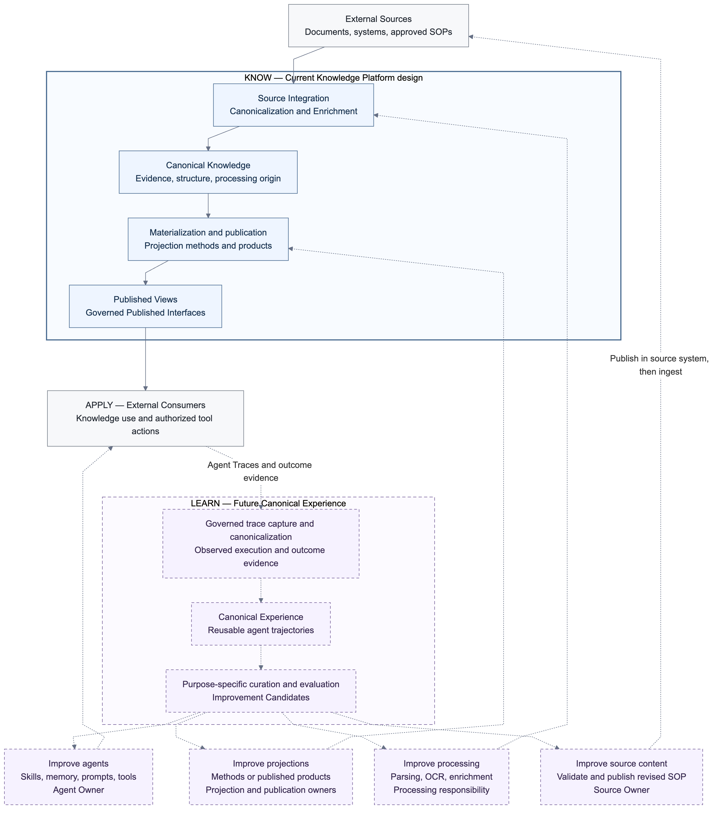
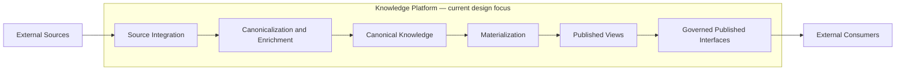

# Enterprise AI Data Foundation
## High-Level Design

**Stage:** Architecture direction review candidate

**Related confirmed work:** the [Knowledge Platform logical design](docs/design/knowledge-platform-logical-design.md)
records the separately confirmed overall decisions from 2026-09-28. This direction
package retains its own review scope; its open questions do not reopen those
confirmed decisions. Detailed work follows the [active wayfinder map](https://github.com/davidlinnnn/data-ingestion/issues/52).

**Audience:** architecture, security and data governance, AI consumer, and delivery stakeholders

## 1. Purpose and decision sought

The enterprise needs to preserve reusable knowledge from two kinds of activity:
understanding its sources and carrying out work with that knowledge. This HLD
explains the current ingestion problem, the proposed Knowledge Platform, and the
longer-term Knowledge Loop connecting knowledge use to improvement.

The decision sought is agreement on the **problem, scope, architectural
responsibilities, guiding principles, and questions to investigate next**. The
Knowledge Loop is at an early stage. Detailed logical contracts and implementation
choices will be developed from representative sources and consumer needs.

[ARCHITECTURE-BASELINE.md](ARCHITECTURE-BASELINE.md) is the companion reference
for the proposed boundaries, principles, open design questions, and review
criteria. [CONTEXT.md](CONTEXT.md) defines the shared language. Previous detailed
contracts remain available as [non-normative design notes](docs/design/README.md).

## 2. Current situation and evidence

The enterprise has invested in a shared ingestion pipeline that acquires source
content, parses it, and extracts information such as text, tables, images, and
layout. Sharing this work reduces repeated integration and parsing across AI
applications.

Over time, that flow has also taken on consumer-specific work: chunking,
embedding, summarization, and preparation for particular agents or applications.
The existing project account describes durable outputs primarily as
consumer-ready artifacts, with reusable source understanding coupled to the run
that produced them. The [earlier architecture exploration](https://github.com/davidlinnnn/data-ingestion/issues/1)
records how this problem framing developed.

The current working diagnosis is that the pipeline lacks a sufficiently explicit,
reusable contract between source understanding and consumer preparation. That
makes it harder to evolve the two independently. This is a diagnosis of the
existing architecture; pipelines can themselves have owners, versions, and
publication controls.

Reviewers should validate the diagnosis against a small set of operational
examples. The following evidence is still to be attached; it is not claimed as
measured performance or production incident data:

| Working problem statement | Evidence to bring to the review |
|---|---|
| A consumer method change requires modifying shared ingestion | One chunking, embedding, or synthesis change and the stages it affected |
| A new consumer cannot reuse source understanding independently | One onboarding example and the extra ingestion work it required |
| Artifact lineage and reprocessing impact are difficult to establish | One source update traced to its dependent consumer outputs |

## 3. Problem and architectural drivers

The current flow combines concerns that change for different reasons:

- **Source acquisition** changes with source systems and their access rules.
- **Source understanding** changes with formats, parsing, and reconstruction methods.
- **Knowledge representation** preserves what was understood for later reuse.
- **Consumer preparation** changes with retrieval, graph, synthesis, and application needs.
- **Publication** determines which prepared knowledge is available to consumers.

Without a durable contract between these concerns, reuse tends to require either
repeating source processing or adding more behavior to the shared flow. Changes
to one consumer can then carry unnecessary coordination and reprocessing costs
for others.

Retrieval, Graph, and Wiki make this separation valuable. They may use the same
source evidence while differing in meaning, input scope, update cadence, quality
criteria, and publication decisions. A graph or synthesis product may draw on
many Assets; its lifecycle need not match a single document-processing run.

A second, future driver is **reuse of execution experience**. As agents apply
knowledge to operational work, their traces can provide evidence about successful
methods, failures, missing knowledge, and process improvements. A trace's runtime
format alone does not make that experience reusable across agents or evaluation
systems. Which traces and outcomes are available in the enterprise remains a
discovery question; this HLD does not claim that experience infrastructure
already exists.

The architectural aim is to establish reusable assets with attributable origins
and independent lifecycles, first for knowledge and later for experience.

## 4. Vision: Know → Apply → Learn → Improve

**Know:** understand governed Sources and preserve reusable Canonical Knowledge;
materialize useful Published Views from it.

**Apply:** people, applications, and agents use those views in retrieval,
reasoning, reading, and operational tasks.

**Learn:** turn observed agent execution into reusable Canonical Experience,
then curate and evaluate it for a declared purpose.

**Improve:** route evidence-backed changes to the owners of the agent, projection,
processing method, or source content being changed.

The [editable Mermaid diagram](docs/diagrams/knowledge-loop.md) distinguishes
current design scope from future capabilities. Neither indicates implementation
completion or a deployment topology.

Two canonical assets support the loop:

- **Canonical Knowledge** preserves source-derived information and structure,
  including the distinction between source evidence and derived interpretation.
- **Canonical Experience** is the future domain for reusable observations of AI
  and agent execution. A **Canonical Agent Trajectory** is a proposed core
  representation within that domain.

An Agent Trace contains records emitted by a runtime and its tools. Future
experience capture and canonicalization would organize observed task context,
actions, tool interactions, knowledge use, results, and available outcomes or
feedback into a trajectory. It should retain observed order, branches, retries,
and evidence where available, while making gaps explicit. An agent's report of
success is not by itself a verified outcome, and inferred explanations must
remain distinguishable from recorded observations.

Canonical Experience can support many uses: evaluation cases, analytics, failure
analysis, candidate memories, skill improvements, or curated training data.
Eligibility for one use does not establish eligibility for another. Policy,
privacy, quality, and purpose controls apply to capture and subsequent use.
Trajectory schemas, storage, and evaluation mechanisms remain future design work.

## 5. Current scope and future scope

The **Knowledge Platform** is the current design focus. It spans Source
Integration, Canonicalization and Enrichment, Canonical Knowledge,
Materialization, publication, and Governed Published Interfaces. Knowledge
ingestion is a capability within this scope.

Future Canonical Experience and its improvement capabilities are shown to explain
the direction and the evidence the knowledge side should preserve. They are not
part of the current Knowledge Platform delivery commitment. The two domains may
use compatible governance and lineage concepts without sharing a schema, runtime,
or physical service.

Sources, business systems, agent runtimes, and consumer applications remain
outside the Knowledge Platform. Agents obtain knowledge offered by the platform
through Governed Published Interfaces. They may separately use business systems'
authorized operational interfaces to execute tasks or propose source updates.
Those actions remain under the authority of the business system and its owners.

This HLD does not select vendors, physical schemas, APIs, storage or workflow
engines, numeric service levels, staffing, budgets, or delivery dates. It also
does not choose a complete trajectory model, memory system, or learning pipeline.

## 6. Conceptual architecture and responsibilities

This is a responsibility view. It does not require a separate service or job for
each box. Governance, lineage, quality visibility, lifecycle coordination, and
audit apply across the Knowledge Platform.

| Responsibility | Architectural home |
|---|---|
| Connectivity, discovery, capture, source change and policy evidence | Source Integration |
| Parsing, structural reconstruction, modality interpretation, reusable enrichment | Canonicalization and Enrichment, producing attributable Canonical Knowledge |
| Durable source-derived content, structure, evidence, and processing origin | Canonical Knowledge |
| Chunking, embedding, graph extraction, synthesis, and their producing methods | The relevant Projection Definition and Materialization |
| Evaluation of candidate knowledge products, publication, withdrawal, and replacement | Platform controls with accountable projection and publication owners |
| Semantics of declared projection product operations, such as ranked retrieval | Projection and its Definition Owner |
| Application-level query orchestration, additional ranking/traversal over published interfaces, presentation, context assembly, tool use, and agent behavior | External Consumers |
| Adoption and publication of a changed SOP in its source system | Source Owner |

Canonical Knowledge separates source understanding from consumer specialization.
Materialization uses retained canonical inputs and declared processing
dependencies without reconnecting to or re-parsing Sources. A change in a
projection method can therefore be evaluated and published independently of
source acquisition. A change in parsing may produce new canonical results from
legally retained source observations.

Source facts and derived interpretation both need evidence and attributable
origins. The particular representation of native content, OCR, reconstructed
tables, or competing interpretations remains a logical-design question.

Projection meaning and publication each have an accountable owner. Their
organizational arrangement is left to the relevant product design. Platform
operators enforce lifecycle and governance controls; they do not acquire authority
to redefine domain meaning or approve source content merely by executing work.

## 7. Representative scenarios and intended value

### 7.1 Change a consumer method or add a consumer

An owner changes a retrieval representation, graph mapping, or synthesis method.
The new method is evaluated against retained Canonical Knowledge and produces a
candidate view with traceable inputs and method origin. Publication is an
explicit lifecycle decision. Other consumers' methods can continue to evolve
independently.

A new application uses an existing view or motivates a new projection. Its
onboarding should not require adding consumer preparation to Source Integration.
Retrieval supports search and RAG; Graph supports evidence-backed relationships;
Wiki supports cited synthesis. Projections own the semantics of their declared
product APIs; consumers own application-level orchestration and reading experiences.

### 7.2 Update, revoke, or correct knowledge

A source update produces a new source observation and attributable downstream
results. The platform can explain which inputs and methods produced a published
result and which dependent products may need reevaluation.

A permission change or confirmed deletion requires affected disclosure to stop
under the applicable governance rules. Ordinary content staleness and inability
to authorize access are distinct conditions. Acquisition failure does not by
itself establish source deletion. Detailed change detection, consistency, and
in-flight serving behavior are questions for subsequent design.

If a retained source observation was parsed incorrectly, a processing correction
can produce a new canonical result with its own origin. The source content need
not be declared changed to explain a better interpretation of it.

### 7.3 Learn from executing an SOP

An agent uses a published SOP and carries out a task through authorized business
tools. Its trace identifies the knowledge actually observed, actions taken, tool
results, and available outcome evidence. Future experience processing turns that
record into a reusable trajectory.

Evaluation may identify an unnecessary step or a missing exception. That finding
becomes an Improvement Candidate. If it concerns the agent's technique, the Agent
Owner can evaluate a skill or memory change. If it changes the SOP's business
content, the Source Owner validates and publishes a revision in the source
system. Normal Source Integration then captures the revised SOP and the knowledge
lifecycle produces updated views.

An updated SOP is normally a new Source Revision of an existing Asset. A separate
new SOP may be a new Asset; a new governed acquisition boundary is a new Source.
An experience-derived report can also become source content after accountable
publication with appropriate evidence and policy.

### 7.4 Route improvement to the thing that needs changing

| Improvement target | Examples | Adoption and return path |
|---|---|---|
| Agent behavior | Skills, memory, prompts, planning, tool strategy, models | Agent Owner evaluates and adopts changes in the agent lifecycle |
| Projection method or product | Chunking, embedding, graph mapping, synthesis, corrected or withdrawn views | Projection and publication owners evaluate methods or products and use the materialization/publication lifecycle |
| Canonical processing method | Parsing, OCR, table reconstruction, normalization, enrichment | Processing responsibility evaluates the method and produces new attributable results from retained source inputs |
| Source content | Revised SOP, corrected business guidance, new evidence-backed report | Source Owner validates and publishes through the source system, then Source Integration captures it |

The same observed failure may have different causes. Incorrect source guidance
belongs on the source path; a correct source misread by OCR belongs on the
processing path; poor synthesis belongs on the projection path; poor tool use
belongs on the agent path. A product correction need not imply a method change.
Application-level query rewriting and additional reranking are consumer-side
improvements; changes to a projection's declared native operations belong to its owner.

Improvement Candidates do not directly rewrite Canonical Knowledge or silently
replace Published Views. Each adopted change has an owner, attributable evidence,
and a lifecycle appropriate to its target. New executions can later provide
evidence about whether an adopted change helped.

## 8. Principles, alternatives, and trade-offs

The [Baseline principles](ARCHITECTURE-BASELINE.md#5-architectural-principles)
cover separation of concerns, source fidelity, governance, lineage, independent
lifecycles, and accountable improvement. Their purpose is to preserve the
architecture's value as implementation choices evolve.

| Choice or tension | Direction and trade-off to evaluate |
|---|---|
| Keep adding preparation to shared ingestion, duplicate processing per consumer, or establish reusable canonical knowledge | Prefer the canonical boundary for independent evolution; verify that reuse justifies the additional model and platform responsibilities |
| Preserve rich multimodal understanding or simplify immediately for one consumer | Preserve reusable evidence and structure; representation complexity and processing cost need representative-source validation |
| Re-materialize a product, retain historical outputs, or replay execution byte-for-byte | Preserve traceable regeneration from retained inputs; choose the required reproducibility level per use case rather than promise universal exact replay |
| Stop unauthorized disclosure while maintaining useful serving availability | Preserve fail-closed governance; validate source-policy detection and serving consistency before fixing a protocol |
| Share graph meaning enterprise-wide or let domains own their meanings | Do not require a universal ontology for initial adoption; identity and cross-view interoperability need concrete consumer scenarios |
| Learn from experience while avoiding propagation of bad conclusions | Preserve observed evidence and separate candidate evaluation from adoption; validate outcome quality and purpose eligibility |

The existing shared pipeline remains the starting point for evolution. The
responsibility mapping identifies where capabilities belong; sequencing,
coexistence, cutover, and migration costs require later planning.

## 9. Review and next design work

Reviewers should be able to agree on the current problem, explain the proposed
boundaries, walk the scenarios, and identify what remains uncertain. The
[Architecture Direction Review criteria](ARCHITECTURE-BASELINE.md#8-architecture-direction-review)
accept explicit design questions when they do not conceal disagreement about the
problem or responsibility split.

The [open-question register](ARCHITECTURE-BASELINE.md#7-open-design-questions)
identifies validation needs for canonical representation, reproducibility,
authorization consistency, publication, trajectory concepts, and improvement
routing. These are inputs to subsequent design work, not an approved backlog or a
requirement to implement the future experience domain before reviewing this HLD.

After direction alignment, investigate the highest-impact questions with focused
examples or prototypes, write and review the resulting logical contracts, then
plan physical design and delivery. Agreement at this stage does not establish
implementation completeness, funding approval, or production certification.
