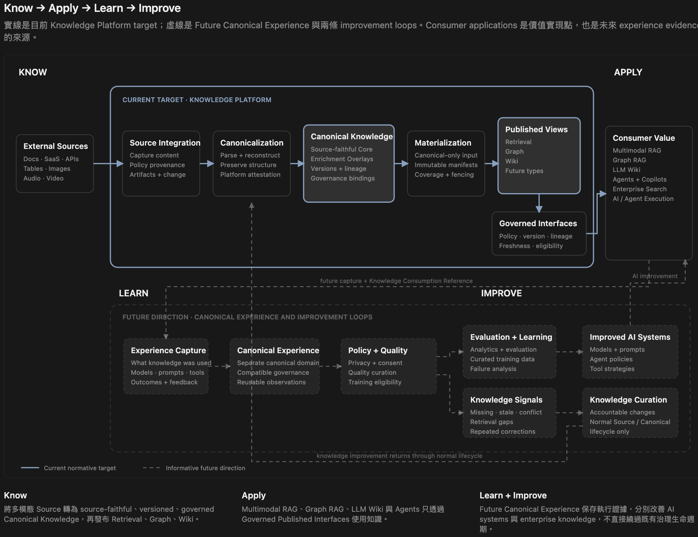

# Enterprise AI Data Foundation

The Enterprise AI Data Foundation is a target architecture for turning
heterogeneous enterprise information into reusable, governed knowledge for AI
systems.

Its first bounded delivery domain is the **Knowledge Platform**:

> Understand governed source knowledge once, preserve it as Canonical
> Knowledge, and publish many independently governed views.

This repository currently contains the architecture baseline and explanatory
materials. It is not yet a deployable implementation or delivery plan.

## Purpose

Enterprise knowledge is distributed across documents, tables, business
systems, SaaS platforms, APIs, images, diagrams, audio, video, and other
modalities. AI applications repeatedly need the same upstream capabilities:

- source acquisition and change detection;
- parsing and structural reconstruction;
- policy interpretation and enforcement;
- versioning, lineage, and provenance;
- transformation into retrieval, graph, or synthesized knowledge products.

When every application rebuilds those capabilities independently, the
enterprise gets duplicated processing, inconsistent source interpretation,
fragmented governance, incomplete lineage, and derived products that cannot be
reliably rebuilt.

The enterprise's existing shared ingestion pipeline avoided that duplication
but exhibits the mirror-image failure mode: without a durable canonical
boundary, consumer-specific preparation — chunking, embedding, summarization,
agent-specific transforms — has accumulated inside one ingestion flow,
coupling every consumer's lifecycle to every other's. Both failure modes share
one root cause: no durable knowledge layer between source understanding and
knowledge consumption. [`HLD.md`](HLD.md) tells this story in full.

The Foundation separates **source understanding** from **knowledge
consumption**. Source information is first preserved as durable Canonical
Knowledge. Independently owned Published Views can then evolve for different
consumer needs without reconnecting to or re-parsing enterprise Sources.

## Knowledge Loop



The long-term direction is:

```text
Know → Apply → Learn → Improve
```

- **Know:** transform governed Sources into source-faithful Canonical Knowledge
  and Published Views.
- **Apply:** deliver governed knowledge to search, RAG, graph, wiki, agent, and
  application experiences.
- **Learn:** capture future evidence about which knowledge, models, prompts,
  tools, actions, and feedback participated in AI or agent execution.
- **Improve:** use governed experience evidence to improve AI systems and
  enterprise knowledge through accountable lifecycle changes.

The editable version is available in
[`docs/diagrams/knowledge-loop.md`](docs/diagrams/knowledge-loop.md). It is a
discussion aid; the Architecture Baseline remains normative.

## Architecture at a glance

```text
External Sources
      │
      ▼
┌──────────────────────────────────────────────────────────┐
│ Knowledge Platform                                       │
│ Source Integration → Canonicalization                    │
│                    → Canonical Knowledge                 │
│                    → Materialization → Published Views   │
└────────────────────────────┬─────────────────────────────┘
                             │
                             ▼
                 Governed Published Interfaces
                             │
                             ▼
                    External Consumers
```

The Knowledge Platform owns the governed lifecycle from Source Integration
through publication. External Sources and External Consumers remain outside
its boundary.

Canonical Knowledge preserves reusable, source-faithful content, structure,
evidence, lineage, and governance before consumer-specific specialization.
Materialization consumes Canonical Knowledge without Source access and produces
immutable Published View Versions.

The initial standard Published View interface families are:

- **Retrieval:** governed passages and representations for lexical, dense,
  vector-similarity, and hybrid retrieval;
- **Graph:** independently owned nodes, edges, meanings, and evidence-backed
  claims;
- **Wiki:** governed synthesis with mandatory citations and accountable
  publication.

Additional Projection Types can be registered when they preserve the same
governance, lineage, coverage, lifecycle, and deletion-propagation obligations.

## Consumer value

The Foundation creates value through External Consumer applications while
leaving product behavior and semantic ownership with those consumers.

### Multimodal RAG

Multimodal RAG can retrieve across text, tables, layout, images, audio, and
video while retaining source evidence, policy, versions, and lineage. Consumer
teams remain free to choose retrieval strategy, reranking, context assembly,
models, and generation behavior.

### Graph RAG

Graph RAG can combine governed retrieval with domain-owned graph semantics for
relationship discovery and multi-hop reasoning. Different Graph definitions
may serve different domains without forcing one enterprise-wide ontology or
shared semantic identity.

### LLM Wiki

LLM Wiki applications can publish synthesized knowledge products with complete
citations, immutable versions, rollback, and an accountable Knowledge
Publisher. Reading-product presentation and interaction remain consumer
responsibilities.

### Agents and copilots

Agents and copilots can combine Retrieval, Graph, and Wiki Published Views
without implementing Source connectors, parsing, or canonicalization. Published
knowledge remains untrusted generator input, so prompt-injection and
content-trust controls remain consumer responsibilities.

## Binding architecture principles

The normative baseline establishes these cross-cutting principles:

1. **Governance and leakage:** source authorization is the access ceiling;
   materialization and query paths fail closed.
2. **Lineage:** every published observation carries evidence lineage through
   Canonical Knowledge to its originating Source Revision.
3. **Rebuildability:** Published View Versions remain reproducible without
   Source access while their complete Reconstruction Closure is lawfully
   retained.
4. **Deletion propagation:** Tombstones, security invalidation, erasure, and
   retention expiry close affected eligibility and prevent future disclosure.
5. **Canonicalization quality:** typed canonical primitives preserve source
   fidelity, and publication is gated against silent omission or structural
   reduction.

For precise definitions and obligations, use
[`ARCHITECTURE-BASELINE.md`](ARCHITECTURE-BASELINE.md), not this summary.

## Scope

### Current target

The current target is the complete logical Knowledge Platform architecture:
Source Integration, Canonicalization, Canonical Knowledge, governance,
materialization, publication, and Governed Published Interfaces.

### Future direction

**Canonical Experience** is a separate future canonical domain for reusable
observations of AI and agent execution. The current baseline defines only the
Knowledge-side `Knowledge Consumption Reference`; it does not define future
experience ingestion, curation, training eligibility, retention, or feedback
machinery.

### Explicitly not defined

This baseline does not choose or promise:

- vendors, products, databases, storage engines, or deployment topology;
- physical schemas, concrete APIs, or endpoint definitions;
- parser, embedding-model, or retrieval-tuning choices;
- numeric SLOs, capacity targets, budgets, staffing, or delivery dates;
- an implementation backlog or migration plan;
- final threat-model, security-certification, or compliance outcomes.

## Current status

The coordinated architecture-review candidate is
[`babda22`](https://github.com/davidlinnnn/data-ingestion/commit/babda22bfc0eeb06bed5a6af7d94717f648c5265)
on the
[`architecture-baseline-review-babda22`](https://github.com/davidlinnnn/data-ingestion/tree/architecture-baseline-review-babda22)
review branch. It supersedes candidate `1acfc9a`: the HLD is restructured
around the existing ingestion pipeline's limits, and the Baseline now
separates frozen invariants from provisional mechanism contracts (Baseline
authority levels).

Formal Architecture Baseline Endorsement is pending in
[`Architecture baseline review — babda22`](https://github.com/davidlinnnn/data-ingestion/issues/29).
The Review Record requires independent outcomes from:

- the Enterprise Architecture Reviewer;
- the Security and Data Governance Reviewer;
- the AI Consumer Architecture Reviewer.

Endorsement means the architecture is decision-complete for later design. It
does not authorize funding, delivery, production, or final security and
compliance certification.

## Documentation

- [`HLD.md`](HLD.md) — explanatory narrative covering background, the limits
  of the existing ingestion pipeline, strategy, target value, current
  positioning, and the complete Knowledge Loop.
- [`ARCHITECTURE-BASELINE.md`](ARCHITECTURE-BASELINE.md) — sole normative
  source for boundaries, contracts, lifecycle rules, governance, publication,
  consumer interfaces, and review criteria.
- [`CONTEXT.md`](CONTEXT.md) — canonical domain glossary.
- [`docs/registries/foundation-seed-registrations.md`](docs/registries/foundation-seed-registrations.md)
  — governed registry seed data for initial Element Kinds, payload contracts,
  and Source Evidence locator families.
- [`docs/diagrams/knowledge-loop.md`](docs/diagrams/knowledge-loop.md) —
  editable Mermaid representation of the complete Knowledge Loop.
- [Architecture wayfinder map](https://github.com/davidlinnnn/data-ingestion/issues/1)
  — index of the decisions and investigations that produced the candidate.

## Proposed progression

The following progression is a discussion aid, not an approved roadmap:

1. complete Architecture Baseline Endorsement;
2. use `/to-spec` to turn the linked architecture decisions into a buildable
   logical and physical design;
3. use `/to-tickets` to split the specification into reviewable,
   dependency-aware tracer bullets;
4. implement and validate each ticket against the endorsed boundaries;
5. expand Sources, Projection Definitions, and consumer applications according
   to demonstrated value and governance readiness.

Dates, budgets, delivery sequence, and the first tracer-bullet scope remain
future planning decisions.

## Discussing changes

Use the Mermaid diagram for collaborative exploration, but treat diagram edits
as proposals. A change to system boundaries, canonical or publication
contracts, governance or lifecycle invariants, architecture principles, or
consumer-observable behavior must be reconciled with the Architecture Baseline
and may require a new review.

