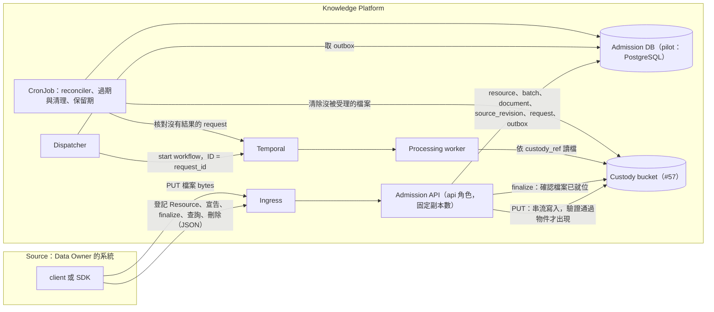
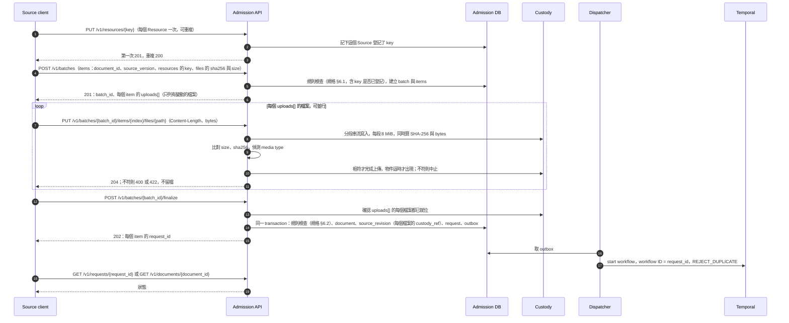

# Knowledge Platform 文件交付指南：設計、決策與 Source API

**狀態：** Contract companion：說明契約，不另立契約；和規格不一致時以規格為準。2026-11-07 定案方向與契約；最近一次對齊在 2026-11-20（第 7.2 節）。實作票與進度在第 7.3 節。

本文是「Source 如何把文件交給平台」的單一入口。讀完這一份，就知道設計的想法、做過的決定與理由、API 怎麼用、部署要準備什麼，一般不必再開另外兩份文件；每條規則的完整條文仍在規格。三份的用途不同：

| 文件 | 給誰 | 內容 |
|---|---|---|
| 本文 | Source 開發者、DevOps、想了解設計的人 | 設計、決策、架構與流程、API 使用方法、部署需求 |
| [admission 規格](knowledge-platform-admission-spec.md) | 平台實作者 | 完整契約：每條受理規則、狀態、派送與耐久、保留期 |
| [admission 設計筆記](knowledge-platform-admission.md) | 查歷史的人 | 逐輪的問答紀錄（Q4、Q5 等編號），含已被取代的內容 |

Resource 登記的契約在[授權指南](knowledge-platform-authorization-guide.md) §4.7。術語依 `CONTEXT.md`。

| 讀者 | 先讀 | 再讀 |
|---|---|---|
| 想了解設計的人 | 摘要；第 2 節：選項與決定 | 第 3、4 節 |
| Source 開發者 | 摘要；第 5 節：使用指南 | 第 4.2 節的失敗表 |
| DevOps | 第 3 節：架構；第 6 節：部署與維運 | 第 4.2 節的失敗表、第 7.3 節的實作狀態 |
| 平台實作者 | 規格 §5、§6（契約） | 第 2 節的決定、第 4 節 |

## 摘要

Source 是把文件交給平台的系統，例如 KM。它用平台核發的 credential 呼叫 API。交一份文件是三個呼叫；處理在背景進行，結果用查詢取得。

| 步驟 | 呼叫 | 平台做什麼 |
|---|---|---|
| 準備（每個 Resource 一次） | `PUT /v1/resources/{key}` | 記下這個 Resource；Resource 決定誰讀得到文件 |
| 1. 宣告 | `POST /v1/batches` | 還沒收檔就檢查規則，回覆哪些檔案要上傳 |
| 2. 上傳 | 每個檔案一個 `PUT` | 邊收邊驗大小與 SHA-256，通過才存下來 |
| 3. finalize | `POST /v1/batches/{batch_id}/finalize` | 一次受理整批，回 `202` 與每份文件的 `request_id` |
| 之後 | `GET /v1/documents/{document_id}` | 回報處理進度，以及文件是否已經可以被讀到 |

三個主要的決定：

- **檔案經平台 API 上傳。** 不用 presigned URL，也不讓 client 直接寫 storage：公司政策禁止前者，後者要多發一套 storage 憑證（第 2.3、2.4 節）。
- **先宣告、再上傳、最後 finalize。** 沒變的文件在宣告就結束，只改一個附件就只傳那個附件；finalize 把整批在一個 transaction 受理，`202` 之後不會遺失也不會重複（第 2.5 節）。唯一的例外是資料庫的磁碟區毀損後從備份還原：最後大約一分鐘內受理的 request 可能遺失，要請 Source 重送（規格 §9）。
- **Resource 用 Source 自己的 key，先登記再使用。** 打錯的 key 會被擋下，不會默默建出一個新的 Resource（[ADR-0013](../adr/0013-resource-identified-by-source-key.md)）。

最短的用法是第 5 節開頭的 quick start。

## 1. 背景與限制

### 1.1 誰上傳、上傳什麼

- 上傳者是 Data Owner 的系統（`CONTEXT.md` 的 **Source**），用平台核發的 Source credential 呼叫 API；人只是觸發者，平台不以人的身分授權這個操作（設計筆記 2026-10-18 的 client 釐清）。
- 一次提交是一個 **Batch**，最多 50 個 item；每個 item 是一份 Document 的一個版本，含一個 `main` 檔與零到多個附件，每個檔案宣告 `sha256`、`size`、`media_type`。
- 主檔格式要有採用中的 Processing Profile 版本才收（admission 規格 §3、§6.1 第 2 條）；pilot 只有 PDF（`paper-pdf`）。

### 1.2 不變的邊界

這些在政策變更前後都成立，是本文所有選項的共同前提（「上傳直接就位」一列在 2026-11-11 取代了原本的「staging 與 custody 分開」）：

| 邊界 | 內容 | 出處 |
|---|---|---|
| 三步驟提交 | 宣告 → 上傳 → 明確 finalize；finalize 才做耐久受理並回 `202` | 規格 §5、設計筆記 Q4 |
| 固定輸入先於受理 | 檔案內容在受理前固定，SHA-256 由平台驗證；任何後續寫入都不能改變已 finalize 的輸入 | [ADR-0004](../adr/0004-fixed-capture-custody-before-admission.md) |
| 上傳直接就位 | 檔案驗證通過後，直接寫到它在 custody bucket 的 key；finalize 不寫 storage；沒被受理的檔案由 admission 清除 | 規格 §5.2、§6.2、§10；[ADR-0012](../adr/0012-uploads-written-at-custody-key.md) |
| 受理即派送 | finalize 的同一個 transaction 寫入 request 與 outbox，dispatcher 再啟動 Temporal workflow | 規格 §9 |
| 處理端不碰 client | processing 用平台憑證依 `custody_ref` 讀檔，不對 client 發任何 URL | [#129](https://github.com/davidlinnnn/data-ingestion/issues/129) |

### 1.3 公司政策（2026-10-30）

主管確認：公司政策禁止 client 以 presigned URL 上傳檔案。SAS 是同類的、由 storage 簽發的 bearer URL，轉達時一併視為排除。這條政策讓 2026-10-20 定下的上傳 grant 形式（storage 原生 presigned URL 或 SAS，設計筆記 Q5）失效。紀錄：[#95 的轉達](https://github.com/davidlinnnn/data-ingestion/issues/95#issuecomment-6518076869)、[#96 的轉達](https://github.com/davidlinnnn/data-ingestion/issues/96#issuecomment-6658212404)、[資料安全文件](knowledge-platform-data-security.md) §2。

**政策範圍（使用者 2026-11-07 確認）**：政策只排除 presigned URL 這種 bearer URL 機制，不限定傳輸管道；經 admission API 上傳可行。這是本文決定的唯一前提，已成立。

### 1.4 規模

PROD 負載規格（[#88](https://github.com/davidlinnnn/data-ingestion/issues/88#issuecomment-6633160435)，2026-11-04）：

| 項目 | 數值 |
|---|---|
| 尖峰 | 每分鐘 50 份 PDF，持續 10 分鐘；一次 burst 500 份 |
| 檔案大小 | 平均 20 MB，硬上限 50 MB |
| 換算 | 約 1 GB／分鐘，即 17 MB/s；一次 burst 約 10 GB |
| 同時上傳數 | 每條連線 100 Mbps 時，一份 20 MB 約 1.6 秒傳完，平均同時 1 到 2 個上傳 |

換算與同時上傳數是估算，不是量測。

## 2. 選項與決定

### 2.1 最初的五個方案（#53 Q9，2026-10-02 至 10-03）

| # | 方案 | 誰搬檔案 | 當時的結論 | 政策下的狀態 |
|---|---|---|---|---|
| 1 | 平台發上傳授權，client 直接 PUT 到 storage（presigned URL） | client | 選為通用入口 | 被排除 |
| 2 | Source 發 signed GET，平台去抓檔 | 平台 | 保留為選用的匯入路徑 | 也是 presigned URL，只是方向相反；不採用 |
| 3 | 長期委派的 connector（暫時憑證、聯邦身分） | 平台 | 只給需要持續同步的來源 | 不受影響，但建置成本最高 |
| 4 | 預先註冊 Source 的 storage，平台用自己的身分去讀，client 只送檔案位置 | 平台 | 最早的 pilot 提案；每個 Source 都要設定 endpoint 與 token，改為方案 1 | 不受影響 |
| 5 | 檔案內容直接放在 ingestion API 的 request 裡 | client → API | 影像、影片不該經過 API；pilot 不提供 | 不受影響 |

出處：[Q9 最終建議](https://github.com/davidlinnnn/data-ingestion/issues/53#issuecomment-5966660481)、[Q9 確認](https://github.com/davidlinnnn/data-ingestion/issues/53#issuecomment-5966721936)、[雲端實務研究](../research/attachment-handoff-cloud-practices-2026-10-02.md)。

### 2.2 push 對 pull

push：client 把檔案送進平台。pull：平台去 Source 的 storage 讀檔。

| 面向 | Push | Pull |
|---|---|---|
| client 要做的事 | 實作上傳與失敗重傳 | 只送檔案位置與 sha256 |
| 平台要做的事 | 收檔、驗證 | 多一個抓檔元件，負責重試、限速、逾時 |
| 每個來源的上線成本 | 發一組 credential | 逐一談定 storage 位置、讀取權限、防火牆 |
| 網路方向 | client 連平台，平台不必對外連線 | 平台要能連到每個來源的 storage |
| 憑證風險 | 平台不持有來源的憑證 | 平台持有所有來源的讀取權限，被入侵時影響面大 |
| 檔案固定性 | 檔案一到就算 SHA-256、立即固定 | 宣告到抓檔之間檔案可能被改或刪，要綁版本並處理失敗 |
| 回應時機 | finalize 當下就知道檔案齊不齊 | 多一個非同步的「抓檔中」階段與對應的錯誤狀態 |
| 流量控制 | client 決定何時送，burst 直接打到平台，靠限流擋 | 平台自己排隊抓，可以把 burst 攤平 |
| 適用的來源 | 任何能呼叫 HTTP 的系統 | 只有檔案已放在相容 storage 的系統；其他系統要各寫 connector |
| 越權風險 | 小：只能寫自己被指定的位置 | 要防 A 來源藉平台的身分讀到 B 來源的檔案 |
| 對規格的改動 | 小：三步驟流程與規則不變 | 大：上傳步驟換成抓檔階段，狀態與錯誤碼要重定 |
| 公司政策 | 經平台端點多半合規 | 沒有 client 上傳；但平台讀其他團隊的 storage 需要另外核准 |

兩種方式搬的資料量一樣（burst 時約 1 GB／分鐘），檔案最後都要在 custody 存一份，所以 pull 不省儲存空間。pull 的價值只在「檔案本來就放在公司核准的 storage」的來源，這也是 Q9 當時「已在核准 custody 的檔案不必再傳一次」的結論；pilot 目前沒有這種來源。

### 2.3 經平台 API 對 client 直接寫 storage

presigned URL 本來就是「讓 client 不拿 storage 憑證也能直接寫」的機制。它被禁之後，client 要直接寫 storage 就必須持有 storage 的憑證，等於在 Source credential 之外再多一套身分系統。

| 面向 | 經 API 上傳 | client 直接寫 storage |
|---|---|---|
| 資料路徑 | client → API pod → storage，多一跳 | client → storage |
| client 持有的憑證 | 只有 Source credential | 另外一組 storage 憑證：長期金鑰，或 STS 暫時憑證（MinIO：15 分鐘至 365 天，預設 1 小時） |
| 每個 Source 上線 | 發 credential 即可 | 還要在 storage 建身分、綁定只能寫自己 prefix 的 policy |
| 網路 | storage 留在內部，只有平台連得到 | storage 要開放給所有 client 的網段 |
| 檔案落地前的檢查 | 傳輸中就能擋下大小、型別、未知 batch、超出配額，並同時算 SHA-256 | policy 能限制 prefix，但文件裡沒有可限制上傳大小的條件；只能等 finalize 才發現並清掉 |
| client 的開發 | 一般的 HTTP PUT | S3 SDK 與 endpoint 設定 |
| 與 storage 產品的耦合 | client 看不到 storage；#57 尚未選定產品，之後怎麼選都不影響 client | client 綁定 S3 API 與該產品的憑證機制 |
| 稽核 | 上傳紀錄集中在平台 | 分散在 storage 與平台兩邊 |
| 公司政策 | 多半合規 | 風險最高：發給 client 的暫時憑證比 presigned URL 權限更大，很可能遇到同樣的反對 |

多一跳 API 的代價以目前的規模很小：17 MB/s、平均同時 1 到 2 個上傳，而 admission 的 `api` 本來就是水平擴充的角色。檔案到 GB 等級，或流量高一到兩個數量級時，直接寫 storage 才划算。

### 2.4 決定（2026-11-07）

- **方向：push，經平台上傳端點。** client 以 Source credential 把每個檔案 `PUT` 到 admission 的上傳端點，admission 串流寫入 storage（2026-11-11 起直接寫到 custody 的 key，見第 3 節）。
- **契約採最小形式**（規格 §5.2）：上傳端點直接以 Source credential 驗證，不另發 grant token；每個檔案一個 `PUT`；宣告回應的 `uploads[]` 列出平台端點；原本的 grant 重發端點與一小時效期刪除。理由：少一套 token 的簽發、過期與重發；上傳的授權本來就在 finalize 再檢查一次；Source credential 是每次呼叫都要帶的東西。
- **不做的事**：分段或續傳（50 MB 以下整個重傳即可）、inline 內容、pull 路徑（等有具體來源再開）。
- **對 Valet Key 原則的影響**：client 不再持有任何對 storage 的委派權限，設計筆記裡「以 Valet Key 模式授予 client 有限的 storage 存取」改為歷史。平台先驗證提交者的授權、再接受資料傳輸，這個順序沒有變。

### 2.5 為什麼是這幾個呼叫（2026-11-19 的審查）

2026-11-19 對 Source 這一側的 API 做了一次獨立審查，問題是流程能不能更簡單。結論是呼叫不變，使用者同日確認照審查的建議處理；紀錄在[設計筆記](knowledge-platform-admission.md#api-review-on-2026-11-19)。每一步的理由：

| 步驟 | 換到什麼 | 併掉或拿掉會失去什麼 |
|---|---|---|
| 登記 Resource | 平台只收它認得的 key，打錯的 key 在宣告時被擋。登記要 `manage_relations`、交文件要 `submit`，兩種權限分開 | 併進宣告（沒見過的 key 自動建立）：打錯字會默默建出一個 Resource，只有 `submit` 的 credential 也能建 |
| 宣告 | 檔案還沒傳就逐 item 檢查規則；只傳有變動的檔案；內容沒變的文件在這一步就結束 | 併進上傳：被拒的 item 也已經把檔案傳完，沒變的檔案每次都要重傳 |
| 每檔一個 `PUT` | 可並行；失敗只重傳那一檔；平台收到就驗證 | 併進宣告：50 個 item、每個 20 MB 是一個 1 GB 的 request，任何一檔失敗都整批重來 |
| finalize | 整批在一個 transaction 受理；受理當下重查刪除、Resource 與版本順序；重複呼叫回同一份結果 | 改成「最後一個檔案到就自動受理」：並行上傳時由哪一個 `PUT` 帶回受理結果不固定，那個回應遺失時 client 要另外查詢 |
| 查詢 | 處理是非同步的，結果用查詢取得 | 沒有替代品，除非做 callback；callback 列為之後的事（規格 §1） |

出處：規格 §5、§6.1、§6.2、§9；設計筆記 Q4、Q4a、Q10.1d；[ADR-0012](../adr/0012-uploads-written-at-custody-key.md)、[ADR-0013](../adr/0013-resource-identified-by-source-key.md)。

和公開的 API 比較。數的是「把一個檔案交出去，到對方承認收到」的呼叫數，不含查詢：

| API | 一個檔案 | 完成的方式 |
|---|---|---|
| 本平台 | 3 | 明確的 finalize，一次涵蓋整批 |
| [Slack 外部上傳](https://docs.slack.dev/messaging/working-with-files/) | 3 | 明確的 complete |
| [S3 multipart upload](https://docs.aws.amazon.com/AmazonS3/latest/userguide/mpuoverview.html) | 3（只有一段時） | 明確的 complete |
| [OpenAI Uploads](https://developers.openai.com/api/docs/api-reference/uploads) | 3（只有一段時） | 明確的 complete |
| [GCS resumable upload](https://docs.cloud.google.com/storage/docs/resumable-uploads)、[tus](https://tus.io/protocols/resumable-upload)（核心協定） | 2 | 最後一個 byte 到就完成 |
| [OpenAI Files](https://developers.openai.com/api/docs/api-reference/files/create) | 1 | 沒有事前檢查，也沒有「只傳有變動的檔案」 |

有明確 complete 的三個，都是把多個獨立的上傳組成一個單位；本平台的單位是多份文件乘多個檔案，屬於同一類。兩個呼叫的那兩個處理的是一條依序送的 byte stream；本平台允許檔案並行上傳，沒有「最後一個 byte」可看。

審查之後的處置：

- **做**：SDK 把三個呼叫包成一個（[#194](https://github.com/davidlinnnn/data-ingestion/issues/194)）；第 5 節加 quick start 與欄位表；規格 §5.1 寫明哪些欄位必填，以及 client 照 `uploads[]` 給的 `url` 上傳。
- **不做：單一 request 的便利端點。** 它是第二條進件路徑，和「單筆與批次共用一個契約」（設計筆記 2026-10-18）不一致。重新考慮的條件已經定了：pilot 的 client 無法使用 SDK（設計筆記 Q4a）。
- **現在不做：自動 finalize。** 設計筆記 Q4a 把它列為之後的最佳化；有 SDK 之後，省下的那一個呼叫開發者看不到。

對「一份文件、一個檔案」的情境，宣告與 finalize 分開給 client 的好處很少。這個情境的簡化交給 SDK，不改契約。

## 3. 系統架構


```mermaid
flowchart LR
  subgraph source["Source：Data Owner 的系統"]
    C["client 或 SDK"]
  end
  subgraph platform["Knowledge Platform"]
    I["Ingress"]
    A["Admission API（api 角色，固定副本數）"]
    DB[("Admission DB（pilot：PostgreSQL）")]
    CU[("Custody bucket（#57）")]
    D["Dispatcher"]
    T["Temporal"]
    W["Processing worker"]
    J["CronJob：reconciler、過期與清理、保留期"]
  end
  C -- "登記 Resource、宣告、finalize、查詢、刪除（JSON）" --> I
  C -- "PUT 檔案 bytes" --> I
  I --> A
  A -- "PUT：串流寫入，驗證通過物件才出現" --> CU
  A -- "resource、batch、document、source_revision、request、outbox" --> DB
  A -- "finalize：確認檔案已就位" --> CU
  D -- "取 outbox" --> DB
  D -- "start workflow，ID = request_id" --> T
  T --> W
  W -- "依 custody_ref 讀檔" --> CU
  J -- "核對沒有結果的 request" --> T
  J --> DB
  J -- "清除沒被受理的檔案" --> CU
```

Admission DB 在 pilot 是 PostgreSQL。PROD release 之前，admission 要移到公司代管的 MongoDB（[#239](https://github.com/davidlinnnn/data-ingestion/issues/239)，[2026-11-17 的裁決](https://github.com/davidlinnnn/data-ingestion/issues/78#issuecomment-6949497546)）。移植改寫的是資料存取、dispatcher 取件與 Change Feed 的做法；Temporal 自己的資料庫兩個階段都是 PostgreSQL。pilot 累積的資料在切換時搬移，或請 Source 重送，#239 開始時決定。

### 3.1 元件職責

| 元件 | 職責 | 出處 |
|---|---|---|
| client 或 SDK | 算 SHA-256、宣告、上傳、finalize、查詢；失敗時重送 | 規格 §5、設計筆記 Q4 |
| Ingress | TLS 終止、轉送；上傳路徑要放寬 body 上限與 timeout | 第 6 節，#78 |
| Admission API | 平台 API 的 `api` 角色：驗證 Source credential、Resource 登記、套用 §6 規則、串流收檔並驗證、finalize、狀態查詢、刪除 | 規格 §5、§6；[授權指南](knowledge-platform-authorization-guide.md) §4.7 |
| Admission DB | resource、batch、document、source_revision、request、outbox 等紀錄 | 規格 §3；resource 見授權指南 §4.6 |
| Custody bucket | 上傳的檔案；受理後成為固定輸入，processing 依 `custody_ref` 讀取；沒被受理的由 admission 清除 | 規格 §6.2、§10，#57 |
| Dispatcher、Temporal | 受理後的派送與處理，與上傳方式無關 | 規格 §9、§10 |
| CronJob | reconciler 每 5 分鐘核對已派送但沒有結果的 request；每小時把逾期的 batch 標為過期，並清除沒被受理的檔案；每天執行保留期 | 規格 §9、§13 |

### 3.2 憑證與信任邊界

| 誰 | 持有什麼 | 能做什麼 |
|---|---|---|
| client | Source credential，權限是 `submit`、`manage_relations` 其中之一或兩者 | 對自己的 Source 登記 Resource、宣告、上傳、finalize、查詢、刪除；寫不到 storage |
| Admission（`api` 與清理的 CronJob） | custody bucket 的憑證（查物件是否存在、寫入、刪除）、DB 連線 | `api` 代 client 把檔案寫進 custody bucket；清理的 CronJob 刪除沒被受理的檔案、中止未完成的上傳 |
| Processing worker | 同一個 bucket 的讀寫憑證 | 依 `custody_ref` 讀固定輸入，寫處理結果（規格 §10） |

storage 的憑證只存在平台內；client 的網段只需要連到 Ingress。平台的設定只放 Source credential 的 SHA-256，不放 credential 本身（授權指南 §6.2）。worker 的憑證讀得到已上傳但還沒受理的檔案，到 admission 清除它們為止（[ADR-0012](../adr/0012-uploads-written-at-custody-key.md) 的後果）。

## 4. 流程

### 4.1 正常流程


```mermaid
sequenceDiagram
  autonumber
  participant C as Source client
  participant A as Admission API
  participant DB as Admission DB
  participant CU as Custody
  participant D as Dispatcher
  participant T as Temporal
  C->>A: PUT /v1/resources/{key}（每個 Resource 一次，可重複）
  A->>DB: 記下這個 Source 登記了 key
  A-->>C: 第一次 201，重複 200
  C->>A: POST /v1/batches（items：document_id、source_version、resources 的 key、files 的 sha256 與 size）
  A->>DB: 規則檢查（規格 §6.1，含 key 是否已登記），建立 batch 與 items
  A-->>C: 201：batch_id、每個 item 的 uploads[]（只列有變動的檔案）
  loop 每個 uploads[] 的檔案，可並行
    C->>A: PUT /v1/batches/{batch_id}/items/{index}/files/{path}（Content-Length、bytes）
    A->>CU: 分段串流寫入，每段 8 MiB，同時算 SHA-256 與 bytes
    A->>A: 比對 size、sha256，偵測 media type
    A->>CU: 相符才完成上傳，物件這時才出現；不符則中止
    A-->>C: 204；不符則 400 或 422，不留檔
  end
  C->>A: POST /v1/batches/{batch_id}/finalize
  A->>CU: 確認 uploads[] 的每個檔案都已就位
  A->>DB: 同一 transaction：規則檢查（規格 §6.2）、document、source_revision（每個檔案的 custody_ref）、request、outbox
  A-->>C: 202：每個 item 的 request_id
  D->>DB: 取 outbox
  D->>T: start workflow，workflow ID = request_id，REJECT_DUPLICATE
  C->>A: GET /v1/requests/{request_id} 或 GET /v1/documents/{document_id}
  A-->>C: 狀態
```

### 4.2 失敗與重試

| 情境 | 結果 | client 該做的事 |
|---|---|---|
| 宣告的 `resources` 填了沒登記的 key | 該 item `RESOURCE_NOT_FOUND` 被拒，其他 item 照常 | 先 `PUT /v1/resources/{key}`，該 item 重新宣告 |
| 上傳中斷線 | 該檔沒有 `204`，不留檔 | 重送整個 `PUT` |
| `Content-Length` 或實際 bytes 不等於宣告的 `size` | `400 SIZE_MISMATCH` | 檢查檔案與宣告；檔案真的變了就重新宣告 |
| SHA-256 不等於宣告 | `422 DIGEST_MISMATCH` | 同上 |
| 偵測到的 media type 不等於宣告 | `422 MEDIA_TYPE_MISMATCH` | 修正宣告或檔案，重新宣告 |
| `PUT` 到 `carried_over` 或未宣告的 path | `404` | 該檔不需要上傳 |
| 同一個檔案 `PUT` 兩次 | 沒有變化：已就位的檔案就是宣告的內容 | 無 |
| 檔案沒上傳完就 finalize | 該 item `FILES_MISSING` 被拒，其他 item 照常受理 | 該 item 重新宣告 |
| batch 開啟 24 小時未 finalize | `409 BATCH_EXPIRED`；已上傳的檔案由清理刪除 | 重新宣告 |
| 上傳中 storage 或資料庫無法回應 | `503 UNAVAILABLE`；檔案可能已就位，也可能沒有 | 依 `Retry-After` 重送整個 `PUT`；兩種情況重送都安全 |
| finalize 時 storage 無法回應 | `503 UNAVAILABLE`；batch 維持 open，什麼都不變 | 依 `Retry-After` 重試 finalize |
| finalize 在 commit 之前中斷（pod 被終止、資料庫重啟） | 連線中斷或 `503`；batch 維持 open，檔案都在 | 重試 finalize |
| finalize 已 commit，但 `202` 沒送到 | 已受理 | 重試 finalize，拿到同一份結果 |
| 文件在宣告之後被另一個 batch 建立 | 該 item `STALE_DECLARATION` 被拒，其他 item 照常受理 | 該 item 重新宣告 |
| finalize 之後再 `PUT` | `409 BATCH_FINALIZED` | 新版本要重新宣告 |
| finalize 重複呼叫 | 回同一份結果 | 可安全重試 |
| `429` 或 `503` | 帶 `Retry-After` | 依 `Retry-After` 重試；`ADMISSION_PAUSED` 只擋宣告，不擋上傳與 finalize |
| API pod 在上傳中被終止 | 連線中斷，物件不會出現；未完成的分段由清理中止 | 重送整個 `PUT` |

表中的「重新宣告」是一次新的宣告，要換一個 `Idempotency-Key`，body 相同也一樣：同一個 key 配同一個 body，24 小時內拿回的是原本的結果（設計筆記 Q6）。

## 5. 使用指南：給 Source 開發者

本節依契約寫，不是現況。`dev` 上能呼叫的是 Resource 登記、宣告、上傳、finalize、`GET /v1/batches/{batch_id}` 與狀態查詢；刪除還沒實作，進度見第 7.3 節。projection 的回報接上之前（#252），每份未刪除的文件的 `readiness` 都是 `not_ready`；這段期間用 request 的 `state` 追蹤一次提交（規格 §5.6）。

### Quick start：一份文件、一個 PDF

```sh
# 準備：算出檔案的 SHA-256 與大小
shasum -a 256 policy.pdf     # 64 個十六進位字元
wc -c < policy.pdf           # bytes

# 準備（每個 Resource 一次）：登記 Resource
curl -X PUT https://kp.example/v1/resources/hr-all -H "Authorization: Bearer $KP_TOKEN"

# 1. 宣告。回應 201，帶 batch_id 與 items[0].uploads[0].url
curl -X POST https://kp.example/v1/batches \
  -H "Authorization: Bearer $KP_TOKEN" -H "Content-Type: application/json" \
  -d '{"items":[{"document_id":"hr:leave-policy","source_version":"1","resources":["hr-all"],
       "files":[{"path":"policy.pdf","role":"main","sha256":"9f2c…","size":18342,"media_type":"application/pdf"}]}]}'

# 2. 上傳到回應給的 url。回應 204
curl -X PUT "https://kp.example/v1/batches/bat_01J…/items/0/files/policy.pdf" \
  -H "Authorization: Bearer $KP_TOKEN" -H "Content-Type: application/pdf" \
  --data-binary @policy.pdf

# 3. finalize。回應 202，帶 request_id
curl -X POST https://kp.example/v1/batches/bat_01J…/finalize -H "Authorization: Bearer $KP_TOKEN"

# 之後：查詢，直到 readiness 是 ready，或 attention 出現 action_owner 是 source 的項目
curl https://kp.example/v1/documents/hr:leave-policy -H "Authorization: Bearer $KP_TOKEN"
```

一開始可以不管的東西：

| 項目 | 為什麼可以先不管 |
|---|---|
| `Idempotency-Key` | 選填。沒帶而重送宣告，會多一個 batch、多扣一次配額，但同樣的內容不會被受理兩次（規格 §6.2、§6.4） |
| `title`、`source_url`、`metadata`、`uploaded_by` | 選填，不影響處理 |
| `carried_over` | 只有重送多檔文件時才不是空的 |
| `GET /v1/requests/{request_id}` | 一般整合只看 document 的 `readiness`；request 留給除錯 |
| `GET /v1/batches/{batch_id}` | 整批的進度；交單份文件用不到 |

以下各小節是完整的說明。

### 5.1 前置

- 向平台取得 `source_id` 與 Source credential（pilot 是平台核發的 service-account token）。credential 的權限有兩種：`submit`（交文件）與 `manage_relations`（登記與刪除 Resource）。宣告與刪除文件需要 `submit`；登記 Resource 需要 `manage_relations`，只有 `submit` 的 credential 會得到 `403`。
- base URL 由部署提供，下面以 `https://kp.example` 代表。
- 登記 Document 要放入的 Resource。key 是 Source 自己對這個 Resource 的識別，例如 KM 的 space id；1 到 200 個字元，含 `/` 時在路徑寫成 `%2F`。v1 只能把文件放進自己登記的 Resource（[ADR-0013](../adr/0013-resource-identified-by-source-key.md)）。

```sh
curl -X PUT https://kp.example/v1/resources/hr-all \
  -H "Authorization: Bearer $KP_TOKEN"
```

第一次回 `201`，重複呼叫回 `200`，所以每次交文件前都呼叫一次也可以。列出、取得與刪除 Resource 的契約在授權指南 §4.7；key 的義務（同一個 Resource 的文件讀者相同、key 不可換一批讀者重用）在授權指南 §3.2。

### 5.2 三個呼叫

**1. 宣告**

```sh
curl -X POST https://kp.example/v1/batches \
  -H "Authorization: Bearer $KP_TOKEN" \
  -H "Idempotency-Key: 7c9e4b1a-…" \
  -H "Content-Type: application/json" \
  --data @declare.json
```

`declare.json`：

```json
{
  "items": [
    {
      "document_id": "hr:leave-policy",
      "source_version": "3",
      "title": "Leave policy",
      "source_url": "https://km.example/hr/leave-policy",
      "resources": ["hr-all"],
      "uploaded_by": "sso:user-1",
      "metadata": { "km_folder": "HR/Policies" },
      "files": [
        { "path": "policy.pdf", "role": "main", "sha256": "9f2c…", "size": 18342, "media_type": "application/pdf" },
        { "path": "assets/flow.png", "role": "attachment", "sha256": "1ab0…", "size": 220114, "media_type": "image/png" }
      ]
    }
  ]
}
```

這個例子列出全部的欄位。每個 item 的欄位：

| 欄位 | 型別 | 必填 | 說明 |
|---|---|---|---|
| `document_id` | 字串 | 是 | Source 自己的文件代號；重送、查詢、刪除都用它。字元限制見第 5.4 節 |
| `files` | 陣列 | 是 | 這個版本的全部檔案，見下表 |
| `source_version` | 字串 | Source 依版本排序時要（預設） | 內容是整數（最多 18 位），或帶時區的 RFC 3339 時間，例如 `"3"`；一份文件只能用其中一種。寫成 JSON 數字，整個 request 會得到 `400`。比上一版小的會被拒（`STALE_SOURCE_VERSION`）；和上一版相同但內容不同的也會被拒（`VERSION_CONFLICT`），除非上一版被判定無法處理。Source 沒有版本號時，請平台把它設成依到達順序，就不用填 |
| `resources` | 字串的陣列 | 新文件，且 Source 沒有預設 Resource 時要 | 一個已登記的 key，放在陣列裡，只能一個。既有的文件不用填，平台沿用原本的綁定 |
| `title`、`source_url` | 字串 | 否 | 目錄資訊；送了就取代現值 |
| `metadata` | 物件，key 與值都是字串 | 否 | Source 自己的註記；送了就取代整份，`{}` 清空。讀得到這份文件的人都看得到它，所以只放可以給讀者看的內容（[2026-10-31 的裁決](https://github.com/davidlinnnn/data-ingestion/issues/96#issuecomment-6542094987)，規格 §6.5）。大小限制見第 5.4 節 |
| `uploaded_by` | 字串 | 否 | Source 聲明的提交者身分；只做紀錄，不用於授權 |

每個檔案的五個欄位都必填：

| 欄位 | 型別 | 說明 |
|---|---|---|
| `path` | 字串 | 文件內的相對路徑，不可重複；也是上傳網址的最後一段 |
| `role` | 字串 | 恰好一個 `main`，其餘是 `attachment` |
| `sha256` | 字串 | 64 個十六進位字元。平台用它判斷檔案有沒有變，並驗證收到的內容 |
| `size` | 整數 | bytes。超過上限的在宣告時就被拒；上傳時要和 `Content-Length` 相同 |
| `media_type` | 字串 | 主檔的格式要是平台支援的（pilot 只有 `application/pdf`），否則宣告時就被拒 |

排序方式與預設 Resource 是每個 Source 的設定，由平台設定（規格 §2）。規則的完整條文在規格 §6.1。

回應 `201`：

```json
{
  "batch_id": "bat_01J…",
  "state": "open",
  "expires_at": "2026-10-22T09:00:00Z",
  "items": [
    { "index": 0, "document_id": "hr:leave-policy", "document_uid": "doc_7f3…", "status": "declared",
      "uploads": [ { "path": "assets/flow.png", "method": "PUT", "url": "https://kp.example/v1/batches/bat_01J…/items/0/files/assets/flow.png" } ],
      "carried_over": ["policy.pdf"] }
  ]
}
```

要用的是 `batch_id`、每個 item 的 `status`，以及 `declared` 的 item 的 `uploads[]`。`uploads[]` 只列與上一版不同的檔案，其餘列在 `carried_over`，不必再傳；上例是重送，只有附件變了。item 的 `status`：

| `status` | 意思 | 接下來 |
|---|---|---|
| `declared` | 等上傳與 finalize | 上傳 `uploads[]` 的檔案，再 finalize |
| `unchanged` | 內容和最新版相同；`title`、`source_url`、`metadata` 已更新 | 結束 |
| `queued` | 同樣的內容已經有 request 在處理，或平台失敗後重新排入；帶 `request_id` | 結束，用 `request_id` 或 document 查詢 |
| `rejected` | 被拒，帶 `error`（`reason` 與 `message`） | 修正後重新宣告 |

**2. 上傳**：對 `uploads[]` 的每個檔案發一次 `PUT`，可以並行。網址用 `uploads[]` 給的 `url`，不要自己組；回應裡不認得的欄位略過。

```sh
curl -X PUT "https://kp.example/v1/batches/bat_01J…/items/0/files/assets/flow.png" \
  -H "Authorization: Bearer $KP_TOKEN" \
  -H "Content-Type: image/png" \
  --data-binary @assets/flow.png
```

`curl` 會自動帶 `Content-Length`；自寫 client 時必須帶，且等於宣告的 `size`。`Content-Type` 可以帶宣告的 `media_type`，平台不檢查它的值，而是檢查檔案的 bytes（第 6.5 節）；`curl --data-binary` 沒指定時會帶 `application/x-www-form-urlencoded`，所以範例明確指定。成功回 `204`，沒有 body。

**3. finalize**

```sh
curl -X POST https://kp.example/v1/batches/bat_01J…/finalize \
  -H "Authorization: Bearer $KP_TOKEN"
```

回應 `202`，內容是這個 batch 與它的每個 item，和 `GET /v1/batches/{batch_id}` 同一個形狀；受理的 item 帶 `request_id` 與 `source_revision_id`，被拒的帶 `error`。節錄：

```json
{
  "batch_id": "bat_01J…", "state": "finalized",
  "items": [
    { "index": 0, "document_id": "hr:leave-policy", "document_uid": "doc_7f3…",
      "status": "queued", "request_id": "req_01J…", "source_revision_id": "srv_3" }
  ]
}
```

**之後：查詢**

```sh
curl https://kp.example/v1/requests/req_01J… -H "Authorization: Bearer $KP_TOKEN"
curl https://kp.example/v1/documents/hr:leave-policy -H "Authorization: Bearer $KP_TOKEN"
```

`GET /v1/documents/{document_id}` 的回應（節錄；完整欄位在規格 §5.6）：

```json
{
  "document_id": "hr:leave-policy", "document_uid": "doc_7f3…", "resource_id": "hr-all",
  "readiness": "ready_stale", "since": "2026-10-15T09:12:00Z",
  "latest": { "source_revision_id": "srv_3", "source_version": "3", "request_id": "req_…" },
  "attention": [
    { "kind": "source_revision_rejected", "action_owner": "source", "source_version": "3",
      "message": "PDF could not be parsed; fix and re-upload", "since": "2026-10-15T09:12:00Z" }
  ]
}
```

request 的 `succeeded` 只代表處理完成；文件是否可被讀到，看 `readiness`（規格 §7.1）：

| `readiness` | 意思 |
|---|---|
| `not_ready` | Source 要求的讀取端（projection，例如 Retrieval、LLM-Wiki）裡，還有一個沒有這份文件的任何版本 |
| `ready_stale` | 每個讀取端都有這份文件，但至少一個還是舊版 |
| `ready` | 每個讀取端都是最新版 |
| `deleted` | 已刪除 |

回應的 `attention` 列出需要有人處理的事。`action_owner` 是 `source` 時輪到 Source 處理：例如 `source_revision_rejected` 表示這一版無法處理，要修正後重送（規格 §7.2）。平台原因造成的失敗只帶一句固定的英文訊息，不帶原始的錯誤內容；回報問題時附上 request 的 `error.support_ref`（規格 §5.5）。規格還有 `withdrawn` 這個值，pilot 不會出現。

**刪除**

```sh
curl -X DELETE https://kp.example/v1/documents/hr:leave-policy -H "Authorization: Bearer $KP_TOKEN"
```

回應 `202` 與一個 `delete` 的 `request_id`，重複呼叫回同一個 request。刪除不能復原；內容在各讀取端清理完成（`enforced`）之後才不再被提供，階段與時限見規格 §8。

**每個回應都帶 `X-Trace-Id` header**，錯誤的 body 也帶 `trace_id`（規格 §4）。把它記進自己的 log，回報問題時附上。

### 5.3 錯誤與重試

| 回應 | 意思 | 處理 |
|---|---|---|
| `401`、`403` | credential 無效，或沒有這個操作需要的權限 | 修正 credential；不要重試 |
| `404` | batch、item 或 path 不存在，或不在這個 Source 的可見範圍 | 檢查 `uploads[]`；不要重試 |
| `400 TOO_MANY_ITEMS`、`400 INVALID_ARGUMENT` | 宣告超過 50 個 item，或 body 不合格式 | 修正後重送 |
| `422 ALL_ITEMS_REJECTED` | 每個 item 都被拒；宣告時不建立 batch | 看 body 裡每個 item 的 `error` |
| `422 IDEMPOTENCY_KEY_REUSED` | 同一個 `Idempotency-Key` 配了不同的 body | 新的宣告換一個 key |
| `400 SIZE_MISMATCH`、`411 LENGTH_REQUIRED` | 長度不符或缺 `Content-Length` | 修正後重送 |
| `422 DIGEST_MISMATCH`、`422 MEDIA_TYPE_MISMATCH` | 內容與宣告不符 | 檢查檔案；需要時重新宣告 |
| `409 BATCH_EXPIRED`、`409 BATCH_FINALIZED` | batch 已結束 | 重新宣告 |
| `429`、`503` | 限流、暫停或暫時不可用 | 依 `Retry-After` 重試 |
| 連線錯誤、逾時 | 傳輸中斷 | 重送整個 `PUT`；finalize 可重複呼叫 |

上表是整個 request 的結果。宣告與 finalize 另外對每個 item 給結果：被拒的 item 在回應裡帶 `error`（`reason` 與 `message`），例如 `RESOURCE_NOT_FOUND`、`STALE_SOURCE_VERSION`、`FILES_MISSING`，其他 item 不受影響。原因的清單在規格 §12，規則在規格 §6；和 Resource 有關的處理方式在授權指南 §3.2。

整個 request 失敗時的 body（規格 §4）；程式判斷用 `details[].reason`，回報問題附上 `trace_id`：

```json
{
  "error": {
    "code": 409,
    "status": "FAILED_PRECONDITION",
    "message": "The batch expired at 2026-10-22T09:00:00Z.",
    "details": [
      { "@type": "type.googleapis.com/google.rpc.ErrorInfo",
        "reason": "BATCH_EXPIRED", "domain": "admission.knowledge-platform",
        "metadata": { "batch_id": "bat_01J…" } }
    ]
  },
  "trace_id": "4bf92f3577b34da6a3ce929d0e0e4736"
}
```

### 5.4 限制

| 項目 | 值 | 出處 |
|---|---|---|
| 每次宣告的 item 數 | 50（暫定） | 規格 §11 |
| 每個 Source 的進件配額 | token bucket：最多 50 個宣告 item，每分鐘補回 50（暫定） | 規格 §11 |
| 單檔大小上限 | 50 MB，部署可調 | 規格 §11、#88 |
| 上傳方式 | 每檔一個 `PUT`，單一 request；無分段、無續傳 | 規格 §5.2 |
| batch 有效期 | 建立後 24 小時 | 規格 §11 |
| `Idempotency-Key` | 最長 255 字元；24 小時內同一 key 回同一結果，前一次還在處理時等它 commit | 規格 §5.1、§11 |
| `document_id` | 1 到 256 個字元，`[A-Za-z0-9-_.~:]`，區分大小寫；不能含 `/` | 規格 §11 |
| Resource 的 key | 1 到 200 個字元，區分大小寫 | 授權指南 §4.7 |
| `metadata` | 最多 50 個 key；key 是 1 到 64 個字元的 `[A-Za-z0-9_.-]`；值是最長 512 個字元的字串；總共 8 KB | 規格 §11 |

### 5.5 SDK 與實務建議

- 設計筆記 Q4 要求 SDK 把三個呼叫包成一個操作；最小的 Python SDK 是 [`kp_sdk`](../../src/kp_sdk/__init__.py)（#194）：`Client(base_url, credential).submit(items)`。item 照規格 §5.1 寫，只是每個檔案用 `local`（本機路徑）取代 `sha256` 與 `size`，SDK 自己算、宣告、照 `uploads[]` 的 `url` 依序上傳、再 finalize。`429`、`503` 依 `Retry-After` 重試；其他失敗丟出 `PlatformError`，帶 `trace_id`，每個 item 都被拒時另帶各 item 的結果（`items`）。上傳被拒時 batch 維持 open，24 小時後過期，修正後重新呼叫 `submit` 即可。上傳網址的 origin 和呼叫的不同時，它不送 credential，直接丟出例外（規格 §5.1）。
- 宣告前先算好每個檔案的 SHA-256 與大小；宣告後只傳 `uploads[]` 列出的檔案。
- 多個檔案並行上傳；全部收到 `204` 再 finalize。
- 同一次宣告的重送（逾時、連線中斷）用同一個 `Idempotency-Key`；修正之後重新宣告要換一個 key。上傳與 finalize 本身可重複，不需要 key。
- 大量提交時依 50 item／分鐘的配額排程；收到 `429` 就依 `Retry-After` 等待。
- 不要在 log 裡記 credential；診斷資訊用回應的 `X-Trace-Id`。

## 6. 部署與維運需求

DevOps 要準備的東西。數值與設定名稱多數還是暫定的，由 [#78](https://github.com/davidlinnnn/data-ingestion/issues/78) 定案。admission 用自己的 image，不帶 PDF 解析與推論的套件（[2026-11-11 的裁決](https://github.com/davidlinnnn/data-ingestion/issues/78#issuecomment-6792552979)）；admission 還沒有 Dockerfile，程式邊界與依賴的拆分在 [#207](https://github.com/davidlinnnn/data-ingestion/issues/207)。

| 項目 | 需求 | 細節在哪 |
|---|---|---|
| 角色 | 一個 image，三種角色：`api`（固定 2 個副本，不用 HPA）、`dispatcher`（至少 2 個副本）、CronJob（reconciler 每 5 分鐘；batch 過期與上傳清理每小時；保留期每天） | 規格 §13；第 6.1、6.3 節 |
| 指令 | 已有：`kp-admission api`、`dispatcher`、`reconcile`（跑一次就結束，CronJob 每 5 分鐘）、`expire`（把逾期的 batch 標為過期，再清理結束滿一小時的 batch 的上傳，跑一次就結束，CronJob 每小時；要物件儲存的設定）、`feed-retention`（CronJob 每天，見下一列）、`set-profile`（設定 Source 要求的 projection）、`adopt` 與 `cancel-adoption`（設定某個檔案格式用哪個 Processing Profile 版本）。第一次宣告之前要先採用 PDF 的版本：`kp-admission adopt --tenant <tenant> application/pdf paper-pdf@1`，否則每個宣告都是 `UNSUPPORTED_FORMAT`（規格 §3）。順序是：profile 版本已 release、processing worker 已部署、`adopt`、第一次宣告；`adopt` 不檢查這個版本存不存在。還沒有：redrive 與 refresh（#98）、規格 §11 的紀錄保留期（#250） | [`kp_admission/cli.py`](../../src/kp_admission/cli.py) |
| Admission DB | pilot：一個 PostgreSQL instance，放在網路磁碟的 persistent volume，不用 operator；WAL 連續歸檔，加上排程的 base backup，都放到物件儲存。版本要 17 以上；`api` 的資料庫角色要 `pg_read_all_stats`。`feed-retention` 要每天跑：它刪掉超過 90 天的 Change Feed，也預先建立之後幾個月的分區，長期沒跑的話 admission 的寫入會失敗。目前沒有套用 schema 的指令：資料表定義在 [`schema.sql`](../../src/kp_admission/schema.sql)，整份套用在空的資料庫，由誰套用、用哪個 migration 工具由 #78 決定。PROD release 之前移到公司代管的 MongoDB | 規格 §9、§13；[#137 的交接](https://github.com/davidlinnnn/data-ingestion/issues/137#issuecomment-6983041476)；第 3 節；#239 |
| 物件儲存 | S3 相容，一個 bucket，原始檔與處理結果共用。`api` 現在要 `s3:GetObject`（finalize 用 HeadObject 確認檔案已就位）與 `s3:ListBucket` 的權限：少了 `s3:ListBucket`，storage 對不存在的物件回 `403` 而不是 `404`（[AWS HeadObject](https://docs.aws.amazon.com/AmazonS3/latest/API/API_HeadObject.html)），finalize 會一直回 `503`。上傳另外要 `s3:PutObject` 與 `s3:AbortMultipartUpload`；`expire` 的 CronJob 要 `s3:DeleteObject`、`s3:AbortMultipartUpload` 與 `s3:ListBucketMultipartUploads`。少了任何一項，上傳會一直回 `503`，清理則每次都把 batch 留給下一次，並以 exit code 1 結束。processing worker 要讀寫。必要的行為用 `storage_probe.py` 驗證 | 規格 §10；第 6.3、6.7 節；產品由 #57 決定 |
| Temporal | `dispatcher` 與 `reconcile` 要連得到：`TEMPORAL_ADDRESS`、`TEMPORAL_NAMESPACE`。`api` 不連 Temporal，所以 Temporal 停機時照常受理，outbox 裡的 request 等它恢復 | 規格 §9 |
| 路由 | 對外只開放 `/v1/`。`/authz/`、`/read/`、`/report/`（處理端回報狀態）、`/healthz`、`/openapi.json` 與 metrics 不對外。上傳路徑要另外放寬 | 授權指南 §6.1；第 6.2 節 |
| Mesh sidecar | CronJob 的 pod 可能因為 sidecar 不會自己退出而無法結束：確認是否啟用 native sidecar，沒有的話關閉注入，或在結束時停止 proxy。應用程式可能比 proxy 先啟動：`api` 會自行重連資料庫，`dispatcher` 連不上會結束，由 Kubernetes 重啟。`api` 收到 SIGTERM 會先處理完進行中的 request，結束碼是 143 | [#78 的交接](https://github.com/davidlinnnn/data-ingestion/issues/78#issuecomment-6854292201)；第 6.2 節 |
| 設定 | 環境變數。每個角色都要 `KP_ADMISSION_DATABASE_URL`，缺了就以 exit code 2 結束。`api` 另外必填：`KP_AUTHZ_PROVIDER=allow-all`、`KP_DEPLOYMENT=pilot`、`KP_ADMISSION_PUBLIC_URL`（Source 經 ingress 呼叫的 https origin，例如 `https://kp.example`；`uploads[].url` 用它組成，不依賴 ingress 轉送的 header。只接受 `https`、不帶路徑，DEV 也一樣），以及物件儲存的 `KP_S3_ENDPOINT`、`KP_S3_BUCKET`、`AWS_ACCESS_KEY_ID`、`AWS_SECRET_ACCESS_KEY`；缺一個就不啟動。`api` 的其他設定：`KP_CREDENTIALS`（每個 Source credential 的 SHA-256 與權限）、`KP_AUTHZ_PEP_CREDENTIALS`（讀取端的憑證）、`KP_PIPELINES`（回報者憑證的 SHA-256 與它登記的 pipeline；沒設時 `api` 照常啟動，但每筆回報都是 `401`，規格 §7.3）、`KP_SOURCES`（每個 Source 的排序方式與預設 Resource）、`KP_MAX_FILE_SIZE`（bytes；預設是規格 §11 的 50 MB 上限，程式用 50 × 2²⁰ bytes）、`KP_PAUSE_BACKLOG`、`KP_ADMISSION_API_PORT`（預設 8080）、`AWS_REGION`（預設 `us-east-1`）。`expire` 也要物件儲存的四個設定。canonical processing 的 orchestration worker 另外要 `KP_ADMISSION_URL`（`api` 的叢集內位址）與 `KP_ADMISSION_TOKEN`（回報用的憑證，從 Secret 掛載）。改了要重啟 pod | 授權指南 §6.2；[`kp_admission/cli.py`](../../src/kp_admission/cli.py) |
| 健康檢查、metrics、log | `api` 的 `GET /healthz` 用 HTTP probe，並用 `--metrics-port` 開 metrics；`dispatcher` 還沒有 HTTP 端點與 metrics（#189）。log 是 JSON、寫到 stderr，`api` 的每一行帶 `trace_id` | 授權指南 §6.3、§6.6；第 6.4 節 |
| 上線前的驗證 | pilot 前跑叢集層驗證：資料庫故障三案、終止 pod、Temporal 停機、容量 | 第 6.6 節；規格 §13；#99 |

### 6.1 Admission API

- 上傳端點串流處理：每收到一段（8 MiB）就以分段上傳寫入 storage，同時累計 SHA-256 與 bytes；超過宣告大小立即中斷。每個上傳佔用的記憶體是一段的大小，與檔案大小無關；同時 20 個上傳約 160 MiB。
- 上傳與控制 API 同一個 `api` 角色、同一個 image。固定 2 個副本，不用 HPA（2026-11-13 起，依公司慣例，見規格 §13）；server 用 async 框架（FastAPI），每個副本一個 uvicorn worker，慢連線不阻塞其他 request。寫入 storage 的 boto3 是同步呼叫，要放到執行緒執行，否則會卡住同一個副本的所有 request。之後若要隔離上傳流量，把上傳路徑拆成獨立 Deployment，契約不變。

### 6.2 Ingress

ingress-nginx 的預設值是為小 request 設的，上傳路徑要另外設定；公司的 ingress 不一定是 nginx，但同類設定都有，由 #78 定值。

| 設定 | ingress-nginx 預設 | 上傳路徑需要 |
|---|---|---|
| `proxy-body-size` | 1m | 不小於單檔上限（50 MB），或對上傳路徑不設限 |
| `proxy-request-buffering` | on | off：直接轉送，不先把整個 body 收在 ingress |
| `proxy-read-timeout`、`proxy-send-timeout` | 60 秒 | 放寬到幾分鐘；50 MB 在 10 Mbps 約需 40 秒 |

pod 帶 mesh sidecar 時，body 上限、不先緩衝與 timeout 在 sidecar 那一層也要成立，同樣由 #78 定值。

### 6.3 未受理的檔案與清理

- 每小時的 CronJob 清除兩種殘留（規格 §6.2、§13）：沒建立 Source Revision 的 item 所上傳的物件（被拒、過期，或 finalize 時內容和最新版相同），以及沒完成的分段上傳。已受理 item 的物件不刪。
- 只處理 finalize 或過期已滿 1 小時的 batch，讓當時還在傳的上傳先結束；目標是 batch 結束後 2 小時內清完（規格 §11，未量測）。
- 清理用資料庫紀錄算出完整的 key，逐一刪除與中止，不靠 storage 的 lifecycle 規則，也不靠列出前綴：AIStor 不支援中止未完成上傳的 lifecycle 動作，列出未完成的上傳時要給完整的物件名稱（[AIStor S3 API compatibility](https://docs.min.io/aistor/developers/s3-api-compatibility/)）。
- 容量估算：未受理的檔案和已受理的在同一個 bucket，最多保存到過期後 2 小時，一次 burst 約 10 GB。這是正常情況的估算，不是上限：上限取決於每個 Source 能同時開啟的 batch 數，這個值還沒定（規格 §11）。

### 6.4 指標與告警

- 上傳 request 數與結果分布（`204`、`400`、`422`、`409`、中斷）、bytes、上傳時長分布、同時上傳數。
- 等待清理的 batch 數與清理數；上傳失敗率與等待清理的 batch 數設告警。
- 這些併入 #78 的可觀測性清單；量測在 #99。dispatcher 與 reconciler 的 metrics 在 [#189](https://github.com/davidlinnnn/data-ingestion/issues/189)。

### 6.5 安全

- 只走 TLS；credential 與上傳 body 不進 log（資料安全文件 D3）。
- 檔案型別不看副檔名，也不看 `Content-Type`，看檔案的 bytes。平台偵測得到的六種型別（`application/pdf`、`image/png`、`image/jpeg`、`image/gif`、`image/webp`、`image/tiff`）必須和宣告相同；偵測不到的型別（例如 `text/markdown`）以宣告為準，除非檔案開頭是偵測得到的型別（規格 §5.2，2026-11-19 使用者裁決）。所以宣告 `image/jpg` 的 JPEG 會被拒，要宣告 `image/jpeg`；開頭是 `%PDF-` 的純文字檔也會被拒。主檔的 media type 決定走哪個 Processing Profile，沒有特徵的格式就照 Source 的宣告走。
- 文件內容的惡意 payload 與有害內容篩檢屬 #107、#108 的範圍，在受理後的 workflow 裡做，不在上傳端點。

### 6.6 驗證

#99 的叢集層驗證加上：PROD burst 經上傳路徑；上傳進行中殺掉 API pod，client 重送後無殘留、無重複；ingress 設定在單檔上限與慢線路下成立。

### 6.7 Storage 行為的依據（#184，2026-11-11）

設計依賴的行為都列在「必要」；公司的 storage 用 [`storage_probe.py`](../validation/184/storage_probe.py) 重跑，缺一項就不能用（#137）。本機實測的三套是 RustFS 1.0.4、MinIO 社群版 RELEASE.2025-09-07、SeaweedFS 4.50。

| | 行為 | 官方文件 | RustFS | MinIO | SeaweedFS |
|---|---|---|---|---|---|
| 必要 | 分段上傳在完成之前，物件查不到也列不出來 | — | 是 | 是 | 是 |
| 必要 | 未完成的上傳用完整的 key 列得出來 | [ListMultipartUploads](https://docs.aws.amazon.com/AmazonS3/latest/API/API_ListMultipartUploads.html) | 是 | 是 | 是 |
| 必要 | 中止的上傳不能再完成，也不留物件 | — | 是 | 是 | 是 |
| 必要 | 刪除不存在的 key 回成功 | — | 是 | 是 | 是 |
| 不依賴 | 未完成的上傳用資料夾前綴列得出來 | [AIStor](https://docs.min.io/aistor/developers/s3-api-compatibility/)：要給完整的物件名稱 | 是 | 否 | 是 |
| 不依賴 | 完成分段上傳時帶 `If-None-Match: *`，key 已存在就回 `412` | [AWS conditional writes](https://docs.aws.amazon.com/AmazonS3/latest/userguide/conditional-writes.html) | 是 | 是 | 是 |
| 不依賴 | `CopyObject` 帶 `If-None-Match: *`，目的 key 已存在就回 `412` | [CopyObject](https://docs.aws.amazon.com/AmazonS3/latest/API/API_CopyObject.html)（AWS 自 [2025-10-29](https://aws.amazon.com/about-aws/whats-new/2025/10/amazon-s3-conditional-write-functionality-copy-operations/) 起）；AIStor 列為支援 | 是 | 否：回 `200` 並覆蓋 | 是 |

- 儲存端複製和「不覆蓋既有物件」能不能同時成立，要看產品和版本；不支援的實作不報錯，直接覆蓋。這是上傳改成直接就位、finalize 不複製的原因之一（[ADR-0012](../adr/0012-uploads-written-at-custody-key.md)）。
- 一般 bucket 沒有原子的搬移，搬移就是先複製再刪除（[AWS：複製、搬移、改名物件](https://docs.aws.amazon.com/AmazonS3/latest/userguide/copy-object.html)）。
- 未完成的分段會一直佔空間，到期規則刪不掉，AWS 建議用 lifecycle 規則中止（[AWS](https://docs.aws.amazon.com/AmazonS3/latest/userguide/mpu-abort-incomplete-mpu-lifecycle-config.html)）；AIStor 不支援這個 lifecycle 動作，所以由第 6.3 節的 CronJob 中止。

## 7. 未決事項與變更紀錄

### 7.1 未決

| 事項 | 影響 | 負責 |
|---|---|---|
| pull 路徑 | 等有「檔案已在公司核准 storage」的具體來源再開 | #96 之後另開票 |
| 大檔案的續傳 | 5 GB 以上才需要；可以用新增的端點加上，不破壞既有 client（第 7.4 節） | 不在第一版 |
| 公司的 ingress 產品與設定值 | 第 6.2 節的數值 | #78 |
| `KP_ADMISSION_PUBLIC_URL` 的值 | `api` 用它組 `uploads[].url`（規格 §5.1），必填，不依賴 ingress 轉送的 header；值是 ingress 的對外 origin。驗收：經 ingress 宣告，回應的 `url` 是對外網址 | #78 |

### 7.2 變更紀錄

| 日期 | 事件 |
|---|---|
| 2026-10-03 | #53 Q9：通用入口為平台發授權的直接上傳；signed GET 與 connector 為選用 |
| 2026-10-20 | #31 Q5：上傳 grant 為 storage 原生 presigned URL 或 SAS，一小時效期 |
| 2026-10-30 | 主管確認公司政策禁止 client 以 presigned URL 上傳；轉達 #95 |
| 2026-11-05 | 規格與設計筆記加上 superseded 註記；轉達補到 #96 |
| 2026-11-07 | 決定 push、經平台上傳端點；契約寫入規格 §5.2；本文建立 |
| 2026-11-07 | 使用者確認政策只排除 presigned URL，不限定傳輸管道；本決定的前提成立，未決事項移除 |
| 2026-11-11 | #184：上傳直接寫到 custody 的 key，不設 staging，finalize 不寫 storage（[ADR-0012](../adr/0012-uploads-written-at-custody-key.md)）；第 1.2、3、4、6.3、6.4 節改寫，新增第 6.7 節 |
| 2026-11-18 | 對齊之後的決定：Resource 由 Source 自己的 key 識別、先登記再宣告（ADR-0013，#114）；上傳與 SDK 拆到 #194；每個回應帶 `X-Trace-Id`（#204）；pilot 用 PostgreSQL，PROD release 前移到 MongoDB（#239）。新增讀者表、刪除的呼叫、第 6 節的總表與第 7.3 節。`document_id` 的例子改成符合規格 §11 的字元 |
| 2026-11-19 | 本文成為「Source 交付文件」的單一入口，標題改為文件交付指南：新增摘要、第 2.5 節（API 的獨立審查，契約不改）、quick start、欄位表、`readiness` 的說明、第 7.4 節（大檔案的評估）。#96 已合併，第 5、6、7.3 節跟著更新。規格 §5.1 寫明必填欄位與 `uploaded_by`，並要求 client 照 `uploads[]` 的 `url` 上傳。`metadata` 讀者可見（2026-10-31 的裁決）補進規格 §6.5、設計筆記與 `CONTEXT.md` |
| 2026-11-19 | #194：上傳端點、上傳清理與最小 SDK 實作完成。上傳中 storage 無法回應定為 `503 UNAVAILABLE`（規格 §5.2 補上一列）；`uploads[].url` 改用 `KP_ADMISSION_PUBLIC_URL` 組成；media type 的偵測規則補進規格 §5.2 與第 6.5 節。第 7.1 節移除 storage 那一列，對外網址那一列改成 #78 要給的設定值；第 5.5、6 節跟著更新。獨立審查之後：規格 §5.1 寫明 `url` 用平台的對外 origin（部署設定），§5.2 列出偵測的六種型別、`503` 那一列涵蓋資料庫並註明檔案可能已就位，§3 的 `batch` 加上 `cleaned_at`，§13 改為引用 §6.2；本文第 6 節的 S3 權限按角色列出 |
| 2026-11-20 | #97：canonical processing 的回報接收與狀態查詢實作完成（PR #253）。#97 在開工前拆成三張：projection 的回報接收（#252）與 Canonical Acceptance 的記錄（#251）另外實作。第 5 節寫明 `readiness` 在 #252 之前都是 `not_ready`，以及平台原因失敗的訊息是固定句子；第 6 節補上 `/report/`、`KP_PIPELINES` 與 worker 的兩個設定；第 7.3 節更新，保留期的票是 #250 |

### 7.3 實作狀態（2026-11-20）

進度以各票為準；這張表在票結案時更新。

| 步驟 | 端點或元件 | 票 | 狀態 |
|---|---|---|---|
| 受理核心 | 受理紀錄、outbox、dispatcher、reconciler | #95 | 已完成，在 `dev` |
| 共用處理 | `trace_id`、`/healthz`、metrics、log | #204 | 已完成，在 `dev` |
| 登記 Resource | `PUT`、`GET`、`DELETE /v1/resources/{key}`，`GET /v1/resources` | #114 | 已完成，在 `dev` |
| Change Feed | 讀取端取得文件變更的 API（`/read/v1/`，不對外） | #126 | 已完成，在 `dev` |
| 宣告、finalize | `POST /v1/batches`、`POST /v1/batches/{batch_id}/finalize`、`GET /v1/batches/{batch_id}`、batch 過期、採用紀錄 | #96 | 已完成，在 `dev` |
| 上傳 | `PUT /v1/batches/{batch_id}/items/{index}/files/{path}`、上傳清理、最小 SDK | #194 | 已完成，在 `dev` |
| 狀態查詢 | `GET /v1/requests/{request_id}`、`GET /v1/documents/{document_id}`、`GET /v1/documents`；canonical processing 的回報接收（`/report/v1/`，不對外） | #97 | 已完成，在 `dev`；`readiness` 在 #252 之前都是 `not_ready` |
| projection 的回報接收 | 登記、serving 事實、修復與 heartbeat；`readiness` 的 serving 部分 | #252 | 未實作，下一張 |
| Canonical Acceptance 的記錄 | `accepted`、目前的 Canonical Revision、`current_revision_changed` | #251 | 未實作，等 #57 對受理點的結論 |
| 刪除、重送、重跑 | `DELETE /v1/documents/{document_id}`、redrive、refresh | #98 | 未實作，在 #252 之後 |
| 保留期 | batch 與 `Idempotency-Key` 到期回 `404` 並移除紀錄 | #250 | 未實作 |
| dispatcher 與 reconciler 的 metrics | | #189 | 未實作 |
| 驗證 | CI 層與叢集層 | #99 | 未實作，在 #98 之後；叢集層另外等 #78 |
| admission 的 image、依賴拆分 | | #207 | 未實作 |
| 部署形態、ingress 數值、告警 | | #78 | 設計中 |
| 移到 MongoDB | | #239 | pilot 之後，PROD release 之前 |


### 7.4 大檔案（1 GB 以上）的評估（2026-11-19）

問題：之後要收 1 GB 以上的影片時，現在的契約夠不夠。結論：之後可以用新增的方式支援，現在不用改契約。下表的連線速度是假設，時間是換算，都不是量測。

| 檔案 | 100 Mbps 下傳一次 | 現在的契約 |
|---|---|---|
| 50 MB 以下 | 4 秒以內 | 可用；50 MB 是部署設定的上限（規格 §11） |
| 1 GB | 80 秒 | 調高上限，調整第 6.2 節的 ingress 與 sidecar 設定，並把 pod 的終止寬限與 sidecar 的 drain 時間拉到比上傳時間長，就可用 |
| 5 GB | 6.7 分鐘 | 勉強：斷線要整檔重傳（規格 §5.2） |
| 20 GB | 27 分鐘 | 不可用：斷在 90% 就損失 24 分鐘，而且撐不過一次部署 |

- **最先遇到的限制是「單一 request、不能續傳」**，不是 storage，也不是記憶體。依設計（#194 實作），平台寫入 storage 是分段的，每段 8 MiB，一個上傳佔的記憶體和檔案大小無關（第 6.1 節）；20 GB 是 2,385 段，低於 S3 的 10,000 段上限（[AWS](https://docs.aws.amazon.com/AmazonS3/latest/userguide/qfacts.html)）。
- **部署會切斷長時間的上傳。** pod 的終止寬限預設 30 秒（[Kubernetes](https://kubernetes.io/docs/concepts/workloads/pods/pod-lifecycle/)），Istio sidecar 的 `terminationDrainDuration` 預設 5 秒（[Istio](https://istio.io/latest/docs/reference/config/istio.mesh.v1alpha1/)）。上傳時間超過寬限的，每次部署都會被切斷重來。慢的連線現在就會遇到：50 MB 在 10 Mbps 要 40 秒；client 重送整個 `PUT` 即可（第 4.2 節），寬限的數值由 #78 定。
- **續傳可以新增。** 保留現在的 `PUT`，在宣告與 finalize 之間加分段上傳的端點，形狀和 OpenAI Uploads 的 create、add parts、complete 相同。`uploads[]` 的每一項已經有 `method` 與 `url`，整檔的 `sha256` 照舊；規格 §5.1 因此要求 client 照回應的 `url` 上傳。
- **影片當主檔還需要一個 Processing Profile**（pilot 只有 PDF）；這也是新增。
- **20 GB 級的檔案另有一條路**：平台去公司核准的 storage 讀檔（第 7.1 節的 pull 路徑），檔案不經過 API pod。
- 做續傳時，清理的假設要跟著改：現在假設上傳在一小時內結束（第 6.3 節）。

## 來源

- [admission 規格](knowledge-platform-admission-spec.md)、[admission 設計筆記](knowledge-platform-admission.md)、[授權指南](knowledge-platform-authorization-guide.md)、[Source handoff 設計](knowledge-platform-source-handoff.md)、[資料安全文件](knowledge-platform-data-security.md)
- [雲端實務研究](../research/attachment-handoff-cloud-practices-2026-10-02.md)、[inline 與 reference ingestion 研究](../research/document-inline-reference-ingestion-2026-10-18.md)、[CSP admission 實務研究](../research/admission-authorization-csp-practices-2026-10-20.md) §7、§8
- MinIO 官方文件：[STS](https://docs.min.io/enterprise/aistor-object-store/developers/security-token-service/)、[存取控制](https://docs.min.io/enterprise/aistor-object-store/administration/iam/access/)（頁面描述的是企業版 AIStor，公司使用的版本可能有差異）
- [ingress-nginx ConfigMap](https://kubernetes.github.io/ingress-nginx/user-guide/nginx-configuration/configmap/)、[boto3 S3 transfer](https://docs.aws.amazon.com/boto3/latest/reference/customizations/s3.html)、[OpenAI Uploads API](https://developers.openai.com/api/docs/api-reference/uploads)
