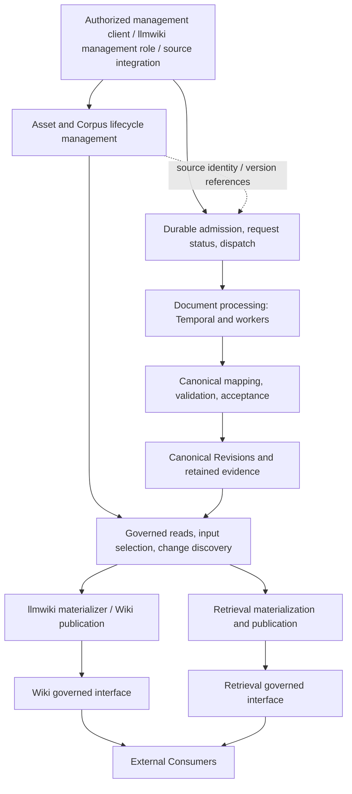

# Knowledge Platform logical system design

[Design notes](README.md) · [Documentation guide](../README.md)

**Date:** 2026-09-28. **Status:** user-confirmed logical baseline for responsibilities,
boundary semantics and detailed-decision handoff. This is not an approved buildable
specification, deployment topology, or completed Architecture Direction Review.
Unresolved physical and detailed contract choices remain with their named owners.

**Review checkpoint:** Q1–Q25 and the assembled skeleton are confirmed, including
the fresh-context spike's responsibility clarifications and validation cases.
The overall logical decision is resolved; detailed decisions remain open.

The [overall design review](knowledge-platform-overall-review.md)
adds boundary success/failure semantics, storage candidate trade-offs, explicit
commit/recovery boundaries, current PDF evidence and the verified handoff order.
It records the user-confirmed logical scope and subsequent design handoffs.

This versioned design checkpoint supports [Define the overall Knowledge Platform
logical system design](https://github.com/davidlinnnn/data-ingestion/issues/58)
under [Design the Knowledge Platform from source handoff to governed
publication](https://github.com/davidlinnnn/data-ingestion/issues/52).
Issue comments are the decision records; this document assembles their implications.
Use [CONTEXT.md](../../CONTEXT.md) for domain definitions.

**Checkpoint update — 2026-09-30:** the [map's design-authority rule](https://github.com/davidlinnnn/data-ingestion/issues/52#existing-work-and-authority)
keeps confirmed target contracts authoritative. Workflow/API differences become
versioned implementation migration or integration work with affected validation.
Measured PDF resource configurations inform the operating-envelope decision only
within their qualified scope. Source-handoff Q1–Q3 were subsequently
[confirmed on 2026-09-30](https://github.com/davidlinnnn/data-ingestion/issues/53#issuecomment-5909819124): delegated Source submission, stable logical Asset identity, and fixed captured inputs with accountable custody before durable admission.
The [source-handoff design](knowledge-platform-source-handoff.md) records their
scope and remaining questions; the full source-handoff ticket remains open.

## Confirmed design inputs

| Decision record | Confirmed constraint |
|---|---|
| [Starting charter](https://github.com/davidlinnnn/data-ingestion/issues/52) | Controlled captured-file inputs first; PDF/Markdown/PPTX representation design; Wiki first, Retrieval as a reuse check; independent projection workflows; Kubernetes and shared Temporal; separate direction review |
| [Canonical Acceptance](https://github.com/davidlinnnn/data-ingestion/issues/58#issuecomment-5761731359) | Explicit rules automate ordinary acceptance; exceptions requiring judgment involve a human; processing completion, canonical acceptance, and publication have distinct meanings |
| [Shared Corpus](https://github.com/davidlinnnn/data-ingestion/issues/58#issuecomment-5843462731) | Platform-managed knowledge collections can be reused by multiple projections |
| [Membership and fixed inputs](https://github.com/davidlinnnn/data-ingestion/issues/58#issuecomment-5843489434) | Explicit membership first; an Asset can belong to multiple Corpora; each Materialization fixes its actual Asset/Canonical Revision inputs without obtaining a lasting access grant |
| [Batch, completeness, and updates](https://github.com/davidlinnnn/data-ingestion/issues/58#issuecomment-5843539018) | Admitted documents have independent outcomes; projections require complete inputs by default and explicitly opt into partial coverage; projections own automatic/explicit-trigger update behavior |
| [Membership removal versus withdrawal](https://github.com/davidlinnnn/data-ingestion/issues/58#issuecomment-5843568717) | Ordinary member removal triggers normal updating; authorized eligible old publications may remain during replacement; urgent stop-disclosure intent uses explicit withdrawal |
| [Version availability and selection](https://github.com/davidlinnnn/data-ingestion/issues/58#issuecomment-5843634273) | Eligible old canonical results remain usable with visible freshness gaps; projections select latest eligible accepted results, captured-source targets, or exact revisions, then use fixed materialization inputs |
| [Standalone Assets and ingestion intent](https://github.com/davidlinnnn/data-ingestion/issues/58#issuecomment-5843694542) | Corpus membership is optional for ingestion; ordinary submission registers a captured source reference and durably accepts processing intent; membership changes remain observable to projections without inherently requiring parsing/OCR again |
| [Governed canonical read boundary](https://github.com/davidlinnnn/data-ingestion/issues/58#issuecomment-5843749474) | Projections use a platform-managed, version-explicit, governed read contract; large artifacts may use controlled references |
| [Management and materialization roles](https://github.com/davidlinnnn/data-ingestion/issues/58#issuecomment-5843848093) | llmwiki may expose an explicitly authorized management entry point while its materializer separately consumes canonical inputs; the platform owns upstream lifecycle transitions |
| [Projection-owned serving](https://github.com/davidlinnnn/data-ingestion/issues/58#issuecomment-5843866759) | Each projection owns its external API/product logic under common governance/publication obligations; the first phase does not require a universal domain-serving gateway |
| [Recoverable updates, failure ownership, and Temporal direction](https://github.com/davidlinnnn/data-ingestion/issues/58#issuecomment-5843984257) | Q18/Q19 confirmed: recover missed changes, retain layer-owned recovery and judgment-based intervention; the user directs canonical and projection processing to use Temporal durable workflows |
| [Independent coherent publication](https://github.com/davidlinnnn/data-ingestion/issues/58#issuecomment-5844008136) | Q17 confirmed: each projection prepares a coherent product version and publishes independently, without a cross-projection barrier; incremental builds and eligible old-version fallback remain allowed |
| [Recovery and first adoption](https://github.com/davidlinnnn/data-ingestion/issues/58#issuecomment-5844091825) | Q24/Q25 confirmed: protect authoritative and unique data, rebuild derivatives only with retained eligible dependencies, validate a controlled Corpus and breaking-upgrade rehearsal; full legacy PROD replacement is not a first-phase completion condition |

## Logical responsibility and data flow

Additional confirmed inputs: [Q20–Q22](https://github.com/davidlinnnn/data-ingestion/issues/58#issuecomment-5844054630)
establish platform custody for accepted canonical/evidence dependencies, independent
versioned evolution with bounded compatibility migrations, and separately
controllable resource/cost budgets for work classes sharing Temporal. Processing
owns execution intermediates; projections own their products. Custody protection
must precede completed acceptance, without requiring byte copying or indefinite
retention. Compatible retained inputs may be reused across projection upgrades;
incompatible consumers must be blocked explicitly. Backfills must not exhaust
daily-ingestion capacity. Physical mechanisms and numeric targets remain open.

Boxes denote logical responsibilities, not separate services, databases, or queues.
Management clients act under explicit authority; ordinary External Consumers use
Governed Published Interfaces, not general canonical management APIs.
llmwiki may contain both an explicitly authorized management-client role and a
materializer role. Its materialization read access does not imply management or
canonical write authority. Management calls request platform-owned transitions;
the materializer does not overwrite canonical history or approve upstream results.
Forwarding files does not redefine their Source or Source Owner. These are role
boundaries, not a requirement to deploy separate services.

| Responsibility | State or facts it owns | Contract still to design |
|---|---|---|
| Asset and Corpus management | Asset identity/source observations; Corpus metadata and membership | Authorized actors, create/update/remove/withdraw operations, source-event ordering, membership revision encoding, Corpus retirement/deletion |
| Admission, status, dispatch | Accepted immutable processing requests, pending work, durable status summaries and workflow references | Batch validation/partial admission, idempotency, acceptance transaction, dispatch/reconciliation, backend |
| Document processing | Frozen method/profile execution, checkpoints and complete-result artifacts | Qualified core integration, method compatibility and supported operating scope; its artifacts are not accepted canonical data by default |
| Canonical mapping and acceptance | Candidate evaluation, attributable acceptance/exception decision facts and required supporting evidence | Mapping rules, policy versions/thresholds, authorized decision roles, source/lifecycle checks, atomic acceptance and decision-evidence retention |
| Canonical and evidence custody | Accepted representations, evidence links and retention ownership | Revision/current-selection semantics, persistence, read consistency, artifact adoption and purge handling |
| Read, input selection, change discovery | Platform-managed, version-explicit governed read contract and attributable input selection, independent of physical DB/storage layout | Snapshot resolution, artifact access, change discovery/reconciliation and compatibility; this need not be a distinct service or additional source of truth |
| Projection, publication and serving | Projection definition, completeness/update strategy, generated products, published versions, publication candidates/validation evidence/release and withdrawal decisions, and projection-owned external API/product logic | Input/publication contracts, lineage, quality gates, decision-evidence retention, stale-run handling and common governance enforcement |

Authorization, lineage, audit, observability, retention, and failure handling cross
these boundaries. Logical ownership above does not select an organization chart.
Ordinary ingestion submission includes source-version registration and durable
processing intent, even when the Asset has no Corpus membership. Its transaction
and partial-admission mechanics remain open. A Corpus membership command changes
projection inputs; it does not inherently change source bytes or processing
methods. Compatible accepted results can be reused. Missing/incompatible results
and already-running work must be distinguished; who arranges missing work after
a membership-only command, and whether that is automatic, remain open.

Each projection implements its own Governed Published Interface under shared
version/lineage, authorization, withdrawal, and availability obligations. This is
a contract boundary, not a central universal product API. Optional shared ingress
or gateway infrastructure can handle common routing and operational concerns while
projections retain API meaning and product behavior. No gateway product or topology
is selected; ingress authentication alone is not complete data-level governance.

Projection operations may include native ranked retrieval; External Consumers own
application-level orchestration, additional ranking and context assembly over the
published interfaces. Canonical owners retain acceptance/exception facts and their
required evidence; projection owners retain publication candidates, validation and
release/withdrawal facts for the applicable lifecycle/custody period. Required
records cannot rely solely on request-record retention or Temporal history. Exact
retention/erasure and storage mechanisms remain detailed work, without requiring a
new central audit service.

Each projection prepares and validates a coherent version within its declared
publication unit before making it current; Wiki can publish while Retrieval is
still building or has failed. Incremental work is allowed, and publication units
need not equal an entire Corpus. Ordinary replacement failures may preserve an
eligible authorized old version. Exact units, switch protocols, reader/version
semantics, stale-run protection and rollback eligibility remain detailed design
work; this does not promise multi-request session pinning.

## Boundary contracts and persistence responsibilities

Canonical processing and downstream projection processing use Temporal durable
workflows as the user's chosen execution direction. Logical ownership remains
separate: platform-owned canonical acceptance and projection-owned materialization
and publication. This does not select one end-to-end workflow, child-workflow
relationships, namespaces, task queues, or worker deployment boundaries.

Use Temporal for execution recovery, configured retry/timeouts, and execution
visibility rather than a parallel generic retry engine. Domain acceptance rules,
authorized human intervention, safe repeated side effects, publication eligibility,
and cross-store/workflow handoff reconciliation still need explicit contracts.
Temporal execution history is not the canonical content store or the complete
business/audit record. Freshness, coverage, cost and escalation signals still need
domain-aware monitoring; workflow success alone does not establish acceptance or
eligible publication. Existing admission durability during a Temporal outage stays
in force. These are design implications, not runtime qualification claims.

Q18 requires recoverable change discovery/state reconciliation after projection
downtime; notifications are not the sole correctness mechanism. Q19 assigns
bounded technical recovery to each owning layer, canonical judgment exceptions
to authorized accountable roles, and projection failures to their projection.
Interventions retain an audit trail. Detailed mechanisms and operating targets
remain with the linked decision tickets.

| Boundary | Required meaning | Open mechanism |
|---|---|---|
| Submission to admission | Source-version registration plus durable processing intent; `202 + request_id`, immediately queryable pending work, immutable input identity, explicit per-item results; optional Corpus membership | Envelope versus item validation, partial admission, registration/intent consistency, authoritative record and dispatch intent |
| Admission to processing | Versioned source/artifact references and frozen resolved methods; uncertain starts reconciled | Request DB/inbox, JetStream, or outbox design; no broker selected |
| Processing to canonical acceptance | Complete required processing, typed content, evidence, integrity, limitations and attribution | Mapping/acceptance API or workflow boundary, policy, candidate persistence and artifact custody transfer |
| Corpus/canonical to projection | Governed version-explicit read contract; expected versus available members, exact usable revisions, fixed actual inputs, controlled artifact references | API/SDK and artifact-access mechanisms, query/event/polling combination, consistent snapshot resolution, missing-input representation |
| Projection to publication | Independent publication of a coherent attributable product version, quality outcome, actual inputs and current governance eligibility | Publication unit, publish/switch/withdraw protocol, reader/version semantics, superseded-run protection and serving enforcement |

Admission retains request records under its existing terminal-plus-30-day rule and
must preserve accepted work through a bounded 24-hour Temporal outage and one
admission-storage-node failure. These are design requirements, not demonstrated
whole-platform guarantees. Cross-projection status aggregation remains deferred.

Keep storage responsibilities distinct: request/status records; Asset/Corpus and
canonical metadata; source/evidence/processing payloads; projection-owned products.
Existing PDF checkpoints use object storage. This does not select the canonical
or admission DB, require separate DB instances, or establish artifact-retention
ownership. The detailed persistence decision must compare complete designs against
transactions, access patterns, governance, retention, and the operating envelope.

Recovery must protect authoritative Asset/Corpus state, retained source/canonical
data and evidence, governance, and necessary version/publication records.
Projection outputs are rebuildable only where eligible inputs, methods and
configuration remain available. Unique projection information (for example human
Wiki edits, if that feature exists) requires protection of its own; this does not
add an editing feature to the scope. Rebuildable products may still warrant backup
because of recovery time or cost. Temporal execution recovery does not replace
data recovery. Restore consistency and current withdrawal/deletion reconciliation
need design; loss/time targets and backup mechanisms remain with [Set the first-adoption workload and operating envelope](https://github.com/davidlinnnn/data-ingestion/issues/54)/[Define governance enforcement across canonical data and published views](https://github.com/davidlinnnn/data-ingestion/issues/56)/[Select canonical persistence and artifact ownership](https://github.com/davidlinnnn/data-ingestion/issues/57).

## Confirmed version-selection behavior

Freshness and completeness are separate requirements. A complete projection can
require a usable accepted result for every intended member, or a usable result
for every member's targeted Source Revision. Declare which rule applies.

| Selection meaning | Example: source S1 has accepted C1, while S2 is processing | Result |
|---|---|---|
| Latest eligible accepted result | C1 remains authorized, lifecycle-eligible and compatible | C1 may be selected; expose the S2 pending/failed freshness gap |
| Latest captured source target | S2 is the observed target at this selection boundary | Not-ready until a qualifying S2 result exists; no silent S1 substitution |
| Exact Canonical Revision | The caller explicitly selects C1 | Resolve eligible C1 or report why it is unavailable; no silent replacement |

These names explain behavior rather than finalize API values. Latest source means
platform-observed/captured state. Fix the selected targets and actual canonical
inputs; ordinary newer arrivals belong to subsequent updates, not silent changes
to an executing Materialization. Governance still applies to pinned references.
An ordinary continuously served Wiki can use latest eligible accepted results;
a strict synchronization build targets explicit Source Revisions.

Method/profile compatibility also constrains selection because several results
can derive from one source version. Detailed ordering, cutoff consistency, wait
and coalescing behavior, and concurrent-candidate handling remain open.

## Walkthroughs and unresolved edges

| Scenario | Confirmed behavior and candidate flow | Remaining decision or validation |
|---|---|---|
| Corpus grows from 100 documents to 105 | Preserve the Corpus identity; process new work independently; expose missing/ready members; select fixed eligible inputs; llmwiki updates its existing Wiki product and `index.md` according to its own logic | Registration plus submission atomicity, snapshot resolution, incremental recomputation and publication ordering; llmwiki behavior is a user-provided scenario, not inspected implementation evidence |
| Three admitted documents fail | Preserve 97 successful outcomes; report the three failures; default complete-input projection waits or reports not-ready; explicit partial-input projection records coverage and omissions | Retry operation identity, bounded waiting/status behavior, admission-time failures, authorization-safe missing-input reporting |
| Source or method changes | Eligible old canonical results remain usable with a visible freshness gap; explicit captured-source targets do not silently fall back; running materializations retain selected versions | Revision/current-selection ordering, snapshot cutoff consistency, method compatibility and stale candidate/run prevention |
| Member removed from Corpus A but shared with B | Ordinary membership update affects A's intended input scope; it does not implicitly delete the shared Asset or withdraw B's access | Selection cutoff, in-flight work, propagation and current-publication update timing |
| Existing Asset joins another Corpus | Reuse eligible, source/profile-compatible canonical results; expose the membership change so the projection can update its input scope | Behavior when results are missing/incompatible or work is already in flight; membership-only commands versus explicit ingestion requests |
| Urgent withdrawal races with processing/publication | Ordinary rebuilding cannot excuse continued ineligible disclosure; fixed references do not preserve authority | Withdrawal scope/authority, observation and enforcement boundary, cache/replica behavior, prevention of late-result access restoration |
| Temporal or projection unavailable | Admission preserves accepted pending work within its bounded requirements; unrelated document/projection outcomes remain independently attributable | Durable dispatch, duplicate/lost-ack reconciliation, missed changes, backpressure and capacity validation |
| Processing artifacts adopted, then cleanup runs | Canonical evidence must retain valid custody before processing cleanup can reclaim adopted bytes | Ownership-transfer protocol, retention, shared references, corruption and purge across dependent copies |
| Data storage is lost or corrupted | Restore protected authoritative/unique state; rebuild derivatives only with retained eligible dependencies; do not resurrect withdrawn/deleted content | Cross-store restore consistency, validation, loss/recovery targets and whether rebuilding meets the cost/time budget |

Source/Asset withdrawal, ordinary member removal, Corpus deletion, and custody
purge require distinct commands/meaning. Corpus deletion must not be assumed to
cascade into shared Asset destruction. Exact deletion, mutation, and retention
contracts remain proposals for review, not resolved by the ordinary-removal answer.

## Next decisions and review status

### Production rebuild and migration scenario — Q23 release policy confirmed

The user reports that legacy RAG breaking upgrades require manual data rebuilds,
Elasticsearch reindexing and blue/green production deployment. The legacy system
has not been inspected. Add this as an explicit design walkthrough:

1. Declare affected scope and target method/schema/product versions; resolve
   retained eligible inputs and rebuild only affected layers where compatible.
2. Use the owning layer's Temporal workflows for bounded resumable preparation of
   a separate candidate generation, preserving eligible current service.
3. Validate coverage, lineage, product quality and serving-code/model compatibility;
   reconcile additions, updates and deletions to a defined cutover boundary.
4. Recheck governance and release eligibility, switch the product generation, then
   observe and retire old artifacts under explicit custody/recovery rules.

The managed-operation direction and human release boundary are confirmed; this
is not implemented capability or an approved detailed cutover protocol.
Worker deployment versions, canonical revisions and published
product versions are distinct. Workflow upgrades need not imply historical
recomputation; Temporal replay/recovery does not mean recomputing completed work
under new logic. An Elasticsearch alias, if that backend is chosen, can support
index switching but cannot alone coordinate query-model/config compatibility,
live updates or governance. Rollback requires a retained compatible authorized
generation and must not restore withdrawn/deleted content. Zero downtime and
arbitrary rollback are not promised.

[Q23 confirmed](https://github.com/davidlinnnn/data-ingestion/issues/58#issuecomment-5844072563):
automate rebuild, validation/report generation and housekeeping; initially retain
one authorized release decision for major breaking PROD migrations. People judge
the report and release timing; the workflow executes the cutover and subsequent
steps. Associate the release decision with its candidate and validation evidence.
Routine compatible updates retain their existing automatic policy. Concrete report
validity/revalidation, approval identity, release concurrency, live-change catch-up,
recovery and cleanup protocols remain detailed work. This is not authorization to
perform any production operation.

### Coverage and handoff register

This records the confirmed logical review scope and still-open detailed decisions.
Recovery principles and first-adoption scope are now confirmed by Q24/Q25.
First adoption validates a controlled Corpus through Wiki and Retrieval and
rehearses a breaking upgrade with managed rebuild/publication. Full replacement
of legacy PROD is not a first-phase completion condition. Legacy conversion, API
compatibility and traffic migration require separately scoped adoption work.

| Review area | Established at the logical level | Detailed decision owner |
|---|---|---|
| Outcomes and boundaries | Controlled Corpus, Wiki first, Retrieval reuse, upgrade rehearsal, governed consumption and distinct management roles; no required full legacy PROD replacement in phase one | [Define captured-source identity and authorization handoff](https://github.com/davidlinnnn/data-ingestion/issues/53) source/authority; [Set the first-adoption workload and operating envelope](https://github.com/davidlinnnn/data-ingestion/issues/54) pilot targets; legacy migration separately scoped |
| Components and state ownership | Platform canonical ownership, projection product/API ownership, retained domain decisions/evidence, shared Temporal | [Design ingestion admission, task status, and infrastructure integration](https://github.com/davidlinnnn/data-ingestion/issues/31)/[Design canonical schema and lifecycle across PDF, Markdown, and PPTX](https://github.com/davidlinnnn/data-ingestion/issues/32)/[Define canonical consumption and publication for Wiki and Retrieval](https://github.com/davidlinnnn/data-ingestion/issues/55) runtime contracts and [Select canonical persistence and artifact ownership](https://github.com/davidlinnnn/data-ingestion/issues/57) persistence |
| Submission/API | Durable asynchronous admission, independent admitted-item outcomes | [Design ingestion admission, task status, and infrastructure integration](https://github.com/davidlinnnn/data-ingestion/issues/31) batch validation/atomicity, idempotency and dispatch |
| Identity/lifecycle | Shared Corpus, fixed inputs, version selection and rule-based acceptance | [Design canonical schema and lifecycle across PDF, Markdown, and PPTX](https://github.com/davidlinnnn/data-ingestion/issues/32) detailed schema/lifecycle and [Define captured-source identity and authorization handoff](https://github.com/davidlinnnn/data-ingestion/issues/53) source identity |
| Persistence/consistency | Separated custody roles, protected authoritative/unique data, conditional derivative rebuildability and coherent publication | [Select canonical persistence and artifact ownership](https://github.com/davidlinnnn/data-ingestion/issues/57) storage candidates/selection, transactions, retention and restore design; [Set the first-adoption workload and operating envelope](https://github.com/davidlinnnn/data-ingestion/issues/54) recovery targets |
| Coordination | Temporal workflows, recoverable change discovery, independent projection publication | [Define canonical consumption and publication for Wiki and Retrieval](https://github.com/davidlinnnn/data-ingestion/issues/55) handoff/reconciliation and migration contracts |
| Failure/governance | Layer-owned recovery, judgment exceptions, withdrawal separate from ordinary updates | [Define governance enforcement across canonical data and published views](https://github.com/davidlinnnn/data-ingestion/issues/56) enforcement/authority and [Set the first-adoption workload and operating envelope](https://github.com/davidlinnnn/data-ingestion/issues/54) recovery targets |
| Operations/evolution/adoption | Versioned compatibility, bounded budgets, managed PROD rebuild with human release decision | [Set the first-adoption workload and operating envelope](https://github.com/davidlinnnn/data-ingestion/issues/54) workload/targets; [Design canonical schema and lifecycle across PDF, Markdown, and PPTX](https://github.com/davidlinnnn/data-ingestion/issues/32)/[Define canonical consumption and publication for Wiki and Retrieval](https://github.com/davidlinnnn/data-ingestion/issues/55) upgrade and migration protocols |

The user confirmed the overall responsibility table, boundary meanings and handoff
on 2026-09-28. Q17 establishes independent coherent publication. Q18/Q19 and
the shared Temporal execution direction are recorded above; concrete recovery,
handoff, workflow boundaries and monitoring policies remain detailed work.
Q16 establishes projection-owned serving under shared
contracts; publication units/protocols and enforcement mechanics remain open. Q14 establishes
management/materialization role separation; concrete identity, permission and
delegation mechanics remain open. Q11 establishes version-selection behavior;
detailed current-selection ordering and concurrency remain open.
Carry detailed decisions into the existing map children:

- [Define captured-source identity and authorization handoff](https://github.com/davidlinnnn/data-ingestion/issues/53): capture and policy trust boundaries.
- [Set the first-adoption workload and operating envelope](https://github.com/davidlinnnn/data-ingestion/issues/54): measured facts versus chosen operating targets.
- [Design canonical schema and lifecycle across PDF, Markdown, and PPTX](https://github.com/davidlinnnn/data-ingestion/issues/32): representation, identity, lifecycle, membership and acceptance contracts.
- [Design ingestion admission, task status, and infrastructure integration](https://github.com/davidlinnnn/data-ingestion/issues/31): durable API/dispatch/status contract.
- [Define canonical consumption and publication for Wiki and Retrieval](https://github.com/davidlinnnn/data-ingestion/issues/55): input resolution, updates and publication handoff.
- [Define governance enforcement across canonical data and published views](https://github.com/davidlinnnn/data-ingestion/issues/56): enforceable withdrawal/revocation and custody obligations.
- [Select canonical persistence and artifact ownership](https://github.com/davidlinnnn/data-ingestion/issues/57): physical persistence and custody after required semantics are clear.

The independent [PDF processing core](https://github.com/davidlinnnn/data-ingestion/issues/33)
continues its existing qualification. This logical baseline neither certifies its
latest runtime status nor adds a blanket dependency on the design map. Overall
closure records the user's review confirmation; the detailed map remains open.
