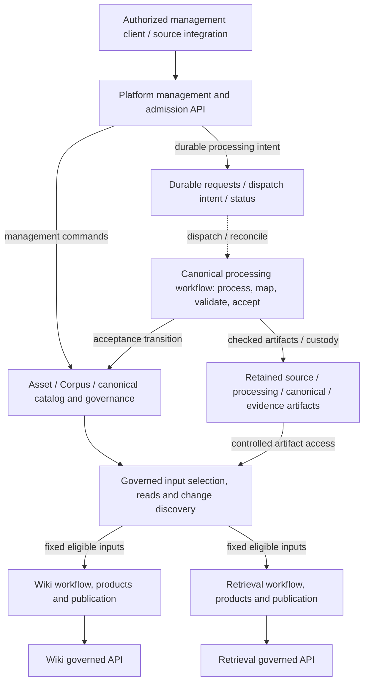

# Knowledge Platform — overall design review

[Design notes](README.md) · [Decision synthesis](knowledge-platform-logical-design.md)

**Reviewed candidate:** 2026-09-27, with fresh-context spike clarifications
incorporated on 2026-09-28. **Status:** user-confirmed logical baseline: ownership,
boundary semantics, scenario coverage and detailed-decision handoffs. This is not
an implementation specification, physical deployment approval, or completion of
the separate Architecture Direction Review. Decision authority remains the records in
[Define the overall Knowledge Platform logical system design](https://github.com/davidlinnnn/data-ingestion/issues/58).

## Review outcome

The Q1–Q25 decisions fit a coherent logical design. No contradiction was found
that requires reopening them at this level. The review identified missing
boundary semantics, storage comparisons and recovery walkthroughs; this document
supplies those outlines and assigns unresolved mechanisms to existing decisions.
It does not certify implemented end-to-end behavior.

The confirmed logical baseline is:

- The platform owns Asset/Corpus lifecycle, durable ingestion admission, canonical
  acceptance/custody, and governed canonical consumption.
- Processing and projections use shared Temporal infrastructure, with independently
  owned workflows. Processing completion, canonical acceptance, and publication
  remain separate outcomes.
- Wiki and Retrieval own their products, APIs and independent coherent publication.
  Shared governance is mandatory; a universal serving gateway is not required.
- Production rebuild is a managed, recoverable operation. For major breaking
  migrations, people judge the report and timing; the workflow executes release.
- First adoption proves a controlled Corpus, both projection paths and one breaking
  upgrade rehearsal. Full legacy PROD replacement is a separate adoption scope.

## Components and authoritative state

These are logical modules, not a requirement for one service or database per box.
Commands, reads and durable workflow execution are different interactions.

Canonical, Wiki and Retrieval workflow execution uses Temporal; the diagram does
not prescribe one parent/child workflow tree. Artifact boxes represent custody
classes, not buckets. Source registration and admission must expose the agreed
single submission meaning even if implemented by several internal modules.

| Owner | Authoritative state | Must not be confused with |
|---|---|---|
| Platform lifecycle/canonical modules | Source observations, Asset/Corpus relationships, accepted revisions, acceptance/exception decisions and required supporting evidence, governance decisions | Parser objects, workflow history, an index's current contents |
| Admission module | Accepted requests and durable execution intent; queryable outcomes with observation time and workflow references | Temporal availability or its execution status alone |
| Temporal and workers | Execution history/progress and orchestration; checked processing artifacts remain in their stores | Business acceptance, perpetual audit storage or backup of knowledge |
| Projection | Definition/method, actual selected inputs, product versions, publication candidates, validation evidence, release/withdrawal decisions, publication state, serving behavior and unique projection data | Authority to change canonical history or expand source access |

A projection owns the semantics of its declared product operations, such as
ranked retrieval. An External Consumer owns application-level query orchestration,
additional ranking and context assembly over those interfaces. A native top-k
operation and a consumer's cross-tool reranking therefore have distinct owners.

Canonical and projection owners retain the domain decision facts and supporting
evidence above for their applicable lifecycle/custody periods. These records must
not depend solely on request records' terminal-plus-30-day retention or Temporal
history. Representation, retention and erasure remain detailed domain/persistence
work; no central audit service or perpetual retention is implied.

Source content remains untrusted input. Source/capture authority, checksums,
bounded parser execution and governed artifact access must survive each boundary.
Embedded document text cannot grant management authority or alter workflow policy.

## Contract outline

Identifiers below denote required meanings, not final field names or endpoint
schemas. Existing internal processing version numbers are not public API versions.

| Boundary | Inputs and interaction | Success and failure meaning | Consistency / owner |
|---|---|---|---|
| Client → submission | Authorized captured Source Revision, immutable artifact identity, requested method, optional Corpus association; HTTP admission then asynchronous processing | `202 + request_id` means durable accepted intent, immediately queryable; it does not mean parsing or acceptance succeeded. Malformed/unauthorized/capacity-rejected requests must not falsely report acceptance | Admission owns acceptance and status. Batch envelope/item validation and source-registration/intent atomicity remain in admission design |
| Client → lifecycle | Authorized Asset/Corpus commands and target identities; completion semantics must be explicit per operation | Membership mutation is distinct from processing, withdrawal and purge. A membership-only call need not imply parsing | Lifecycle owns authoritative relationships; revisions/concurrency and any missing-result scheduling remain in canonical/admission design |
| Admission → workflow | Immutable request, frozen resolved method/profile, source references; asynchronous durable dispatch | Lost start acknowledgement means an uncertain start to reconcile, not permission to create conflicting work | Stable dispatch identity and retry semantics must prevent duplicate effects. Request persistence and Temporal are separate transaction domains |
| PDF core → canonical | Versioned complete processing-result reference, typed content, evidence, checksums, method and limitations; asynchronous governed mapping/acceptance | Check business outcome and required artifacts. Partial/failed results are not accepted; quality/judgment exceptions remain explicit | Platform owns acceptance; protect adopted evidence before completing acceptance. Internal result IDs are not Canonical Revision IDs |
| Corpus/canonical → projection | Corpus scope or explicit targets, selection/completeness policy and compatible method requirements; bounded reads plus asynchronous change discovery | Resolve exact eligible Canonical Revisions and actual inputs, or explicit not-ready/unavailable/unsupported outcomes with authorization-safe coverage | Platform owns resolution/read authority; projection owns its selected input record and progress. Snapshot consistency and retryable selection remain detailed work |
| Projection → publication | Candidate product version, actual input references, producing method, validation and current governance eligibility; asynchronous build/release | A complete eligible product becomes current independently. A failed build may retain an eligible old version; it cannot preserve revoked access | Projection owns publication, stale-run protection and reader semantics; switch/enforcement mechanics remain open |
| Human → major migration release | Authorized decision on a named candidate and validation report | Approval permits the defined release after required rechecks; it is not blanket approval for a changed candidate | Workflow executes the release. Evidence freshness, competing releases and approval expiry remain projection/governance contracts |

The processing seam is verified in local code: `PDFProcessing` initializes
`canonical_accepted=False` and can return `status='failed'` after catching an
Activity error. A Temporal execution can therefore complete normally without a
successful processing business result. Consumers must inspect that result and
resolve checked artifact references. See [workflow code](../../src/pdf_processing/processing_workflow.py)
and the [internal handoff contract](../../src/pdf_processing/README.md#typed-content-and-source-evidence-t06).

Resolve a Materialization Input Snapshot at a defined selection boundary and
retain exact references; do not hold a database transaction open throughout
OCR/LLM execution. Exact references still require current access eligibility.

## Storage candidates and decision boundary

**Review recommendation, not a selected database:** evaluate PostgreSQL for
transactional metadata plus object storage for large immutable payloads first.
Keep MongoDB as a viable alternative. Do not add a separate event broker merely
because Temporal is used. Existing checkpoint storage remains its own integration.

| Candidate | Fit for these responsibilities — architectural inference | Cost / evidence still required |
|---|---|---|
| PostgreSQL relations + JSONB + object storage | Relationships, unique request identities, revision references and mutable selection records can use transactions/constraints; evolving structured content can use JSONB; large evidence stays in object storage | Transaction/isolation boundaries, indexes, JSON granularity, HA/restore and workload capacity need design and validation; no atomic transaction with Temporal/object storage |
| MongoDB + object storage | Nested canonical documents fit document aggregates; multi-document transactions can cover cross-record changes when needed | Aggregate boundaries, shared membership relationships, transactional concerns/retries and operating capability need validation; do not accumulate every Corpus relationship into an unbounded document |
| Object manifests as the main catalog | Natural for immutable revision manifests, fixed-input records and exports | Mutable membership/current selection, idempotency and dispatch would need application-managed indexing and cross-object consistency/recovery; this shifts DB responsibilities into application protocols |

Facts behind the comparison: PostgreSQL provides transactions and relational
constraints, while JSONB supports indexing; it does not preserve exact original
JSON formatting/key duplication, so retain original evidence bytes separately.
MongoDB supports single-document atomicity and multi-document transactions, whose
guarantees depend on the configured concerns. AWS S3's documented strong
consistency and single-key atomicity do not provide atomic multi-key updates;
these AWS guarantees are not evidence about every S3-compatible backend.
[PostgreSQL capabilities](https://www.postgresql.org/about/),
[PostgreSQL JSON types](https://www.postgresql.org/docs/current/datatype-json.html),
[MongoDB transactions](https://www.mongodb.com/docs/manual/core/transactions/),
[AWS S3 consistency](https://docs.aws.amazon.com/AmazonS3/latest/userguide/Welcome.html).

Admission and canonical metadata may share a database if their contracts and
operational requirements fit; this is not decided. Payload custody classes need
not require separate physical stores. Projection stores remain product-owned.
An Elasticsearch index, if selected by Retrieval, is not the canonical authority.

Every candidate must address these commit boundaries:

1. **Admission commit → Temporal start:** retain accepted intent through a crash
   or outage and reconcile ambiguous starts. Temporal persists its own workflow
   start; it does not enlist the application DB in that transaction. A durable
   request dispatcher or transactional intent/outbox is a candidate, not a newly
   selected broker. [Temporal start lifecycle](https://github.com/temporalio/temporal/blob/main/docs/architecture/workflow-lifecycle.md).
2. **Artifact write → canonical acceptance:** handle uncommitted orphan artifacts
   and lost acknowledgements; acceptance must not expose missing or cleanup-prone
   evidence. Define reference protection and cleanup ordering.
3. **Accepted change → projection observation:** notifications can accelerate
   work, but recovery must reconstruct missed work from authoritative state.
4. **Candidate build → published version:** govern the switch, late writers and
   uncertain acknowledgements; runtime/query configuration must match the product.
5. **Backup restore → renewed serving:** reconcile restored content against current
   withdrawal/deletion obligations before restoring access.

Final physical selection belongs to [Select canonical persistence and artifact ownership](https://github.com/davidlinnnn/data-ingestion/issues/57),
coordinated with the admission decision if stores are shared. Feature availability
is not proof of the required single-node failure tolerance or recovery targets.

## Change discovery and workflow boundaries

| Mechanism candidate | Benefit | Obligation that remains |
|---|---|---|
| Poll/query authoritative state or changes | Small integration surface and a natural recovery path | Define consistent pagination/cutoff, deletions, checkpoint retention and request load |
| Push notifications | Lower normal discovery delay | Duplicates, gaps, ordering and unavailable consumers still need durable recovery |
| Push for wake-up plus reconciliation | Responsive updates with a recovery path | More moving parts; justified by freshness/load requirements |

Start detailed comparison with a query/reconciliation path; add push only when
the operating envelope justifies it. This is a recommendation for evaluation,
not a finalized protocol. Reconciliation can itself run as a Temporal workflow.
Choose document-level processing and independently owned projection workflows;
exact workflow granularity, queue isolation and version rollout remain open.

## End-to-end walkthroughs and verification obligations

| Scenario | Required sequence / outcome | Verification in the detailed design |
|---|---|---|
| First submission | Capture/authorize → durable admission → complete processing → mapped/validated canonical acceptance with custody → fixed projection inputs → independent builds → governed publication | Correlate request, source/method, Canonical Revisions, materialization and Published View Version; distinguish all three success boundaries |
| Batch of 100, one invalid at submission | Validate envelope/items, return an explicit admission outcome for each relevant item according to the chosen batch contract | Batch admission atomicity remains unresolved; do not infer it from independent execution of admitted items |
| 100 admitted, three fail processing | Preserve 97 outcomes; expose failures; complete-input projections report not-ready, explicitly partial projections report coverage | Repeat delivery must not overwrite success or silently broaden completeness |
| Accepted request, response/start acknowledgement lost | Client retry and dispatcher recovery resolve the accepted identity and reconcile workflow state | Same-key/same-input retry versus mismatched-input behavior, no lost accepted work or conflicting execution; exact API behavior belongs to admission |
| Temporal unavailable | Within the accepted bounded capacity/outage requirements, preserve queryable requests and dispatch later | Test outage recovery and reject unaccepted new work honestly when capacity/storage is unavailable |
| Corpus 100 → 105 / member removal | Reuse existing eligible canonical data; process missing inputs as defined; select fixed actual inputs; projection updates itself | Missing-result scheduling on membership-only commands, cutoffs, ordinary removal and current eligibility |
| Projection down or late run completes | Other projections continue; recovering projection reconciles; obsolete output cannot silently replace the intended current version | Missed/duplicate/out-of-order changes, tombstones or equivalent deletion representation, and stale publication guards |
| Canonical DB committed, no notification | Discover the accepted revision through the recoverable change/read contract | Crash each side of notification delivery; no permanent missed materialization |
| Withdraw/delete during build or approval wait | Deny ineligible disclosure and prevent a late run/old approval from restoring it | Recheck at applicable read/publication boundaries; include caches and retained rollback generations |
| Adopted evidence plus processing cleanup | Establish retained custody before acceptance; reclaim only artifacts outside protected obligations | Crash/lost-ack interleavings, integrity failures and shared-reference cleanup |
| Breaking upgrade | Resolve compatible inputs → bounded candidate rebuild → validation report → authorized release decision → reconcile/recheck → switch → observe/retire | Query-model/index compatibility, live mutations/deletions, old worker completion, uncertain switch, and eligible rollback |
| Storage loss/restore | Recover authoritative and unique data; reconstruct only derivatives with available eligible dependencies | Backup consistency, current governance reconciliation, measured restore/rebuild cost and recovery targets |

Two concrete acceptance cases from the
[fresh-context spike](../reviews/knowledge-platform-overall-spike-2026-09-28.md)
belong to those existing validation obligations:

- If a person approves K1/report R1 and catch-up creates materially different K2,
  the K1/R1 approval cannot authorize K2. Bind the changed candidate/evidence to the
  applicable renewed release decision. Governance rechecks may reject K1; they do
  not extend its approval to unreviewed output. Projection/governance design owns
  the exact validity and cutover protocol.
- If a t0 backup allows access, revocation takes effect at t1, and a t2 failure
  leaves only that backup, the restored grant cannot prove current authorization.
  Keep disclosure fail-closed until trustworthy current governance is established.
  Governance/persistence design owns that recovery mechanism and its operating targets.

## Evidence and assumptions

| Classification | Record and practical limit |
|---|---|
| Human-confirmed design constraints | Q1–Q25 records indexed in the [logical design](knowledge-platform-logical-design.md); agreements are design inputs, not measured guarantees |
| Inspected implementation | The review inspected local PDF code at `6d929e1`; the relevant input/registry contracts were subsequently compared with the accepted integration tip, as recorded in the [version-bound evidence refresh](https://github.com/davidlinnnn/data-ingestion/issues/53#issuecomment-5871056247). This checkpoint is based on accepted `dev` commit `9e00ddc47968343d157a05db2e5bc433c4e86b7e`; no whole-platform execution was run in this review |
| Bounded external qualification record | [Q04 scoped acceptance](https://github.com/davidlinnnn/data-ingestion/issues/51#issuecomment-5836549290) is closed with 16 named release gates; evidence is bound to source/producer/profile/runtime identities, not universal PDF support |
| PDF qualification update — 2026-09-30 | [T09a scoped acceptance](https://github.com/davidlinnnn/data-ingestion/issues/44#issuecomment-5868212755) is complete for the fixed serial workload and topology, integrated into `dev`. [T09b: Calibrate group size and concurrency against full-workflow and recovery cost](https://github.com/davidlinnnn/data-ingestion/issues/45) and [T10: Package and qualify the deployable PDF core and integration handoff](https://github.com/davidlinnnn/data-ingestion/issues/46) remain open. Consult their current evidence before inferring capacity; earlier open-T09a wording described the 2026-09-27 snapshot |
| User-reported scenarios | Wiki/index behavior and legacy RAG operational pain were described by the user; their actual implementations were not inspected |
| Unverified operating assumptions | Pilot scale, update rate, freshness/availability targets, recovery loss/time targets, quotas and supported production topology await the operating-envelope decision |
| Unselected mechanisms | Public API/schema shapes, source authority mapping, DB/backend, acceptance transactions, dispatch/change protocol, release units, workflow rollout, backup/restore and enforcement |

The independent PDF core remains unblocked by this map. A future canonical adapter
must compare the agreed contract with the qualified producer output; any evidence
gap or changed completion requirement needs a bounded integration decision.

## Confirmed handoff

The native child order/dependencies were checked on 2026-09-27 and still match
the intended decision sequence. No extra service, infrastructure ticket or blanket
PDF-core dependency is needed from this review.

| Decision stage | Existing owner and dependencies |
|---|---|
| Logical skeleton confirmed | [Define the overall Knowledge Platform logical system design](https://github.com/davidlinnnn/data-ingestion/issues/58): user confirmed ownership, boundary meanings and handoff after incorporation of the spike feedback on 2026-09-28 |
| Source boundary and operating envelope | [Define captured-source identity and authorization handoff](https://github.com/davidlinnnn/data-ingestion/issues/53) follows overall review; [Set the first-adoption workload and operating envelope](https://github.com/davidlinnnn/data-ingestion/issues/54) can proceed independently |
| Canonical and admission contracts | [Design canonical schema and lifecycle across PDF, Markdown, and PPTX](https://github.com/davidlinnnn/data-ingestion/issues/32) follows source identity; [Design ingestion admission, task status, and infrastructure integration](https://github.com/davidlinnnn/data-ingestion/issues/31) also requires the operating envelope |
| Projection and governance | [Define canonical consumption and publication for Wiki and Retrieval](https://github.com/davidlinnnn/data-ingestion/issues/55) follows canonical contracts; [Define governance enforcement across canonical data and published views](https://github.com/davidlinnnn/data-ingestion/issues/56) follows projection contracts |
| Physical persistence | [Select canonical persistence and artifact ownership](https://github.com/davidlinnnn/data-ingestion/issues/57) follows governance and the operating envelope; coordinate shared-store choices with admission |

Governance and persistence requirements constrain every earlier discussion; their
later finalization does not postpone considering them. New findings may require
revisiting a contract. Detailed decisions remain open and are not covered by a
logical-skeleton endorsement.

The user confirmed this logical ownership, contract outline, scenario coverage and
explicit handoff after asking to incorporate the independent spike feedback.
Storage and change-discovery recommendations remain starting points for comparison;
this confirmation does not select PostgreSQL, polling or a production topology.

### Follow-through checkpoints

The map's [Not yet specified register](https://github.com/davidlinnnn/data-ingestion/issues/52#not-yet-specified)
is the authoritative tracking location for remaining PDF integration, pilot
coexistence and additional operational uncertainty. Its 2026-09-28 follow-through
clarification assigns revisit points to the existing decisions and requires an
explicit disposition before their closure. Map completion must account for every
remaining item; affected specification/implementation handoffs must trace required
work and validation to their owners and tickets. These checks occur during design
and handoff, not after implementation. Independent PDF-core qualification remains
unblocked; full legacy PROD replacement is not silently added to pilot scope.
