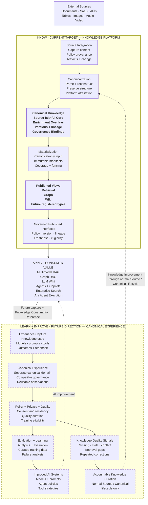

# Enterprise AI Data Foundation — Knowledge Loop

This Mermaid diagram is an editable discussion aid derived from
[`HLD.md`](../../HLD.md) and the screenshot in
[`knowledge-loop.png`](knowledge-loop.png).

[`ARCHITECTURE-BASELINE.md`](../../ARCHITECTURE-BASELINE.md) remains the sole
normative source. A diagram change is a proposal until the coordinated
documents adopt it.

## Reading guide

- **Know:** source understanding is performed once and preserved as governed,
  source-faithful Canonical Knowledge before consumer specialization.
- **Apply:** Multimodal RAG, Graph RAG, LLM Wiki, agents, copilots, and search are
  External Consumers. Their value is delivered through Governed Published
  Interfaces.
- **Learn:** future Experience Capture may preserve what knowledge, models,
  prompts, and tools participated in an execution, together with outcomes and
  feedback.
- **Improve:** experience may improve AI systems or produce accountable
  knowledge-quality signals. Knowledge changes return through normal Source or
  Canonical lifecycle events; they do not mutate Canonical Knowledge directly.

## Editing guardrails

Keep these boundaries intact unless the Architecture Baseline is deliberately
being reconsidered:

1. External Sources and External Consumers remain outside the Knowledge
   Platform.
2. External Consumers use Published View interfaces only; Governed Canonical
   Read is not a consumer interface.
3. Materialization consumes Canonical Knowledge and does not re-access or
   re-parse a Source.
4. Canonical Experience is a separate future canonical domain, not part of the
   current Knowledge Platform target.
5. A Knowledge Consumption Reference records what governed unit was observed;
   it is not a grant or a new read path.
6. AI and knowledge improvement paths retain policy, lineage, versioning, and
   accountable ownership.
