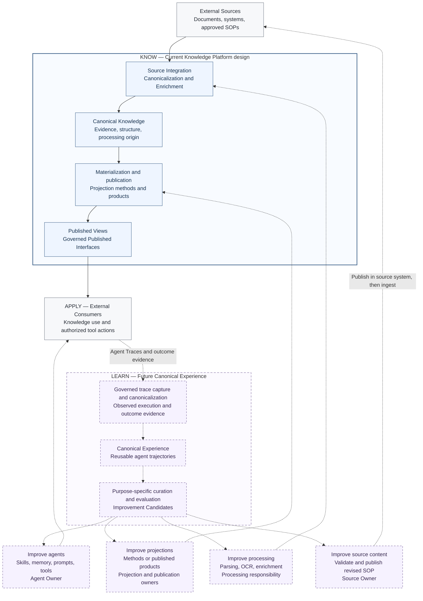

# Enterprise AI Data Foundation — Knowledge Loop

Conceptual diagram for [HLD.md](../../HLD.md) and the current
[Architecture Baseline](../../ARCHITECTURE-BASELINE.md). Solid connections show
the current Knowledge Platform design focus; dashed connections show future
experience and improvement paths. No box implies a deployed capability or a
separate physical service.

```mermaid
flowchart TB
    SRC["External Sources<br/>Documents, systems, approved SOPs"]

    subgraph KP["KNOW — Current Knowledge Platform design"]
        PROC["Source Integration<br/>Canonicalization and Enrichment"]
        CK["Canonical Knowledge<br/>Evidence, structure, processing origin"]
        MAT["Materialization and publication<br/>Projection methods and products"]
        PV["Published Views<br/>Governed Published Interfaces"]
        PROC --> CK --> MAT --> PV
    end

    AG["APPLY — External Consumers<br/>Knowledge use and authorized tool actions"]
    SRC --> PROC
    PV --> AG

    subgraph EXP["LEARN — Future Canonical Experience"]
        CAP["Governed trace capture and canonicalization<br/>Observed execution and outcome evidence"]
        CE["Canonical Experience<br/>Reusable agent trajectories"]
        EVAL["Purpose-specific curation and evaluation<br/>Improvement Candidates"]
        CAP -.-> CE -.-> EVAL
    end

    AG -.->|"Agent Traces and outcome evidence"| CAP

    A["Improve agents<br/>Skills, memory, prompts, tools<br/>Agent Owner"]
    P["Improve projections<br/>Methods or published products<br/>Projection and publication owners"]
    C["Improve processing<br/>Parsing, OCR, enrichment<br/>Processing responsibility"]
    S["Improve source content<br/>Validate and publish revised SOP<br/>Source Owner"]

    EVAL -.-> A
    EVAL -.-> P
    EVAL -.-> C
    EVAL -.-> S
    A -.-> AG
    P -.-> MAT
    C -.-> PROC
    S -.->|"Publish in source system, then ingest"| SRC

    classDef current fill:#eef5ff,stroke:#42658c,color:#17314e
    classDef future fill:#f6f2ff,stroke:#78629b,color:#36284e,stroke-dasharray:5 4
    classDef outside fill:#f7f8fa,stroke:#737b86,color:#242a33
    class PROC,CK,MAT,PV current
    class CAP,CE,EVAL,A,P,C,S future
    class SRC,AG outside
    style KP fill:#f8fbff,stroke:#42658c,stroke-width:2px
    style EXP fill:#fcfaff,stroke:#78629b,stroke-dasharray:6 4
```

## Reading the feedback paths

A skill or memory change returns to the agent. A projection method or product
change returns to materialization and publication. A processing method change
produces new attributable knowledge-processing results. A source-content change
is validated and published in the source system, then captured through normal
Source Integration.

These paths express different responsibilities, not four mandatory new services.
Evaluation proposes a change; the relevant owner adopts it. Runtime traces and
agent conclusions do not automatically become authoritative knowledge or eligible
memory/training data. Policy and purpose controls apply from capture onward.

The combined processing box keeps the overview readable. The
[HLD responsibility view](../../HLD.md#6-conceptual-architecture-and-responsibilities)
separates Source Integration, Canonicalization, Canonical Knowledge, and serving.
Method improvement affects processing; it does not itself change source content.

## Rendered companion

[knowledge-loop.png](knowledge-loop.png) is rendered from the Mermaid block above
using [mermaid-config.json](mermaid-config.json). Extract the block into a `.mmd`
file and pass that configuration to Mermaid CLI when regenerating the PNG.
Update the Mermaid and rendered image together when changing this overview.
The HLD's Mermaid responsibility view provides a more focused current-scope view.
