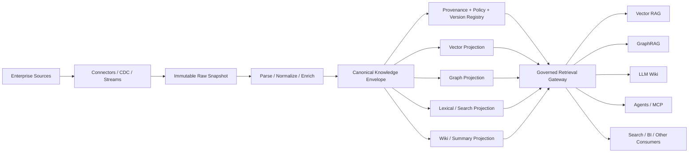
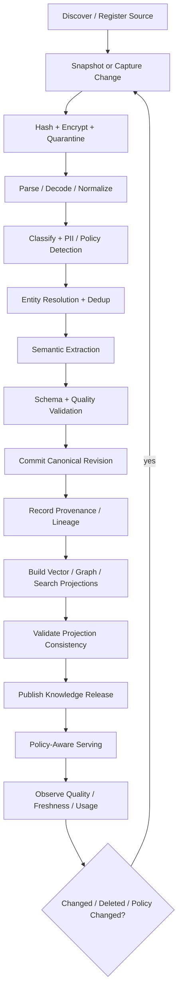
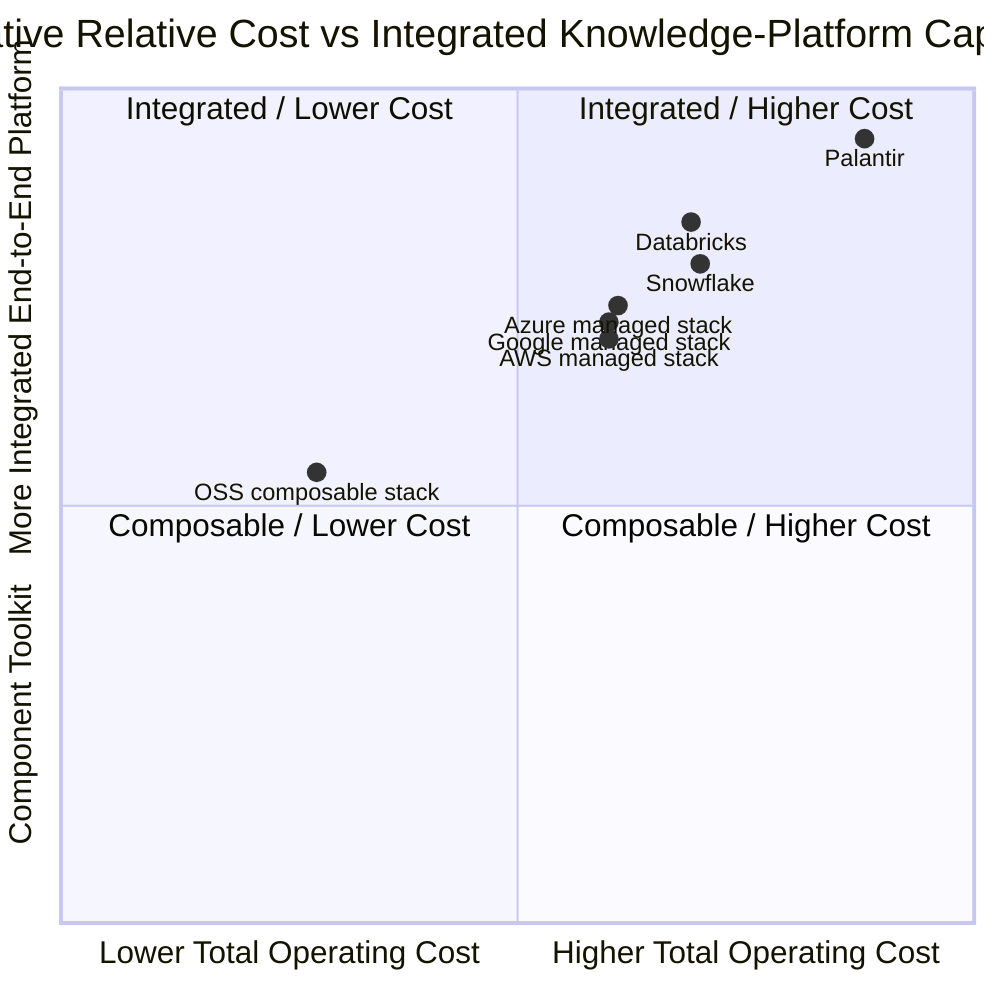
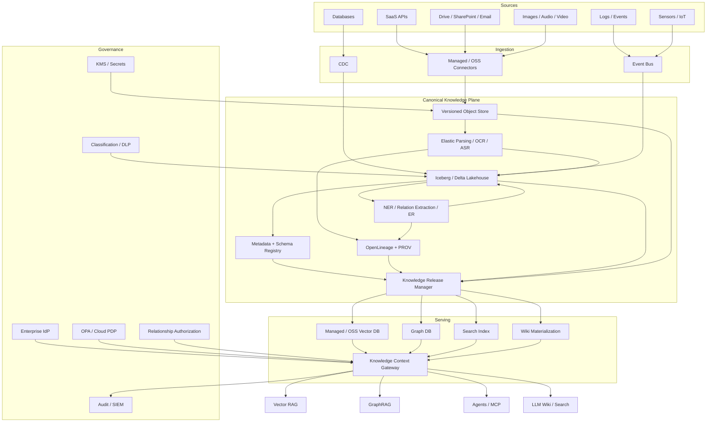
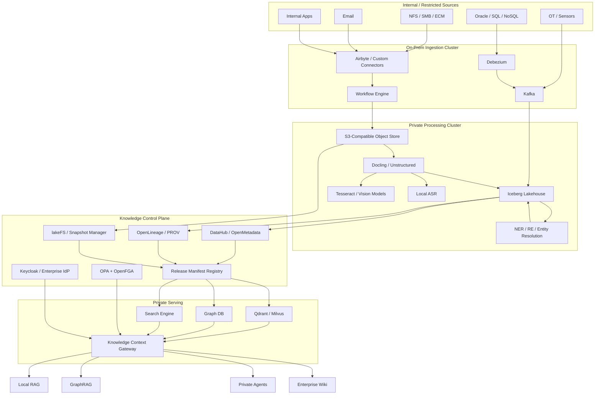
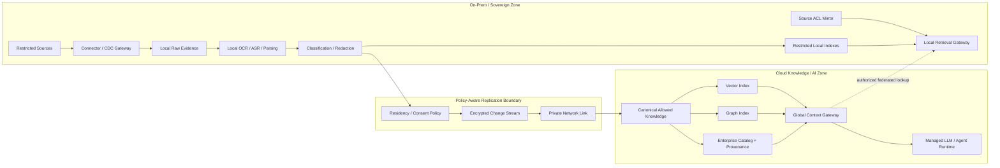

<!--
Filed as a primary source for #19 (Reconcile the team survey with the architecture baseline).
This is a teammate's survey, preserved as received. Classification lives in team-survey-reconcile.md.
-->

# Enterprise Knowledge Ingestion Platform: Reference Architecture, Canonical Knowledge Model, Governance, and Delivery Roadmap

**Research date:** August 22, 2026  
**Scope assumption:** This report assumes no specific enterprise size, industry, cloud, data volume, or budget. Recommendations therefore target a vendor-neutral architecture that can start with a departmental deployment and scale toward a multi-region, regulated enterprise. Where effort and cost ranges are given, they are **rough-order-of-magnitude planning estimates in 2026 USD**, not vendor quotes.

## Executive summary

An enterprise knowledge-ingestion platform should not be designed as “a pipeline that puts documents into a vector database.” That architecture works for prototypes but breaks down when the enterprise needs reproducibility, deletion, policy enforcement, source-level permissions, structured data, multimodality, GraphRAG, agents, or defensible answers to questions such as *“which exact source version produced this answer?”*

The recommended design is a **canonical knowledge fabric** built around a **Canonical Knowledge Envelope, or CKE**. “Canonical” should mean a stable enterprise contract for identity, metadata, provenance, policy and versioning—not one physical database. The authoritative representation should combine immutable source snapshots, normalized modality-neutral knowledge units, semantic assertions, provenance, authorization/policy metadata, and release/version information. Vector indexes, graph indexes, search indexes, GraphRAG community summaries, and LLM-generated wiki pages should normally be **derived projections** of that representation rather than systems of record.

This approach aligns well with existing standards and platform primitives. W3C PROV defines interoperable provenance concepts around **Entity, Activity and Agent**; OpenLineage provides an execution-oriented model around datasets, jobs and runs; RDF provides a standardized graph model, while SHACL can validate RDF structures. citeturn16view0turn16view1turn16view8turn8search1 Modern lakehouse formats such as Apache Iceberg provide snapshots, time travel and rollback, while Delta Lake exposes table versions/change data and lakeFS offers Git-like immutable commits and branching over object storage. citeturn16view2turn1search1turn1search35

The target end-to-end architecture is:



The most important architectural conclusions are:

| Decision | Recommendation | Why |
|---|---|---|
| Canonical representation | **Multi-layer CKE, not a single vector or graph DB** | Preserves evidence, supports multiple consumers, avoids model/index lock-in |
| Raw data | Immutable or effectively immutable, content-addressed snapshots | Enables replay, audit, reprocessing and reproducibility |
| Knowledge unit | Stable ID plus content, source locator, structure, policy, provenance and version | Creates a modality-neutral contract |
| Embeddings | Derived projection keyed to canonical IDs | Embedding models and dimensions change; vectors are lossy representations |
| Knowledge graph | Assertions with evidence and temporal/provenance fields | Avoids turning probabilistic extraction into unexplained “truth” |
| Versioning | Source snapshot + unit revisions + semantic schema versions + signed **knowledge release manifest** | Makes an entire multi-store knowledge state reproducible |
| Authorization | Preserve source ACLs and enforce policy again at query time | Permissions change independently of indexed content; retrieval itself can leak sensitive data |
| Provenance | W3C PROV semantics plus OpenLineage operational capture | Combines artifact-level explanation with pipeline/run lineage |
| Consumers | One policy-aware Context/Retrieval Gateway with multiple adapters | Prevents each RAG/agent application from reimplementing security, citations and time travel |
| Adoption | Start with high-value sources and Vector RAG, but establish identity/version/provenance contracts first | Avoids expensive migration from a “vector database as truth” prototype |

Several existing products now cover meaningful pieces of this model but not the entire problem. Databricks Unity Catalog, for example, combines access control, lineage, audit, classification and governance of data/AI assets; Snowflake provides lineage and policies at the query-engine layer; Palantir's Ontology maps enterprise data into objects, properties and links with integrated governance. citeturn17view0turn17view1turn17view10turn17view2 Cloud RAG services have also become substantially more capable: Azure AI Search supports text, vector and multimodal retrieval; Bedrock Knowledge Bases supports text, images, multimodal documents and structured data; Google Agent Search supports structured/unstructured stores and source-aware authorization. citeturn17view4turn17view6turn17view8turn17view9 Even so, none should automatically become the sole canonical enterprise knowledge layer.

A realistic first-year program generally requires roughly **10–14 core FTEs at peak**. Under the planning assumptions used here, a typical cross-enterprise first production program is approximately **$2.1–6.7 million in year one**; a focused OSS-heavy pilot can be approximately **$1.2–2.8 million**, while a global regulated deployment with significant commercial licensing, hybrid infrastructure and compliance engineering can exceed **$5–15 million**. Those figures are dominated by people and integration complexity rather than vector-storage cost alone.

The single most important success criterion is therefore not “how many embeddings can the system store.” It is:

> **Can the organization reproduce, authorize, explain, update and delete every piece of knowledge delivered to an AI consumer, while retaining enough semantics to serve new consumer types without re-ingesting the enterprise?**

## Architectural thesis and canonical knowledge model

The core design principle is to distinguish **evidence**, **normalized knowledge**, **semantic interpretation**, and **serving indexes**.

A PDF page, database row, email, video segment or sensor observation is evidence. A parsed paragraph, table row, transcript segment or sensor window is a normalized knowledge unit. “Acme acquired Example Ltd.” is a semantic assertion derived from evidence. A 3,072-dimensional embedding representing the paragraph is merely an index projection. Treating all four as equivalent creates provenance, update and governance problems.

W3C PROV is particularly useful because it intentionally separates entities from activities and agents and supplies relationships for describing how one artifact was generated or derived from another. citeturn16view0 RDF is useful when interoperable graph semantics are important because its data model expresses subject-predicate-object triples and supports datasets containing named graphs. citeturn16view8 Neither requires that the entire platform physically use an RDF database.

**Recommended canonical layers**

| Layer | Representative objects | Authoritative? | Main responsibilities |
|---|---|---:|---|
| Source registry | source, connector, owner, native ACL model, schema, SLA | Yes | Source identity and ingestion contract |
| Raw evidence | original document/object, DB snapshot/change event, message, media | Yes | Replay, legal/audit evidence, original bytes |
| Knowledge units | paragraphs, headings, table rows, email parts, frames, transcript segments, events | Yes | Stable modality-neutral retrieval units |
| Semantic layer | entities, entity aliases, assertions, relations, ontology mappings | Yes, with evidence/status | Cross-source semantics and GraphRAG |
| Provenance layer | derivations, pipeline runs, models, prompts, humans, code versions | Yes | Traceability and explanation |
| Governance layer | classification, PII categories, consent/purpose, ACL references, retention | Yes | Policy enforcement |
| Release/version layer | snapshot IDs, manifests, schema versions, index epochs | Yes | Reproducibility and time travel |
| Vector projection | dense/sparse vectors + filterable metadata | **No** | Semantic/hybrid retrieval |
| Graph projection | traversal-optimized property/RDF graph | Usually derived | GraphRAG and relationship queries |
| Wiki/summary projection | entity pages, community summaries, generated synopses | Derived | Human/LLM consumption |
| Search projection | lexical/full-text index | Derived | Exact and hybrid retrieval |

This separation matters because current document tools already produce useful intermediate representations rather than only plain text. Docling supports formats including PDF, Office documents, HTML, email, images and audio formats and exposes a unified `DoclingDocument`; Unstructured partitions raw files into typed document elements and associated metadata. citeturn16view4turn19search3turn19search27

**Canonical treatment by modality**

| Source/modality | Canonical unit | Required source locator | Typical semantic enrichment |
|---|---|---|---|
| PDF/Office/HTML | title, section, paragraph, list, table, cell | document/version, page, bounding box, structural path | entities, topics, relations, citations |
| Database | row or logical business record | database/table/PK, source transaction/version | entity mapping, schema semantics |
| Log/event stream | event | stream/topic, partition, offset, event ID/time | event type, actor, affected entities |
| Email | message + MIME parts + quoted-thread segments | mailbox, message ID, attachment, offsets | people/orgs, thread links, intent |
| Image | image + detected regions | object ID, bounding box | OCR text, objects, captions |
| Audio | transcript segment + optional acoustic object | media ID, start/end time | speaker, entities, topics |
| Video | transcript + frame/shot segments | media ID, timestamp/frame | objects, actions, speaker, scene |
| Sensor/time series | observation/window | device/channel, timestamps, sample range | state/event interpretation |
| SaaS API | API resource/event | provider, tenant, resource ID, native version | mapping to enterprise entities |

A canonical record needs enough coordinates to return a user to the evidence. Bedrock's current multimodal knowledge-base result metadata illustrates this principle by carrying source URIs and, for audio/video, segment start/end timestamps. citeturn17view7 An enterprise platform should generalize that concept across every modality.

**Proposed Canonical Knowledge Envelope**

```json
{
  "knowledge_unit_id": "ku:sha256:2d6f...",
  "enterprise_id": "enterprise-001",
  "source": {
    "source_asset_id": "asset:sharepoint:98341",
    "connector": "sharepoint",
    "native_id": "01F7...",
    "native_version": "17",
    "source_uri": "logical://finance/policies/travel-policy.pdf",
    "content_sha256": "95a4...",
    "captured_at": "2026-08-22T04:19:23Z",
    "source_modified_at": "2026-08-21T13:01:02Z"
  },

  "modality": "text",
  "unit_type": "paragraph",

  "locator": {
    "page": 14,
    "bbox": [0.10, 0.22, 0.88, 0.37],
    "char_start": 15120,
    "char_end": 15741,
    "time_start_ms": null,
    "time_end_ms": null,
    "row_key": null
  },

  "content": {
    "text": "Employees traveling internationally...",
    "mime_type": "application/pdf",
    "object_ref": "knowledge-object://sha256/95a4..."
  },

  "structure": {
    "parent_unit_id": "ku:sha256:7aa1...",
    "document_path": ["Travel Policy", "International Travel"],
    "ordinal": 5
  },

  "semantics": {
    "language": "en",
    "entity_refs": ["ent:employee", "ent:international-travel"],
    "assertion_refs": ["assert:01J5..."]
  },

  "policy": {
    "classification": "internal",
    "pii_categories": [],
    "purpose_tags": ["employee-support"],
    "retention_class": "CORP-POLICY-7Y",
    "authorization_ref": "authz:sharepoint:98341:17"
  },

  "provenance": {
    "prov_entity_id": "prov:entity:ku:2d6f...",
    "generated_by": "run:parse:01J5...",
    "derived_from": ["prov:entity:asset:98341:17"],
    "parser": "doc-parser",
    "parser_version": "4.2.1",
    "model_id": "layout-model-x",
    "model_version": "2026-07",
    "code_sha": "1f2b663",
    "prompt_sha": null
  },

  "version": {
    "knowledge_release": "kr:2026-08-22.001",
    "unit_revision": 4,
    "valid_from": "2026-07-01T00:00:00Z",
    "valid_to": null,
    "recorded_at": "2026-08-22T04:20:04Z"
  },

  "quality": {
    "parse_confidence": 0.997,
    "ocr_cer": null,
    "entity_resolution_confidence": 0.94
  }
}
```

The source locator should be modality-specific but the envelope should be stable. Database rows can fill `row_key`; video uses `time_start_ms`; PDFs use page/bounding-box fields. Consumer code therefore does not need a different provenance model for every connector.

**Do not store the embedding as the only canonical representation.** Instead keep a separate projection record:

```json
{
  "knowledge_unit_id": "ku:sha256:2d6f...",
  "embedding_model": "embedding-model-2026-05",
  "embedding_model_revision": "17",
  "dimensions": 3072,
  "chunk_strategy": "hierarchical-v3",
  "projection_epoch": "vector-prod-2026-08-21",
  "created_at": "2026-08-21T18:31:11Z"
}
```

Vector systems such as Qdrant explicitly model a point as a vector plus an ID and JSON payload, and support metadata filtering; Milvus likewise provides metadata-filtered vector retrieval and distributed deployment modes. citeturn19search8turn14search2turn19search21 Those are excellent projection stores, but an embedding cannot itself preserve the wording, evidentiary coordinates, transformation history or semantics necessary for audit and reprocessing.

**Assertions should themselves be first-class, cited records.**

```json
{
  "assertion_id": "assert:01J5YJ...",
  "subject_entity_id": "ent:policy:travel",
  "predicate": "requires_approval_for",
  "object_entity_id": "ent:international-business-class",
  "object_value": null,

  "status": "asserted",
  "confidence": 0.97,

  "source_unit_ids": [
    "ku:sha256:2d6f..."
  ],

  "valid_time": {
    "from": "2026-07-01T00:00:00Z",
    "to": null
  },

  "system_time": {
    "recorded_at": "2026-08-22T04:20:06Z",
    "superseded_at": null
  },

  "extraction": {
    "run_id": "run:relation-extract:01J5...",
    "model": "relation-model-v7",
    "prompt_sha": "2ad9..."
  },

  "policy_ref": "policy:inherit:ku:2d6f..."
}
```

This is preferable to storing a bare graph edge:

```text
TravelPolicy --requiresApprovalFor--> InternationalBusinessClass
```

because extracted facts can be ambiguous, temporally bounded, source-dependent or later contradicted. The graph should therefore retain **claim identity, source evidence, confidence, valid time and system time**. The graph database can materialize a simpler edge for fast traversal while retaining a pointer to the underlying assertion.

**Entity resolution should similarly preserve evidence.** A source entity should not disappear when it is matched to a canonical enterprise entity. Instead:

```text
source-person:crm:123 \
source-person:hr:889  ---> canonical-person:42
source-person:email:x /
```

with each mapping carrying match evidence, method, score, reviewer state and version. Tools such as Splink implement probabilistic record linkage for records that lack common unique identifiers, illustrating why entity resolution is intrinsically an inference rather than a trivial key join. citeturn13search0turn13search16

**Versioning should operate at several distinct levels.**

| Version domain | Mechanism | Example |
|---|---|---|
| Raw object | Immutable object generation/content hash | PDF version `sha256:95a4` |
| Structured table | Lakehouse snapshot / transaction version | Iceberg snapshot `218846...` |
| Knowledge unit | Stable logical ID + immutable revisions | unit revision 4 |
| Assertion | Append + supersede/retract | assertion v3 |
| Ontology/schema | Semantic version | `enterprise-ontology 2.3.0` |
| API | Contract version | `/v1/...` |
| Parser/model/prompt | Immutable build/version/hash | parser 4.2.1 |
| Vector index | Projection epoch | `vector-prod-2026-08-21` |
| Graph projection | Projection epoch | `graph-prod-2026-08-21` |
| Whole knowledge state | **Knowledge Release manifest** | `kr:2026-08-22.001` |

Apache Iceberg explicitly supports querying exact historical table snapshots and rollback. citeturn16view2 Databricks likewise creates a new table version when Delta Lake or Iceberg tables are modified and exposes history/time travel; Snowflake provides historical access through Time Travel over configured retention periods. citeturn18search1turn18search0 S3 and Google Cloud Storage can retain object versions, but the platform should not confuse storage-provider object versioning with the higher-level knowledge-release abstraction. citeturn18search2turn18search3

A release manifest can provide the atomic cross-store boundary that individual databases cannot:

```json
{
  "knowledge_release_id": "kr:2026-08-22.001",
  "canonical_schema_version": "2.1.0",
  "ontology_version": "7.4.2",

  "raw_snapshot": "object-commit:449d...",
  "lakehouse_snapshot": "iceberg:2188465307835585443",
  "assertion_snapshot": "assertion-log:900718",
  "provenance_snapshot": "prov:commit:c17e...",

  "vector_projection": "vector-prod-2026-08-21",
  "graph_projection": "graph-prod-2026-08-21",
  "search_projection": "search-prod-2026-08-21",

  "policy_bundle_version": "policy:2026.08.18.3",
  "created_at": "2026-08-22T05:00:00Z",

  "validation": {
    "schema_tests": "passed",
    "lineage_coverage": 0.9997,
    "policy_tests": "passed"
  }
}
```

This creates **knowledge-level time travel** even when the graph, vector and object stores have different native versioning capabilities.

A useful lifecycle is:



## Ingestion to governed knowledge

The ingestion plane should distinguish three change-capture classes: **full snapshots**, **incremental polling**, and **event/CDC streaming**. The system should not attempt to turn every source into a real-time stream; freshness should be explicitly tiered by business need.

Airbyte's current catalog advertises more than 600 replication connectors spanning databases, unstructured/file sources and SaaS systems and provides both self-managed and cloud modes. citeturn16view5 For transactional databases, Debezium's CDC model captures an initial consistent snapshot and subsequently produces row-level changes from database logs; connectors retain source log positions to support recovery. citeturn2search1turn2search13

A sensible connector hierarchy is:

| Source | Preferred ingestion mechanism | Why |
|---|---|---|
| OLTP DB | CDC + periodic reconciliation snapshot | Low latency without repeated table scans |
| Data warehouse/lake | Table snapshots + change feed | Preserve table semantics/version |
| SaaS API | Incremental cursor/webhook + periodic full reconciliation | APIs often have mutable resources and rate limits |
| SharePoint/Drive/file shares | Change notifications/polling + object snapshot | Need native ACL and version metadata |
| Email | Journal/API incremental ingestion | Preserve thread/message identifiers and ACLs |
| Logs | Kafka/event bus/native log export | Natural event semantics |
| IoT/sensor | Stream bus + window compaction | High rate and temporal semantics |
| Audio/video | Object event + asynchronous media pipeline | CPU/GPU intensive parsing |
| Images/scans | Object event + OCR/layout pipeline | Separate original evidence from extraction |

Every connector should emit the same minimum **ingestion receipt**:

```json
{
  "source_id": "src:crm-prod",
  "native_object_id": "account/93818",
  "native_version": "197",
  "capture_mode": "cdc",
  "source_position": {
    "log_sequence": "0x00000031..."
  },
  "observed_at": "2026-08-22T05:32:12Z",
  "content_hash": "sha256:...",
  "operation": "UPSERT",
  "native_acl_ref": "crm-role-model:v13",
  "schema_ref": "crm.account:v8"
}
```

That receipt is more important than immediately chunking the content: it is the anchor that makes later transformations attributable and idempotent.

**ETL versus ELT should be chosen per transformation.** Cheap, deterministic normalization belongs close to ingestion; expensive and evolving semantic enrichment should usually be replayable from the canonical raw/normalized layer. The recommended pattern is therefore closer to **capture → persist → transform** than a traditional destructive ETL pipeline.

For structured information, retain original types and source keys rather than stringifying every database row into prose. Bedrock Knowledge Bases, for example, now treats structured stores separately and can translate natural-language requests to SQL instead of requiring structured data to be converted to embeddings. citeturn17view6 That is a useful architectural precedent: structured access should remain structured when possible.

**Transformation pipeline by modality**

| Stage | Documents/images | Audio/video | Structured/events |
|---|---|---|---|
| Decode | MIME/archive extraction | codec/container decode | protocol/schema decode |
| Layout | page/block/table detection | shot/frame segmentation | row/event structure |
| Text extraction | native text + OCR | ASR | native fields |
| Semantic parsing | headings/tables/forms | speaker/scene/topic | schema/domain mapping |
| NER | people/orgs/products/etc. | transcript + visual entities | field-based entities |
| Relation extraction | text/table claims | event/action relations | foreign/domain relationships |
| Entity resolution | aliases across documents | speaker/person matching | record linkage/master data |
| Deduplication | exact + near duplicate | media fingerprints/transcript similarity | IDs, event keys |
| Policy enrichment | PII/classification | voice/face/PII sensitivity | column/field classifications |
| Canonicalization | document units | timed units | records/events |

Tesseract remains a widely used open-source OCR engine; Whisper's original research trained a robust speech-recognition system using roughly 680,000 hours of multilingual and multitask weak supervision. citeturn13search19turn13search21 spaCy provides statistical named-entity recognition and entity-linking pipeline components; entity extraction quality should therefore be tested against enterprise-specific names and vocabularies rather than assumed from a generic model. citeturn13search1turn13search17

For documents, parser routing should be explicit. A born-digital PDF should not automatically incur expensive vision/OCR processing; a scanned contract should. Unstructured explicitly documents trade-offs among parsing strategies in speed, cost and quality, while Docling provides local execution suitable for sensitive or air-gapped data. citeturn19search11turn16view4

**Deduplication needs three layers.**

1. **Byte-level:** content hash identifies exact duplicate source bytes.
2. **Normalized-unit:** normalized text/table/media fingerprints identify formatting variants.
3. **Semantic:** similarity models identify near duplicates, but should not automatically delete evidence.

The source instances remain independently traceable even when they map to a shared canonical content object. Otherwise deletion or authorization changes on one source can inadvertently alter another source's evidence.

**Provenance should be captured during execution, not reconstructed after an incident.** OpenLineage defines datasets, jobs and runs and allows extension through facets; its model is well suited for orchestration/run-level events. citeturn16view1 W3C PROV then supplies the semantic representation needed to answer artifact-level questions across different systems. citeturn16view0

A practical mapping is:

| Platform object | W3C PROV mapping |
|---|---|
| Source document/row/media object | `prov:Entity` |
| Parsed knowledge unit | `prov:Entity` |
| Extracted assertion | `prov:Entity` |
| Embedding/index record | `prov:Entity` |
| Ingest/parsing/NER/embedding job | `prov:Activity` |
| Connector/service identity | `prov:Agent` |
| Model | Agent/entity specialization depending governance model |
| Human reviewer | `prov:Agent` |
| Derivation | `prov:wasDerivedFrom` |
| Generation run | `prov:wasGeneratedBy` |
| Operator/model association | `prov:wasAssociatedWith` |

An important publication invariant is:

> **No derived knowledge object may enter a production knowledge release unless its source entity and transformation activity are resolvable.**

OpenLineage can also capture column-level lineage, while metadata catalogs such as DataHub and OpenMetadata can serve as enterprise-wide catalogs over those lineage events. citeturn0search11turn19search6turn14search4turn14search20

**Governance should attach to knowledge at ingestion but be enforced again at consumption.** This is crucial. If Alice lost access to a SharePoint folder five minutes ago, an embedding created yesterday must not continue exposing the document until the next re-index.

Azure's RAG guidance explicitly recommends document-level access control at retrieval time and warns that RAG can expose sensitive information without careful access design. citeturn17view5 Google Agent Search similarly integrates source access control and returns only content accessible to the end user for supported sources. citeturn17view9 These are strong arguments for **late security trimming**.

The recommended policy model combines:

```text
Decision =
  SourcePermission(principal, resource)
  AND ClassificationPolicy(principal, classification)
  AND PurposePolicy(purpose, allowedPurposes)
  AND ConsentPolicy(subject, processingPurpose)
  AND ResidencyPolicy(dataRegion, executionRegion)
  AND RetentionState(now, retentionClass)
  AND AgentDelegationPolicy(user, agent, tool)
```

OPA is useful for declarative policy-as-code and explicitly separates policy decision-making from policy enforcement. citeturn16view9 For document-sharing hierarchies and agent delegation, ReBAC is particularly relevant: OpenFGA represents authorization through user-resource relationships and explicitly describes authorization questions such as whether an agent can invoke a tool based on the delegating user's access. citeturn16view10

A production design can therefore use:

```text
Identity Provider
      |
      v
Policy Enforcement Point --query--> Policy Decision Point (OPA)
      |                                  |
      |                                  +--> attributes / classifications
      |                                  +--> consent / purpose
      |                                  +--> residency / retention
      |
      +--relationship check----------> ReBAC / OpenFGA
      |
      +--source ACL refresh----------> Connector ACL Registry
```

Policy metadata in each unit should ideally include **policy references**, not merely a flattened list of allowed users. Groups and sharing relationships can change faster than the content.

PII handling should also be a pipeline primitive. Cloud DLP systems support detection and de-identification/pseudonymization patterns; for example, Google Sensitive Data Protection supports detecting sensitive content and transforming it through masking or tokenization approaches. citeturn5search2turn5search5 The platform should distinguish **detection**, **classification**, **redaction**, **tokenization/pseudonymization**, and **access control**—they solve different problems.

Governance requirements are not interchangeable. GDPR, for example, defines personal data broadly and regulates processing including collection, storage, retrieval, use and erasure; principles include data minimization and limits on retention. citeturn16view11turn9search28 HIPAA's minimum-necessary standard and Security Rule impose different healthcare-specific restrictions around use and role-appropriate access to protected health information. citeturn9search7turn9search19 NIST's Privacy Framework and AI Risk Management Framework provide voluntary risk-management frameworks rather than substituting for applicable law. citeturn9search1turn9search34

This leads to an important design nuance: **immutable does not mean “retain forever.”** Immutable snapshots should have lifecycle and retention boundaries. For data subject deletion or retention expiry, designs can expire the relevant snapshots, delete specific object versions where legally permitted, or use crypto-shredding/key retirement for specially partitioned encrypted objects. Cloud object stores expose lifecycle/version-deletion mechanisms, and lakehouse time-travel history is likewise constrained by retention. citeturn18search19turn18search26turn18search29

**Storage should be specialized but coordinated.**

| Storage tier | Best fit | Examples | Canonical role |
|---|---|---|---|
| Object store | original files/media, immutable payloads | S3-compatible, cloud object storage | Evidence |
| Lakehouse | structured units, normalized metadata, event history | Iceberg/Delta/Hudi | Canonical tabular state |
| Metadata/catalog | assets, owners, schema, lineage | DataHub/OpenMetadata/Unity Catalog | Control metadata |
| Relational store | manifests, transactions, workflow state | PostgreSQL etc. | Control plane |
| Vector DB | dense/sparse ANN | Qdrant/Milvus/Pinecone/etc. | Derived index |
| Graph DB | entity/assertion traversals | property/RDF graph database | Semantic/projection layer |
| Search index | full text, lexical, facets | Lucene-derived/managed search | Derived index |
| Provenance store | PROV graph/events | graph/RDF/event store | Traceability |

Vector and graph stores should be rebuilt from canonical state after catastrophic corruption rather than being the only recoverable copy. Qdrant supports snapshots/backups, while Neo4j supports full/differential backup chains and point-in-time-oriented recovery techniques; those features improve operational recovery but do not replace canonical release management. citeturn7search9turn14search3turn14search15

**Scalability comes from partitioning the stages independently.** Parsing, OCR, ASR and model enrichment are typically compute-bound; object capture is I/O-bound; vector indexing is memory/storage intensive; graph extraction can be LLM-token intensive; CDC has tight ordering/recovery constraints. A monolithic worker pool creates poor economics.

A robust pipeline should therefore have separate backpressure domains:

```text
connector queue
  -> raw persistence acknowledgement
     -> parsing queue
        -> classification queue
           -> semantic extraction queue
              -> projection queues
```

If graph extraction is six hours behind, source capture should continue safely because the immutable canonical layers decouple ingestion freshness from expensive downstream enrichment.

Recommended reliability invariants include:

| Invariant | Enforcement |
|---|---|
| Raw capture precedes acknowledgement where feasible | Durable write before connector checkpoint |
| Same source version reprocessed twice yields same canonical identity | Content-derived/idempotency keys |
| Parser upgrade never overwrites prior evidence | New derived revision |
| Deletes are explicit events | Tombstones, not silent disappearance |
| Every projection records canonical revision | Projection metadata |
| Index promotion is atomic from consumers' perspective | Alias/epoch switch |
| Failed enrichment does not lose source | Dead-letter + replay |
| Pipeline checkpoint and source position are durable | Transactional state |
| Schema incompatibility blocks production release | Contract validation |
| Missing authorization metadata defaults closed | Deny by default |

## Consumer exposure and API contracts

The ingestion platform should not make application teams query vector databases, graph databases and catalogs directly. Instead it should expose a **Knowledge Context Gateway** that owns identity propagation, policy evaluation, release selection, query routing, citations, provenance and observability.

That architecture makes the canonical layer independent from changing application patterns.

**Consumer mappings**

| Consumer | Canonical input | Projection | Query pattern | Required response metadata |
|---|---|---|---|---|
| Vector RAG | knowledge units | dense/sparse/lexical index | semantic/hybrid top-k + rerank | source locator, release, policy decision |
| GraphRAG | entities, assertions, text-unit evidence | knowledge graph + communities | neighborhood/local/global graph retrieval | assertions + source units + graph version |
| LLM Wiki | entities + cited assertions + source units | generated entity/topic pages | page/read/search | paragraph/sentence citations, freshness |
| Agent | all governed interfaces | tools/context adapters | iterative tool use | principal/delegation, audit ID |
| Enterprise search | knowledge units | lexical/vector index | hybrid/filter/facet | ACL, snippet, source |
| BI/analytics | structured canonical tables | warehouse/lakehouse | SQL | snapshot/version |
| Event consumers | canonical changes | event stream | subscribe/change feed | previous/current revision |
| Compliance/audit | provenance/policy/version | lineage/provenance graph | trace/explain | complete derivation chain |

**Vector RAG.** The primary retrieval document should be the knowledge unit, not the original entire file. Hierarchical parent/child structure should nevertheless be preserved so that the retriever can find a small passage while an answer generator receives broader contextual sections. Hybrid retrieval is advisable where exact terminology, identifiers and semantic similarity all matter. Qdrant, for example, supports dense and sparse vectors in collections; Microsoft's current Azure guidance similarly emphasizes vector/hybrid retrieval and evaluation. citeturn19search12turn4search35

**GraphRAG.** Microsoft's GraphRAG implementation illustrates a distinct retrieval architecture: its indexing pipeline extracts structured information from unstructured text, constructs a knowledge graph, creates community hierarchies and summaries, and supports multiple retrieval modes. citeturn16view6turn16view7turn6search3 Its local search combines graph information with underlying text units, while global search can operate over community reports. citeturn6search24turn6search18 The original GraphRAG research reported improvements over naïve RAG on global sense-making tasks across very large corpora, although those results should not be generalized to every enterprise query type. citeturn6search1

For a canonical enterprise platform, GraphRAG communities and summaries should therefore be versioned **derived artifacts**:

```text
assertions/entities
      |
      +--> graph projection
                |
                +--> community detection
                         |
                         +--> community summary
                                  |
                                  +--> GraphRAG global retrieval
```

A change to a source assertion should invalidate affected graph/community artifacts rather than forcing blind regeneration of the whole corpus.

**LLM Wiki.** An enterprise wiki should be generated from entity/assertion views rather than free-form summarization of an arbitrary document set. A page might be:

```text
Entity: Project Atlas
Release: kr:2026-08-22.001

Summary
  [generated from assertions A12, A19, A22]

Ownership
  - Business owner ...
  - Technical owner ...

Current status
  [assertions A51-A58]

Related systems
  [graph traversal]

Recent changes
  [knowledge release diff]

Sources
  [exact source documents/rows/locations]
```

Each generated section should record the input assertion IDs and generator/model version. When an input assertion changes, the system marks only dependent sections stale.

**Agents.** Agent consumption requires tighter controls than ordinary search because the caller may perform a series of autonomous reads or actions. The current Model Context Protocol provides a standardized protocol for connecting LLM applications to external resources and tools, and its July 28, 2026 specification is explicitly designed as an integration protocol rather than a knowledge-storage model. citeturn15search0 MCP's security guidance recommends authorization for enterprise/user-data scenarios and its current authorization model follows OAuth-based patterns. citeturn15search1turn15search3

The Knowledge Gateway can therefore expose native REST/gRPC plus an MCP adapter:

```text
Agent
  |
  +--> MCP: knowledge.search
  +--> MCP: knowledge.get_entity
  +--> MCP: knowledge.graph_traverse
  +--> MCP: knowledge.get_source
  +--> MCP: knowledge.get_changes
          |
          v
  Context Gateway
          |
          +--> identity/delegation validation
          +--> policy decision
          +--> query planning
          +--> vector/graph/table retrieval
          +--> provenance/citation assembly
```

Never let an agent bypass the gateway simply because it has credentials for the underlying vector store. MCP's security documentation explicitly discusses attacks such as the confused-deputy problem and token misuse; enterprise tools should maintain resource-specific authorization and audit context. citeturn15search3turn15search6

**Proposed OpenAPI-style consumer contract**

```yaml
openapi: 3.1.0
info:
  title: Enterprise Knowledge Context API
  version: 1.0.0

paths:

  /v1/knowledge/search:
    post:
      operationId: searchKnowledge
      requestBody:
        required: true
        content:
          application/json:
            schema:
              type: object
              required: [query, principal]
              properties:
                query:
                  type: string
                mode:
                  enum: [vector, lexical, hybrid, graph, auto]
                  default: auto
                top_k:
                  type: integer
                  minimum: 1
                  maximum: 100
                  default: 10
                release_id:
                  type: string
                  description: Optional reproducible knowledge release
                as_of:
                  type: string
                  format: date-time
                filters:
                  type: object
                  additionalProperties: true
                principal:
                  $ref: "#/components/schemas/Principal"
                purpose:
                  type: string
                include_provenance:
                  type: boolean
                  default: true
      responses:
        "200":
          description: Policy-filtered search results
          content:
            application/json:
              schema:
                $ref: "#/components/schemas/SearchResponse"

  /v1/entities/{entity_id}:
    get:
      operationId: getEntity
      parameters:
        - name: entity_id
          in: path
          required: true
          schema: { type: string }
        - name: release_id
          in: query
          schema: { type: string }

  /v1/graph/traverse:
    post:
      operationId: traverseGraph
      requestBody:
        required: true
        content:
          application/json:
            schema:
              type: object
              required: [start_entities, principal]
              properties:
                start_entities:
                  type: array
                  items: { type: string }
                predicates:
                  type: array
                  items: { type: string }
                max_depth:
                  type: integer
                  maximum: 5
                valid_at:
                  type: string
                  format: date-time
                release_id:
                  type: string
                principal:
                  $ref: "#/components/schemas/Principal"

  /v1/wiki/{entity_id}:
    get:
      operationId: getWikiPage

  /v1/provenance/{knowledge_id}:
    get:
      operationId: explainProvenance

  /v1/changes:
    get:
      operationId: getKnowledgeChanges
      parameters:
        - name: since_release
          in: query
          required: true
          schema: { type: string }
        - name: until_release
          in: query
          schema: { type: string }

components:
  schemas:

    Principal:
      type: object
      required: [subject]
      properties:
        subject: { type: string }
        groups:
          type: array
          items: { type: string }
        delegation:
          type: object
          properties:
            agent_id: { type: string }
            delegated_by: { type: string }
            scopes:
              type: array
              items: { type: string }

    SearchHit:
      type: object
      required:
        - knowledge_unit_id
        - release_id
        - source
        - policy_decision_id
      properties:
        knowledge_unit_id: { type: string }
        score: { type: number }
        content: { type: string }
        release_id: { type: string }
        source:
          type: object
          properties:
            asset_id: { type: string }
            native_version: { type: string }
            page: { type: integer }
            time_start_ms: { type: integer }
            time_end_ms: { type: integer }
        provenance:
          type: object
          properties:
            generated_by: { type: string }
            derived_from:
              type: array
              items: { type: string }
        policy_decision_id: { type: string }

    SearchResponse:
      type: object
      properties:
        query_id: { type: string }
        effective_release_id: { type: string }
        hits:
          type: array
          items:
            $ref: "#/components/schemas/SearchHit"
```

The API intentionally makes `principal`, `release_id`, source location and `policy_decision_id` first-class concepts rather than optional application annotations.

A typical response should resemble:

```json
{
  "query_id": "qry:01J5...",
  "effective_release_id": "kr:2026-08-22.001",
  "hits": [
    {
      "knowledge_unit_id": "ku:sha256:2d6f...",
      "score": 0.873,
      "content": "Employees traveling internationally...",
      "source": {
        "asset_id": "asset:sharepoint:98341",
        "native_version": "17",
        "page": 14
      },
      "provenance": {
        "generated_by": "run:parse:01J5...",
        "derived_from": ["asset:sharepoint:98341:17"]
      },
      "policy_decision_id": "pdp:decision:887341"
    }
  ]
}
```

This permits a RAG system to cite evidence, an auditor to reproduce the result, and a security team to investigate why the request was authorized without exposing internal policy implementation details to every consumer.

## Tool and platform landscape

No single open-source project provides connectors, document understanding, lakehouse versioning, graph semantics, vector serving, W3C-grade provenance, enterprise policy enforcement, metadata governance and consumer APIs equally well. The OSS route is therefore inherently compositional.

**Open-source / open-core component comparison**

Ratings in the following tables are analytical assessments of suitability for this architecture, not vendor benchmarks. “External” means the capability is normally supplied by another platform component.

| Tool / role | Supported modalities | Canonical-model support | Versioning | Provenance / lineage | Policy | Scalability | Cost model | Maturity |
|---|---|---|---|---|---|---|---|---|
| **Airbyte** — connectors | DBs, SaaS, files, unstructured connectors | Low; replication records rather than enterprise knowledge model | Incremental/checkpoint oriented | Connector/source metadata; use external lineage | Limited; external | High connector breadth; 600+ replication connectors currently advertised citeturn16view5 | OSS/self-managed plus commercial managed/enterprise | **High** for integration |
| **Debezium** — CDC | Relational/selected NoSQL DB changes | Change-event model | Strong source-log offsets/snapshots | Strong source transaction metadata | External | High for log-based CDC; initial snapshot plus continuing changes citeturn2search1turn2search13 | OSS | **High** for CDC |
| **Docling** — multimodal parsing | PDF, Office, HTML, email, images, WAV/MP3 and more | Strong document-intermediate representation via `DoclingDocument` | Derived artifacts must be externally versioned | Parser metadata; full lineage external | Local/air-gapped execution; governance external | Horizontally orchestratable | OSS | **Med-High**, rapidly developing citeturn16view4 |
| **Unstructured** — document ETL | Documents, PDFs, images and other file formats | Typed document elements + metadata | External | Element metadata; external lineage | Mostly external | Batch/distributed through orchestration | OSS plus commercial services | **High** in RAG preprocessing citeturn19search3turn19search31 |
| **Iceberg + lakeFS** — canonical lake/object versioning | Structured/semi-structured plus object references | Strong tabular/raw foundation | **Strong:** snapshots/time travel + immutable Git-like object commits | Commit/snapshot metadata; pair with OpenLineage | External catalog/policy | Very high | OSS/self-hosted; commercial services available | **High** citeturn16view2turn1search35 |
| **DataHub / OpenMetadata** — metadata plane | Metadata across DB, BI, pipelines, files, services | Strong metadata/asset model; not content store | Metadata/version capabilities, not content time travel | **Strong lineage/catalog** | Governance metadata/workflows; enforcement usually external | High | OSS plus managed/enterprise options | **High** citeturn19search6turn14search7turn14search29 |
| **OpenLineage** — lineage standard | Processing jobs/datasets, modality-neutral metadata | Lineage model rather than content model | Run/event history | **Very strong operational standard** | None | Designed for cross-system interoperability | OSS/open standard | **High** citeturn16view1 |
| **Qdrant / Milvus** — vector serving | Embeddings of text/image/audio/video etc.; payload metadata | Vector + payload projection | Snapshots/backup; not canonical content versioning | External, although IDs/payload can carry refs | Metadata filters; enterprise auth external/edition-dependent | Distributed options; Milvus documents deployments from local to very large distributed collections citeturn19search4turn19search21 | OSS/self-host + managed options | **High** |
| **OPA + OpenFGA** — authorization | Modality-independent | Policy/relationship model, not content model | Policy/model versions should be managed in Git/release system | Decision logging can support audit | **Very strong policy decision + ReBAC** | Designed as separate authorization services | OSS plus managed ecosystem | **High** citeturn16view9turn16view10 |

For an OSS-first enterprise, a credible reference stack is therefore something like:

```text
Airbyte / Debezium / Kafka
        +
Docling / Unstructured / OCR / ASR
        +
Iceberg + object storage + lakeFS
        +
OpenLineage + DataHub/OpenMetadata
        +
PostgreSQL control plane
        +
Qdrant or Milvus
        +
Graph DB
        +
OPA + OpenFGA
        +
custom Knowledge Context Gateway
```

The benefit is architectural control and portability; the cost is integration and operational ownership.

**Commercial / managed platform comparison**

| Platform | Supported modalities | Canonical-model support | Versioning | Provenance | Policy / governance | Scalability | Cost model | Maturity |
|---|---|---|---|---|---|---|---|---|
| **Databricks Lakehouse + Unity Catalog** | Structured, files/unstructured, models/AI assets; document AI capabilities in surrounding stack | Strong lakehouse/catalog model; custom CKE still advisable | Delta/Iceberg versions/time travel | **Strong:** automatic lineage and auditing | **Strong:** privileges, ABAC, row/column controls, classification citeturn17view0 | Enterprise cloud scale | Consumption + platform/cloud commitments | **High** |
| **Snowflake + Horizon + Cortex** | Primarily structured/semi-structured plus growing document/AI capabilities | Strong governed data object model; KG semantics require modeling | Native Time Travel | **Strong** source/target lineage | **Strong:** policies execute at query layer, sensitive-data classification, masking/row access citeturn17view1turn17view10 | Enterprise cloud scale | Consumption/credits + edition | **High** |
| **Palantir Foundry/AIP/Ontology** | Broad enterprise structured/unstructured integration | **Very strong semantic object/link model** | Platform-managed histories/versioning patterns | Strong lineage/integration | **Very strong integrated governance/security** | Large-enterprise deployments | Custom enterprise subscription | **High** citeturn17view2turn11search1 |
| **Microsoft Azure AI Search + Foundry** | Text, vectors, multimodal search | Search/index-oriented; canonical layer should be external | Search-index generations operationally; canonical history external | Source/index metadata, broader Azure lineage tools external | Document-level retrieval controls and Entra-based access patterns | Managed cloud search | Consumption/provisioned service | **High** citeturn17view4turn17view5 |
| **AWS Bedrock Knowledge Bases** | Text, images, multimodal docs; structured via supported data stores | Managed KB/vector/structured retrieval abstraction | Source/index lifecycle; full enterprise release semantics external | Source metadata/timestamps available | IAM, metadata filters and AWS governance ecosystem | Managed cloud scale | Usage + underlying vector/model/storage services | **High** citeturn17view6turn17view7 |
| **Google Agent Search + Document AI / Sensitive Data Protection** | Structured data, documents, images; rich document OCR/parsing services | Search/data-store model; custom semantic canonical layer external | Source/store lifecycle; canonical history external | Metadata plus broader Google governance stack | Strong source-aware end-user access control; DLP/de-identification services | Managed cloud scale | Usage/service consumption | **High** citeturn17view8turn17view9turn5search22 |
| **Pinecone** — managed vector tier | Vectorized text/image/etc. + metadata | Embedding + metadata only | Operational index lifecycle; canonical version external | Provenance fields supplied by application | Metadata/namespace filtering; application authorization needed | Managed/serverless vector scale | Usage/managed service | **High** for vector retrieval citeturn7search0turn7search12turn7search30 |

A key conclusion from this comparison is that the most integrated commercial platforms are strongest when an enterprise is already concentrated in that vendor's data/security ecosystem. Cross-cloud enterprises, regulated on-premises environments and companies with many line-of-business SaaS systems still benefit from a vendor-neutral CKE contract.

**Illustrative cost-versus-capability positioning**

The following is deliberately **not a pricing comparison**. The coordinates are analytical scores based on the architecture above. The horizontal axis includes software, infrastructure and operational staffing—not just license price. Actual economics can reverse depending on enterprise discounts, scale and existing skills.



Managed offerings reduce some infrastructure work but do not eliminate ingestion engineering, ontology design, policy modeling, entity resolution, data-quality work or source-specific ACL semantics. Azure's own RAG documentation notes that retrieval, embeddings and added context introduce additional latency and cost beyond model-only requests. citeturn17view5

The primary buy-versus-build decision should therefore be made separately for four planes:

| Plane | Build tendency | Buy tendency |
|---|---|---|
| Connectors/parsers | Buy/use OSS ecosystem unless source is proprietary | Strong |
| Storage/index engines | Rarely build databases | Very strong |
| Governance/catalog | Buy/OSS platform and integrate | Strong |
| **Canonical knowledge contract + gateway** | **Enterprise-specific; own the contract** | Vendor implementation possible, but avoid proprietary lock-in |

Owning the canonical schema and consumer contract is substantially more strategic than owning the vector database implementation.

## Reference architectures and deployment patterns

The three scenarios below use the same logical knowledge model. Only data placement, control-plane ownership and execution boundaries differ.

**Cloud-native reference architecture**

Best suited to organizations already operating predominantly in one or more public clouds and willing to use managed object storage, stream services, Kubernetes/serverless workers, managed databases and AI services.



Managed cloud RAG services can substitute for individual serving components: Azure AI Search currently handles text, vector and multimodal search; Bedrock Knowledge Bases can ingest multimodal sources and use multiple vector-store backends; Google Agent Search provides structured and unstructured data stores. citeturn17view4turn17view6turn17view8 The recommendation remains to keep canonical versions and provenance independently accessible so replacing the serving technology does not require re-ingesting the enterprise.

**On-premises / air-gapped reference architecture**

This deployment prioritizes data sovereignty, offline operation and control over model execution. Docling explicitly supports local execution for sensitive and air-gapped scenarios, while vector systems such as Qdrant and Milvus offer self-hosted deployment paths. citeturn16view4turn19search4turn19search5



The trade-off is operational burden: the enterprise owns upgrades, cluster capacity, GPU scheduling, backups and DR. The benefit is that raw evidence and inference can remain wholly inside the controlled network.

**Hybrid reference architecture**

Hybrid should not mean “copy everything to the cloud.” It should mean a **policy-aware split between evidence locality and canonical interoperability**.



A typical hybrid policy might permit the following to leave the sovereign zone:

```text
allowed:
  - metadata
  - redacted knowledge units
  - non-sensitive embeddings
  - canonical entity IDs
  - aggregate graph assertions
  - provenance references

remain local:
  - original regulated documents
  - raw voice/video
  - direct identifiers
  - restricted source rows
  - encryption keys
```

The cloud gateway can federate an authorized query back to the local gateway when source evidence must stay in place.

This is particularly valuable because **embeddings themselves should not automatically be considered non-sensitive**. Whether an embedding may leave a jurisdiction or security domain should be governed explicitly rather than assumed safe.

**Deployment comparison**

| Attribute | Cloud-native | On-premises | Hybrid |
|---|---|---|---|
| Infrastructure effort | Lowest | Highest | High |
| Elastic parsing/LLM access | Excellent | Hardware-dependent | Excellent for allowed workloads |
| Sovereignty control | Cloud-region dependent | Excellent | Excellent with proper partitioning |
| Managed-service leverage | Highest | Low | Medium-high |
| Integration complexity | Medium | Medium | **Highest** |
| Network dependence | High | Low | Medium |
| Air-gap support | Poor | Excellent | Partial |
| Global collaboration | Excellent | Harder | Good |
| Sensitive raw data locality | Configurable | Excellent | Excellent |
| Operational talent required | Cloud/platform | Kubernetes/data/ML infra | Both |
| Best fit | Cloud-first enterprise | defense/industrial/high sovereignty | multinational/regulated mixed estate |

## Delivery roadmap, migration strategy, evaluation, economics and risk

The implementation should proceed by establishing **contracts before scale**. The anti-pattern is spending the first six months loading every enterprise file into a vector DB and addressing identity, ACLs, provenance and deletion afterward.

A concrete build sequence is:

**Foundation.** Establish enterprise source IDs, source asset IDs, content hashes, knowledge-unit IDs, canonical metadata/schema, provenance events, policy hooks and knowledge-release semantics. Define source ownership and freshness classes before building complex semantic extraction.

**Capture.** Implement raw immutable capture for three to five representative sources: ideally one database, one collaboration/document repository, one SaaS API and one high-volume event source. Support create/update/delete and ACL changes from the beginning.

**Normalize.** Implement modality-specific parsing into the common knowledge-unit envelope. Preserve structural hierarchy and exact evidence coordinates.

**Govern.** Classify content, attach native ACL references, integrate enterprise identity, establish policy-as-code and build negative authorization tests.

**Version.** Add source snapshots, normalized revisions, schema versions, provenance and release manifests. Prove replayability by recreating a release in a clean environment.

**Serve Vector RAG.** Project canonical text units into a vector/lexical index and build the Context Gateway. Measure retrieval before optimizing generation.

**Add semantic graph.** Introduce canonical entities, aliases, evidence-backed assertions and entity resolution. Only then add GraphRAG communities/summaries.

**Add Wiki and agents.** Generate citation-bearing derived views and expose controlled tools via native API/MCP.

**Scale and industrialize.** Add source waves, policy automation, disaster recovery, cost controls, incremental recomputation and hybrid placement if required.

A strong incremental migration pattern for organizations that already have multiple RAG prototypes is:

```text
Existing RAG Applications
        |
        v
Existing Vector Stores
        |
        |  Phase A: add canonical IDs/source refs
        v
Knowledge Gateway
        |
        |  Phase B: redirect new ingestion through CKE
        v
Canonical Store
        |
        |  Phase C: rebuild old indexes from canonical store
        v
Versioned Vector / Graph / Search Projections
        |
        |  Phase D: retire direct application-to-index access
        v
Governed Consumers
```

Do **not** require a big-bang migration. Existing vector indexes can initially register their records into the catalog and gradually acquire canonical IDs. New sources should enter through the canonical ingestion path, while high-risk/valuable legacy indexes are migrated first.

A useful prioritization formula is:

```text
Migration priority =
    business value
  × knowledge reuse across consumers
  × data freshness requirement
  × compliance / security risk
  ÷ migration complexity
```

### Twelve-month roadmap

| Period | Primary scope | Milestones | Typical core team | Effort |
|---|---|---|---:|---|
| **Months 1–2** | Architecture, governance, source inventory, CKE v0.1, identity, storage, CI/CD | Canonical schema approved; first 3 sources registered; raw immutable capture; policy threat model | 6–8 FTE | **Medium** |
| **Months 3–4** | Structured CDC + document parsing; metadata/provenance MVP; Vector RAG | First end-to-end cited RAG answers; delete/update propagation; retrieval baseline | 8–10 FTE | **Medium** |
| **Months 5–6** | Versioning/release manager; OpenLineage/PROV; ACL enforcement; DR/replay | First reproducible signed knowledge release; time-travel API; zero-leak authorization test suite | 9–11 FTE | **Medium** |
| **Months 7–8** | NER, relation extraction, entity resolution, graph projection | Enterprise entity model v1; evidence-backed graph; first GraphRAG and Wiki use case | 10–12 FTE | **Med-High** |
| **Months 9–10** | Agent context APIs/MCP; ReBAC/ABAC; delegated identity; cost controls | Production agent pilot using governed knowledge tools; source-level authorization preserved | 11–14 FTE | **High** |
| **Months 11–12** | Scale, performance, additional source waves, compliance evidence, operating model | Production SLOs, DR exercise, audit evidence, migration factory, year-two rollout plan | 12–15 FTE | **High** |

**Recommended team**

| Role | Peak allocation | Responsibility |
|---|---:|---|
| Principal/platform architect | 1 | Canonical model, boundaries, technical governance |
| Product/program lead | 1 | Prioritization, source onboarding, consumer adoption |
| Data/platform engineers | 3–5 | Connectors, CDC, lakehouse, transformations |
| ML/NLP/knowledge engineers | 2–3 | parsing, extraction, ER, embeddings, graph |
| Search/backend engineers | 2–3 | Context Gateway, retrieval, API, vector/graph serving |
| SRE/platform engineer | 1–2 | Kubernetes/cloud infra, reliability, DR, observability |
| Security/privacy engineers | 1–2 | IAM, ReBAC/ABAC, PII, threat model, audit |
| QA/evaluation engineer | 1–2 | golden sets, policy tests, retrieval/e2e evaluation |
| Data governance/ontology specialist | 1–2 | taxonomy, stewardship, entity/relationship semantics |
| Domain SMEs | fractional/federated | ground truth, source interpretation, acceptance |

This points to a **10–14-person core team for a normal first-year enterprise program**, with peaks around 15 depending on source count and compliance scope.

### Rough-order-of-magnitude cost

These estimates intentionally avoid pretending there is one enterprise scale. They assume fully loaded annual labor cost of roughly **$180,000–$300,000 per core FTE** and include an allowance for infrastructure, commercial software and model usage.

| Program type | Representative scope | Year-one ROM |
|---|---|---:|
| **Low / focused** | 6–8 FTE; 5–10 sources; OSS-heavy; one cloud/on-prem environment; Vector RAG first | **$1.2M–$2.8M** |
| **Medium / enterprise baseline** | 10–14 FTE; 15–30 important sources; graph + agent support; production governance | **$2.1M–$6.7M** |
| **High / regulated global** | 18–25+ FTE; hybrid/multi-region; complex ACLs; substantial commercial platform licenses | **$5M–$15M+** |

The largest cost drivers are usually:

```text
source integration / permission semantics
        >
data cleanup / ontology / entity resolution
        >
engineering + SRE
        >
LLM parsing / graph extraction at high volume
        >
search/vector infrastructure
```

This is why optimizing vector storage price before source and semantic complexity are understood often produces false economies.

### Evaluation and testing

Evaluation must span **data ingestion, transformation, semantic accuracy, security, retrieval, end-to-end answers and operations**. RAG evaluation research supports explicitly separating retrieval/context quality from answer faithfulness and relevance. RAGAS, for example, proposed reference-light measures covering aspects such as context relevance and faithfulness, while BEIR demonstrated that retrieval methods behave differently across heterogeneous datasets and that stronger retrieval can incur additional computation. citeturn12search5turn12search0 Current Databricks and Microsoft guidance likewise emphasizes component-level retrieval evaluation alongside end-to-end metrics. citeturn12search3turn12search2

| Layer | Metric | Recommended launch target/example |
|---|---|---|
| Source coverage | % critical sources onboarded | Track against business inventory |
| Capture reliability | successful captures / expected captures | ≥99.5% for production tier |
| Freshness | source-to-queryable p50/p95 | Explicit tier per source |
| CDC correctness | missed/duplicate/out-of-order changes | Zero unexplained loss |
| Parse quality | character/word error, layout/table accuracy | Corpus-specific acceptance threshold |
| Entity extraction | precision/recall/F1 | Per high-value entity class |
| Relation extraction | precision/recall/F1 | Prioritize precision for authoritative graph |
| Entity resolution | pair precision/recall | High precision for automated merges |
| Dedup | duplicate recall / false merge rate | False merge tightly controlled |
| Provenance | % derived objects with complete source/run lineage | **>99%**, ideally release gate |
| Reproducibility | sampled release objects reproduced byte/ID equivalently | **100% sampled** |
| Authorization | unauthorized retrieval rate in negative tests | **0 tolerated** |
| Delete propagation | time from source delete to inaccessible downstream state | Policy/SLA defined |
| Retrieval | Recall@k, Precision@k, MRR, nDCG | Golden-query suite |
| Citation | evidence/citation precision and recall | High enough for regulated use case |
| Generation | groundedness, faithfulness, answer correctness | Use human + automated scoring |
| Freshness | answer using superseded knowledge | Explicit stale-answer rate |
| Latency | retrieval/API p50/p95/p99 | Consumer-class SLO |
| Availability | Context Gateway successful request rate | e.g. 99.9% target |
| Economics | ingestion $/GB, $/1k documents, $/query | By pipeline/consumer |
| Graph value | improvement vs vector baseline | Must justify graph extraction cost |

The numeric values above are recommended engineering targets, not industry standards.

The testing program should include **golden corpora** containing exact source expectations, access-control scenarios, temporal changes, duplicates and extraction ground truth. A release must be tested as a unit rather than testing parsers and indexes independently.

Recommended test suites include:

| Test | Failure it detects |
|---|---|
| Deterministic replay | hidden state/non-reproducible transformations |
| CDC replay/reconciliation | missing, duplicate or reordered changes |
| Schema evolution | breaking connector/canonical changes |
| Parser regression | layout/OCR quality degradation |
| Entity-resolution golden set | accidental entity conflation |
| Retrieval golden set | index/chunk/model regression |
| ACL negative matrix | knowledge leakage |
| Cross-tenant tests | tenant isolation failure |
| Source deletion test | stale vectors/graph/wiki after deletion |
| Policy-update-without-content-update | stale security filters |
| Projection checksum | vector/graph release skew |
| Chaos/failover | recovery/checkpoint weaknesses |
| Prompt-injection corpus | untrusted document instructions |
| Load/soak test | queue buildup, memory leaks, tail latency |
| Model upgrade shadow test | semantic behavior regressions |

The release process should resemble software deployment:

```text
candidate canonical release
        |
        +--> schema validation
        +--> lineage completeness
        +--> PII/classification checks
        +--> ACL negative tests
        +--> retrieval regression suite
        +--> graph consistency tests
        +--> freshness validation
        +--> index checksum/reconciliation
        |
        v
shadow release
        |
        +--> sampled production queries
        |
        v
atomic alias / release promotion
```

SHACL is appropriate for validating RDF/knowledge-graph constraints where the semantic layer uses RDF, while JSON Schema/Avro/Protobuf contracts can perform analogous validation for the CKE/event layer. citeturn8search1

### Observability model

The platform should expose one trace across ingestion and retrieval:

```text
source event
  -> connector run
     -> raw object
        -> parser run
           -> knowledge units
              -> entity/relation extraction
                 -> vector/graph projection
                    -> knowledge release
                       -> user query
                          -> policy decision
                             -> retrieval hits
                                -> LLM answer
```

The trace ID and canonical IDs should cross process boundaries. This enables a production incident such as “the assistant cited the wrong policy” to be traced backward from answer → retrieval result → knowledge unit → parser run → exact document version.

OpenLineage provides a standardized job/run/dataset capture model for part of this chain, while W3C PROV supplies the more general derivation vocabulary needed beyond traditional pipelines. citeturn16view1turn16view0

### Major risks, trade-offs and mitigations

| Risk / trade-off | Failure mode | Mitigation |
|---|---|---|
| **Vector DB becomes de facto source of truth** | Cannot reproduce, reparse or explain knowledge | Canonical raw/unit store; vector as rebuildable projection |
| **Entity conflation** | Two people/products merged, contaminating GraphRAG | Preserve source identities; probabilistic links; thresholds; human review |
| **Semantic extraction drift** | Model upgrade silently changes graph | Version model/prompt/code; immutable assertions; shadow comparison |
| **Stale ACLs** | User sees document after permission removal | Query-time authorization; relationship store; ACL-change ingestion |
| **Policy leakage via cache** | Result authorized for one user served to another | Principal/policy-aware cache keys; post-cache authorization |
| **Policy leakage via summaries** | Wiki/community summary mixes restricted evidence | Derived object inherits strictest/applicable policy; per-claim citations |
| **Deletion not propagated** | Vector/wiki/graph still exposes deleted source | Tombstones + dependency graph + invalidation SLA |
| **Immutability conflicts with privacy deletion** | Old snapshot retains prohibited data | Retention-managed versions, deleteable partitions, crypto-shredding |
| **Missing lineage** | Cannot explain AI response | Publication gate requiring provenance |
| **Cross-store release skew** | Vector index v12 and graph v11 answer same query | Knowledge-release manifest + atomic aliases |
| **Prompt injection in enterprise documents** | Retrieved content manipulates agent/model | Treat retrieved text as untrusted; separate instructions/data; constrained tools |
| **Agent confused deputy** | Agent uses caller authority incorrectly | Delegated identity, audience-bound tokens, per-tool authorization, audit |
| **Graph extraction cost explosion** | Whole corpus repeatedly sent to large LLM | Incremental extraction, model routing, cached units, budget limits |
| **OCR/ASR cost explosion** | Born-digital files unnecessarily use expensive vision | Parser classifier/router; native text first |
| **Knowledge graph becomes “truth by LLM”** | Probabilistic claim presented as fact | Assertion/evidence/confidence model; domain review |
| **Vendor lock-in** | Consumer apps depend directly on one vendor's index schema | Open canonical schemas, REST/MCP gateway, PROV/OpenLineage, adapters |
| **Ontology overengineering** | Multi-year modeling project before value | Thin ontology first; expand from high-value use cases |
| **Data residency** | Restricted evidence crosses boundary | Local extraction, redaction/tokenization, federated retrieval |
| **Low retrieval relevance** | Correct knowledge exists but is not found | Hybrid search, metadata, hierarchical chunking, reranking, evaluation |
| **Freshness vs cost** | Constant re-indexing consumes compute | Source-specific freshness tiers and incremental projections |
| **Strong consistency vs availability** | Cross-store transaction becomes bottleneck | Canonical release eventual build + atomic publication |
| **Schema evolution** | New modality breaks consumers | Versioned CKE; compatibility rules; translation adapters |

Microsoft explicitly advises treating retrieved content as untrusted because documents can participate in prompt-injection attacks, and MCP's security guidance documents agent/tool-specific threats including confused-deputy behavior. citeturn17view5turn15search3

The most consequential trade-off is **strong cross-store consistency versus practical scalability**. Attempting a distributed transaction spanning object storage, lakehouse, vector database, graph database and metadata catalog is generally the wrong abstraction. The recommended approach is:

```text
Canonical commit
      |
      v
Projection builds independently
      |
      v
All required projection epochs validated
      |
      v
Knowledge Release manifest committed
      |
      v
Single release alias atomically promoted
```

Consumers then see either release N or release N+1, not an arbitrary mixture.

### Final recommended target state

The architecture can be summarized as six contracts:

```text
                   ENTERPRISE KNOWLEDGE PLATFORM

             ┌─────────────────────────────────┐
             │ Source Contract                 │
             │ identity • change • ACL • SLA   │
             └────────────────┬────────────────┘
                              │
             ┌────────────────▼────────────────┐
             │ Canonical Knowledge Contract    │
             │ evidence • units • semantics    │
             └────────────────┬────────────────┘
                              │
             ┌────────────────▼────────────────┐
             │ Provenance Contract             │
             │ source • activity • model • run │
             └────────────────┬────────────────┘
                              │
             ┌────────────────▼────────────────┐
             │ Governance Contract             │
             │ ACL • purpose • PII • retention │
             └────────────────┬────────────────┘
                              │
             ┌────────────────▼────────────────┐
             │ Release Contract                │
             │ snapshot • diff • time travel   │
             └────────────────┬────────────────┘
                              │
             ┌────────────────▼────────────────┐
             │ Consumer Context Contract       │
             │ retrieve • graph • wiki • agent │
             └─────────────────────────────────┘
```

The **Source Contract** guarantees reliable capture and source identity. The **Canonical Knowledge Contract** makes multimodal data look coherent without flattening away its original semantics. The **Provenance Contract** answers where each item came from and how it was transformed, using concepts compatible with W3C PROV and operational standards such as OpenLineage. citeturn16view0turn16view1 The **Governance Contract** ensures that knowledge carries policy throughout its lifecycle and that authorization is re-evaluated at serving time. The **Release Contract** turns independently versioned stores into a reproducible enterprise knowledge state. The **Consumer Context Contract** prevents Vector RAG, GraphRAG, wikis and agents from coupling themselves directly to storage implementations.

This separation is also what makes the architecture durable. Vector retrieval technologies will evolve; GraphRAG algorithms will evolve; embedding models will change dimensions; agent protocols will evolve; SaaS connectors will come and go. The evidence, identities, provenance, policy obligations and enterprise semantics have a much longer lifecycle.

Accordingly, the highest-priority first-year investment should not be a particular vector database, graph database or LLM vendor. It should be the **canonical knowledge envelope, immutable evidence chain, release model, policy-aware Context Gateway and automated quality/security gates**. Once those exist, Vector RAG, GraphRAG, LLM Wikis and agents become replaceable, independently optimizable consumers of the same governed knowledge foundation rather than separate data silos.