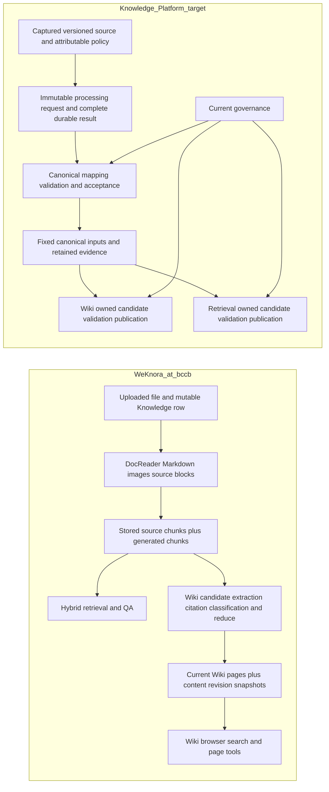

# WeKnora fit for the Knowledge Platform

Research for [#73](https://github.com/davidlinnnn/data-ingestion/issues/73), observed **2026-10-05**. This report records evidence and proposed dispositions. It selects no product, feature, storage engine, protocol, numeric SLA or production deployment.

WeKnora is a credible candidate for the **user-facing Wiki and Retrieval experience**: one knowledge base can ingest several documents, maintain generated topic/entity pages, expose source references, accept corrections and provide hybrid retrieval. The inspected implementation uses shared mutable knowledge/chunk records rather than the platform's distinguishable, accepted Canonical Revisions and independent publication contracts. Its existing permissions and deletion safeguards are useful evidence, but do not establish the current-source authorization and withdrawal contract in #52. Adoption is therefore a comparison of achievable product value and explicit integration work, not a feature-name match. The business pilot and workload remain unselected in #54, so this report does not declare a winning adoption path. [Wiki implementation][wiki-batch], [retrieval implementation][search], [pilot status][pilot].

## 1. Frozen identities and evidence rules

| Input | Frozen identity / authority | Scope |
|---|---|---|
| WeKnora source baseline | `Tencent/WeKnora` **bccb4b151bae403508da77fbb174efc79dc47c1a**; current default-branch head confirmed at research start, and local `git rev-parse HEAD` reproduced it | All implementing-source links below use this commit. This is a main-branch research snapshot, not a released-package qualification. |
| Latest release observed | **v0.8.2**, released 2026-09-24; resolved release commit **3e8b0bfc80b845b2d4b2ed683994748741450a97** | Earlier than the reviewed main snapshot. The conclusions do not assert every reviewed behavior is available in v0.8.2 binaries/images. [Release record][release]. |
| This repository research baseline | `dev` **47b363781448cc72d6cb12df2b76927c101c2e23** | Includes the merged #70 report; research work uses an independent worktree. |
| Qualified PDF implementation | **fe1b283c49c83ad5aeee6808e77b4f25549eba03**, PR #67 | Reuse its bounded qualification; no PDF runtime or historical evidence was replaced. [Handoff][pdf-handoff], [supported scope][pdf-scope]. |
| Existing processing research | #70 report at **47b363781448cc72d6cb12df2b76927c101c2e23** | Capability availability, retained-output probes and illustrative consumer cases remain separate from adoption/consumer qualification. [Report][docling]. |
| Overall design artifact | PR #65 head **b9eae2c8dd7d1c5ff5905d0a635e402176e052b5** | Published working design context; GitHub decision issues govern accepted meaning. [CONTEXT][context]. |
| Design decisions | Complete current #73/#52 bodies/comments and relevant #31/#32/#53/#54/#55/#56/#57/#58/#72 inspected on 2026-10-05 | The accepted charter and later confirmations prevail over an older local glossary or proposal. [Map][map], [overall resolution][overall]. |

Evidence labels used throughout:

- **Documented (D):** first-party documentation describes the behavior. It may lag source or describe configuration rather than measurement.
- **Source-inspected (S):** implementation/schema/migration or upstream test code was inspected at the frozen commit. An upstream test assertion is reported as test-code evidence, not a reproduced pass or production guarantee.
- **Tested (T):** an actual focused check was executed here, with command and limits stated below.
- **Unverified (U):** not established by the inspected path or executed evidence. A source-audit gap is not proof that no alternative implementation exists anywhere.

This was a read-only source/schema/test/doc investigation. No model inference, ingestion, real API round trip, deployment, fault injection, restore, load test or consumer acceptance run was performed. Go was unavailable (`rtk which go`, exit 1); upstream Go tests were not run. The sole executable upstream check was the narrow license-bundle consistency script in section 8. Source presence does not establish operational qualification.

## 2. Current target contract and open decisions

The confirmed first-adoption charter is several documents supporting one Wiki topic and Retrieval over **the same canonical inputs**. Processing Completion, Canonical Acceptance, materialization and publication remain distinct; each projection owns its workflow and coherent publication. An eligible, currently authorized old Published View may serve during ordinary replacement, while revocation/required withdrawal must follow the governance path without waiting for an ordinary rebuild. Standalone Asset ingestion may precede Corpus membership; membership grants no access. Controlled submission of captured versioned files is the initial acquisition slice. [#52 charter][map], [#58 resolution][overall].

The 2026-10-05 decisions matter to this comparison:

| Confirmed requirement | Still open; do not infer from WeKnora |
|---|---|
| **#53 Q1–Q14 confirmed.** Declare accountable source policy authority and authoritative policy source; bind documents to authorization targets through an authorized actor; separately authorize people, workloads and delegated operations; enforce content, existence, summaries, citations, attachments and protected status. Trust decisions only within their scope/validity; unavailable or unverifiable authorization stops affected disclosure. Corpus membership and a provider allow cannot defeat platform withdrawal. | Provider/API/policy representation, cache/freshness bounds, outage/recovery protocol, scope/delegation proofs and enforcement tests. No GAM capability is selected or qualified. [Q12/Q13][auth-confirmed]. |
| Durable lifecycle-command receipt, governance-state application and evidence satisfying the declared enforcement boundary have distinct meanings. Physical purge has a separate completion condition. | Endpoints, fields, scope/timing and mechanisms. Ordinary processing `202` requirements remain intact. [Q13][auth-confirmed]. |
| **Unified lifecycle/status querying is accepted** across canonical outcomes and independently managed projections, with layer-owned facts. It can show canonical accepted, Wiki published and failed new Retrieval while an eligible authorized old Retrieval version serves. | Correlation, query scope/access, freshness/unknown semantics, reconciliation, storage/UI and implementation phasing. It does not require a common workflow or simultaneous publication. [#31 amendment][status-amendment]. |
| Q11 prohibits arrival/completion time, hashes or ordinary timestamps alone from deciding source authority/order; late content cannot restore older reader policy or withdrawn access. | Exact order/precondition/dedup representations and atomic protocols. [Q11][ordering]. |
| **#53 Q14 confirmed: attachment identity belongs to its Capture Package/document-version scope.** Equal bytes, hashes or reused URLs do not merge identity, authority or lifecycle across documents. Retry/redelivery of the same fixed input preserves identity. The first slice excludes a global shared-attachment catalog, cross-document attachment updates and automatic cross-document attachment deduplication. Distinct IDs/copies do not create permission; trustworthy authorization must cover required package contents. [Revised Q14][attachments-confirmed]. | Concrete identifiers/within-document occurrences remain canonical design. Logical identity and physical custody stay separate: eligible approved artifact reuse need not force another upload/copy, but must preserve custody obligations. Revisit global shared management only for a concrete need or measured storage-cost case, with no mandatory later implementation. The assembled source-facing cases/owner handoff still await final shared-understanding review. [Review checkpoint][source-handoff-review]. |
| HTTP-only submission, durable `202 + request_id`, immediate pending lookup, 24-hour Temporal outage handling, terminal-plus-30-day request retention and single admission-storage-node tolerance are accepted inputs. | Acceptance point/request truth and Request DB/inbox, JetStream or outbox choices remain unresolved. [#31][admission]. |

#32 owns representation, version/lifecycle and semantic acceptance; #72 owns fixed required processing profiles and comparative methods; #55 owns product consumption/publication/quality; #56/#57 own enforcement and custody. #54 has started grilling but has **not selected** topic, actual collection, accountable roles, workload/targets or pilot coexistence. The walkthrough below is illustrative, not a business choice. [Canonical scope][canonical], [profiles][profiles], [consumption][consumption], [governance][governance], [persistence][persistence], [pilot][pilot].

## 3. Compact data-flow and retained-input comparison

These are logical responsibilities, not selected deployments. The first flow is **S** from upload, DocReader transport, chunk models, Wiki ingest and search code; the second summarizes confirmed target meanings and pending mechanisms. [Upload][create], [DocReader schema][proto], [chunks][chunks], [Wiki][wiki-batch], [search][search], [map][map].

| Layer / retained input | Actual inspected WeKnora representation (S) | Reuse and contract boundary |
|---|---|---|
| Captured file | `Knowledge` UUID, tenant/KB, file name/path/hash/size, metadata, current processing status, embedding model ID | Useful source handle and digest, but one logical row is updated in place. `ReplaceKnowledgeFile` preserves UUID, replaces current file fields, reparses, then deletes the old file after successful reparse scheduling. It is not an immutable retained Source Revision chain. [Model][knowledge], [replacement lifecycle][replace-lifecycle]. |
| Parsed observations | DocReader `ReadResponse`/stream metadata holds Markdown, images, metadata, error and optional `SourceBlock` ranges; images can stream separately. Go `ReadResult` maps to Markdown/images/source blocks | A practical reader interface; no typed cross-format Canonical Revision, semantic acceptance manifest or full Docling graph contract follows. Engines may omit positions. Streaming schema is not a measured all-process memory bound. [Proto][proto], [read types][read-types]. |
| Shared chunks | UUID, current content, parser `SourceContent`, user-edit revision, index state, context heading, offsets, links/image information and optional `SourceLocators` | Original source chunks are the common input to Wiki and vector/keyword Retrieval. Retrieval can include generated summary/OCR/caption/table chunks; their type is meaningful. Parser-original versus edited content is distinguished, but reparsing replaces the current chunk set. [Chunk model][chunks], [Wiki map][wiki-batch], [search results][search-results]. |
| Evidence location | Locator type can be PDF page/bbox, slide, sheet rows, text offsets, DOCX block, audio time or EPUB section; optional `source_hash`, `mapping`, `partial`, `source_id`, quote | Positive cross-format evidence design. `source_hash` binds a locator to the knowledge row's source hash; it does not by itself retain the old source/result or define accepted-version lineage. Optional/legacy/unmapped cases require explicit handling. [Locator schema][locators]. |
| Wiki current page | UUID, KB-local slug, generated Markdown/summary, status (default `published`), page version, edit author kind, `SourceRefs`, `ChunkRefs`, page links | References identify knowledge documents (legacy `id\|title` also supported; current ingest emits bare ID to avoid leaking filenames) and current chunk UUIDs. These are not canonical/source revision pins or sentence-level immutable derivation evidence. Summary pages intentionally have no chunk-level refs. [Page model][wiki-types], [map path][wiki-batch]. |
| Wiki historical version | Superseded title/content/summary/type/status/aliases, author/time; current content stays on `wiki_pages` | Helpful correction/diff history, bounded by pruning. The revision schema omits source/chunk refs. Revert restores selected historical content into a new current version while preserving current refs/placement. Therefore it is a content rollback, not reconstruction of the exact historical input/lineage snapshot. [Migration][wiki-revisions], [content-only revert][wiki-revert]. |
| Retrieval result | Current hydrated chunk content, chunk content revision, knowledge/title/channel/metadata, score/match type, images/locators | Citable product results, without an independent immutable Retrieval publication version in the inspected path. Unsynchronized/failed chunk edits are excluded from hydration; safe local behavior differs from serving a separately retained old coherent index. [Hydration][search-results], [edit-filter test code][search-edit-tests]. |

A type named `wiki_page` exists in `ChunkType`, but the inspected `CreatePage`/`UpdatePage` paths do not populate a synced page chunk and the current `isSearchableChunk` allowlist excludes that type. Do not assume generated Wiki pages automatically feed hybrid Retrieval. Wiki has its own browser/search/tools. The reuse demonstrated here is of the **source chunks**, not a universal product-serving or canonical API. [Page write path][wiki-page], [retrieval allowlist][search-results], [Wiki tools][wiki-doc].

## 4. Multi-document product case and corrections

**Illustrative common case:** topic “Document processing and recovery,” supported by Paper PDF P, SOP Markdown M with a required image, and PPTX T. A Wiki user wants a grounded topic page connecting explanations and operating steps; a Retrieval user asks what to do after an interrupted run. P/M/T express the three-format design pressure test, not selected pilot material. An existing accepted size-change example is **100 documents plus five additions to the same Corpus and existing Wiki**; it is not a measured WeKnora or platform capacity target. [#32 cases][canonical], [#58 batch/completeness clarification][batch-decisions].

**WeKnora product path (D/S):** create one KB with Wiki plus desired vector/keyword indexing, configure models/parsers, upload the documents, then browse generated summaries/entity/concept pages and links. Wiki maps a document's reconstructed/enriched chunk content, extracts candidate slugs, classifies supporting chunks and reduces updates by slug across documents. It has bounded batching/parallelism and a finalization lane. Hybrid search/QA use the same KB's source chunks and configured indexes. This makes a multi-document topic practical without assuming the platform already has a canonical consumer. Source fidelity, usefulness for this chosen topic and exact citations still require a reviewed fixture run. [Wiki docs][wiki-doc], [map/reduce implementation][wiki-batch], [citation implementation][wiki-cite], [search][search].

**What a user can correct (S):** Wiki editing/revision history distinguishes pipeline, agent, user and revert; issue/lint tools support correction work. Content revisions change for user-visible content, while some reference/link metadata changes do not bump the page version. Generated pages default to published, so this is not an enforced independent candidate/validation/release gate. Re-ingest can modify the same page through the LLM reduce path; an edit author marker is not a promise that human content will never be rewritten. [Page semantics][wiki-page], [Wiki tools/docs][wiki-doc].

Chunk editing separately retains parser-origin `SourceContent`, records a revision/editor, applies an expected-revision conflict check, clears source locators when text changes, then marks indexing `processing`. Search skips pending/failed edits. This is a useful prevention of pretending corrected text still has the original source location. It does **not** automatically turn the edit into accepted canonical correction, preserve source-reviewed truth or update every Wiki claim derived from the old chunk. [Chunk edit][chunk-edit], [search guard][search-results], [upstream edit test code][chunk-edit-tests], [hydration suppression assertions][search-edit-tests].

**Citation precision (S/U):** the Wiki citation pass resolves prompt-local handles to real chunk IDs; images' OCR/caption can enrich cited content, and short internal `[cNNN]` markers are stripped from rendered Markdown while refs persist separately. Test code covers citation union/batching and image enrichment. The fallback extractor may ingest without chunk-level citations after candidate extraction fails; content is truncated to a configured Wiki budget and insufficient text is skipped. Prompts asking for grounded content and stored refs do not prove every output statement follows its source. A product quality gate must account for truncation, fallback/no-evidence, contradictory documents and unsupported extraction rather than report “has citations” as truth. [Citation code][wiki-cite], [citation test code][wiki-cite-tests], [image resolution test code][wiki-cite-resolve-tests], [fallback/truncation][wiki-batch], [rendering strip][wiki-page].

## 5. Requirement → capability / evidence / gap matrix

| Required area / contract | Capability and evidence | Fit / concrete gap / owning handoff |
|---|---|---|
| Several documents → one Wiki topic, Retrieval on common inputs | **D/S:** KB strategies, source chunk sharing, multi-doc map/reduce pages, hybrid retrieval; cited paths above | Strong product similarity. Common retained **accepted canonical versions** and both products' acceptance quality remain **U**. #54 selects case; #32/#55 define shared input/evidence and product gates. |
| Attributable captured versions, result/method versions, evidence and generated origin | **S:** file hash, locator source hash/mapping/partial, chunk type/original-vs-edit, attempt spans, Wiki refs/edit source/revisions | Partial fit. Replacement is mutable; refs/history do not freeze complete canonical/source/method inputs. #32/#57 own immutable retention/lineage; #72 owns frozen method attribution. |
| Source update and method-only reprocessing without silently redefining accepted requests | **S:** replacement preserves knowledge ID; overrides persisted; reparse clears resources and allocates an attempt; stale-task guards and source-replacement tests exist | New attempts are useful, but current KB defaults/models are re-resolved in processing paths rather than a fully resolved immutable platform method manifest. No equivalent retained accepted candidate/current-selection contract established. #31/#32/#72. [Configuration][process-config], [reparse cleanup/attempt][reparse-lifecycle], [attempt test code][attempt-tests], [replacement test code][replace-tests]. |
| Required completion before downstream canonical handoff | **S:** `processing → finalizing → completed`; Wiki per-document op plus configured enrichment accounted by pending counter; completion after terminal success/failure/dead-letter | **Gap:** terminal fanout is not all-required-work-success plus validated durable outputs; vector search can be queryable while finalizing. The PDF handoff's required OCR rule cannot be replaced by this status. #72/#32/#31. [Postprocess][postprocess], [terminal counter][terminal-counter], [PDF handoff][pdf-handoff]. |
| Durable HTTP admission, immediate status, outage/node tolerance, retention/dedup | **D/S:** upload returns 200 with knowledge row; blob then DB then enqueue; enqueue failure can return row marked failed with `success:true`; Redis Asynq or Lite task executor; persistent Wiki lane/spans | Not #31's immutable `202 + request_id` accepted-intent/outage contract. No reproduced 24h outage, one-node loss or terminal-plus-30-day guarantee. A knowledge UUID/hash or task retry does not settle admission dedup. #31; do not select its storage by analogy. [Handler][upload-handler], [creation][create], [queue wiring][container], [recovery][wiki-recover]. |
| Independent projection rebuild/release, authorized old product during replacement | **S:** Wiki and vector/keyword strategies; Wiki async work and user revisions; Retrieval index hydration filters | Separate feature toggles/tasks do not establish independent immutable publication candidates, approval bound to the exact candidate/report, coherent release at a declared projection-owned publication unit or retained old serving version. Reparse destructively clears current indexes before new processing. #55/#57. [Reparse][process], [page writes][wiki-page], [results][search-results]. |
| Unified cross-layer lifecycle/status query with independent facts | **S:** knowledge status, per-attempt stage spans, task inspector, Wiki progress | Useful UI/observability pattern. No equivalent canonical acceptance + independent publication observations, authorized protected status, freshness/unknown/reconciliation contract established. #31/#55/#56; accepted scope amendment is not a reason to merge state machines. [Span schema][spans], [status amendment][status-amendment]. |
| Source policy authority and source authorization ceiling, scoped people/workloads | **D/S:** tenant roles, KB access/shares and API-key capabilities guard Wiki/chunk/search/file routes; task KB/tenant binding guards; document/attachment ownership helpers | Existing KB authority is not attributable externally authoritative Source policy or authorized target binding. A deployment using one uniform delegated team policy may be simpler, but must prove the declaration/validity arrangement. Mixed-source narrowing, cache validity, revoked protected existence/status/evidence and delegation remain **U**. #53/#56; confirmed Q14 requires package-scoped attachment identity without merging authority or lifecycle through shared bytes or creating permission through IDs/copies. [Revised Q14][attachments-confirmed]. [Routes][routes], [access][access], [task binding][postprocess], [Q12/Q13][auth-confirmed]. [Shared-access test code][shared-access-tests] rechecks a KB read grant on the next request; this is local KB authority, not Source policy-current qualification. |
| Withdrawal during work; current governance before disclosure; purge separate | **S:** deleting/cancelled guards, Redis tombstone plus DB fallback, pending-op scrub, durable Wiki retract intent, removal of source/chunk refs | Useful race safeguards, with an urgent gap: multi-source page content remains during async retract after refs are removed; cleanup errors can be best-effort. No declared all-interface stop-disclosure barrier or physical purge proof. #56/#57. [Immediate cleanup/retract intent][delete-retract], [shared-page cleanup test code][delete-shared-tests], [late-work guard][wiki-ingest]. The shared-page assertion covers reference/chunk cleanup, not immediate derived-text removal or global enforcement. |
| Retained source/canonical/evidence custody, rollback/restore | **S:** files/chunks/pages/history, file service abstractions, revision pruning; content revert preserves current refs | Retention caps, old-file deletion, best-effort derivative cleanup differ from target dependency/custody obligations. Restored pre-revocation data cannot establish current access; no reproduced fail-closed restore/reconciliation evidence. #57/#56/#55. [Replacement][replace], [revisions][wiki-revisions], [revert/delete][wiki-page], [overall restore rule][overall]. |
| Quality, operations, maintenance and licensing | **D/S/T:** QA evaluation metrics/dataset path; stages and Langfuse/audit; Compose/Helm; narrow license consistency check | Good tools/configuration; no comparable first-adoption source-fidelity, Wiki truth, governance/recovery or production capacity qualification. Maintained fork/adapter, parser/model versions and distributions add costs described below. #54/#72/#55. [Evaluation][evaluation-doc], [Helm][helm-values], [notices][notices]. |

Current source takes precedence over stale comments: migration `000056` says Wiki is excluded from the finalizing counter, while current `knowledge_post_process.go` explicitly counts its per-knowledge durable operation until it maps or exhausts retries. This report follows the current implementation. That change improves progress visibility without converting `completed` into required-success or publication acceptance. [Migration][pending-migration], [current source][postprocess], [atomic Wiki-slot test code][wiki-slot-tests].

## 6. Six lifecycle walks

These are **source-inspected counterfactual walkthroughs**, not executed integration tests. The target column preserves accepted meanings; mechanisms and numeric targets remain the owning decisions.

| Walk | WeKnora path at bccb (S unless marked U) | Target implication / smallest decision check |
|---|---|---|
| **1. Initial ingestion** | Save each uploaded file, create knowledge row and enqueue parse; DocReader → current chunks/indexes → enrichment + Wiki op → Wiki pages. Upload handler 200 is not completion. Wiki and Retrieval can use the common source chunks; no accepted canonical handoff is interposed. Enqueue error can return a failed saved row. | Fix P/M/T identities and evidence expected by both products, record each item's admission/processing/acceptance/materialization/publication outcome. One invalid document must not turn other admitted docs into a single invented batch outcome. #31/#32/#54/#55. |
| **2. Source content update** | Replace file in place, preserve knowledge UUID, update hash/path, clear/rebuild resources, delete old file after scheduling succeeds. Wiki keeps pending bookkeeping consistent and replaces/retracts old source contributions as new extraction lands. **U:** exact historical source + page lineage reconstruction. | Preserve old eligible authorized publication while building a distinct candidate; pin source/canonical inputs and reconcile current governance. Review same-topic change plus 100+5 additions using actual chosen case; no full rebuild/capacity assumption. #32/#55/#57. |
| **3. Method-only reprocessing** | `reparse` may persist overrides, clears old resources, opens a new attempt, enqueues against the current source; attempts supersede stale work. Parser rules/model/KB defaults can affect rebuilt chunks and Wiki. **U:** stage-compatible artifact reuse or unchanged old accepted method semantics equivalent to the platform. | New immutable processing identity with frozen resolved method/profile; compare required successful outputs and compatibility. Adapt only adopted inputs from qualified PDF result; repeat affected mapping/citation/reuse tests, preserving unchanged PDF qualification. #72/#31/#32. |
| **4. One projection rebuild/failure** | Wiki has an async durable lane and retries/dead letters while source vector index can already be queried; content pages are written incrementally. Chunk reindex failure suppresses that edited chunk. **U:** independently approved coherent Wiki/Retrieval candidate + old serving snapshot. | Demonstrate canonical K accepted, Wiki W published, Retrieval R2 failed while authorized R1 serves, with version/observed status. Approval of K1/report1 cannot authorize materially changed K2 after catch-up. #55/#31/#57. |
| **5. Withdrawal plus late completion** | Marking deleting/cancelled and tombstones short-circuit queued work; `isKnowledgeGone` falls back to DB and treats unreadable/missing/deleting/cancelled as gone. Attempts protect stale processing; deletion scrubs ingest and records retract. Multi-source page refs can be removed before its retained text is asynchronously rewritten. **U:** global current-source authorization/stop-disclosure over pages, snippets, citations, files, histories and caches. | A scope-applicable restriction must stop affected disclosure at the declared boundary, independent of ordinary rebuild. Record durable receipt/applied/enforced/purge separately; late success/provider allow cannot restore withdrawal. Check model-return race, DB/auth outage, stale cache and evidence/history access. #53/#56/#31/#57. |
| **6. Rollback / restore** | Wiki revert creates a new content version, keeps current source/chunk refs and placement; revisions are bounded/pruned. Replacement normally removes previous source file. **U:** backup recovery with current authorization, input/evidence custody and coherent product version restoration. | A content undo cannot claim historical-source lineage. Restoring a pre-revocation backup must first reconcile current governance and required bytes/method identities, then validate eligible views. Breaking-upgrade rehearsal is in first adoption; full legacy PROD cutover is not assumed. #57/#56/#55/#54. |

Sources for walks 1–3: [creation][create], [replacement][replace], [reparse][process], [Wiki map][wiki-batch], [attempt tests][attempt-tests], [replacement tests][replace-tests]. Walks 4–6: [postprocess][postprocess], [search edit filter][search-results], [delete][delete], [late-work guard][wiki-ingest], [revert/history][wiki-page], [overall accepted scenarios][overall]. Exact ordering, publication and enforcement protocols remain open.

## 7. Four adoption paths and concrete seams

| Path | Concrete benefit / plausible seam | Contract fit and change scope | Operating / maintenance / licensing cost | Smallest remaining experiment / decision |
|---|---|---|---|---|
| **A. Direct product adoption** | Fastest way to evaluate complete Wiki browsing/editing/issues plus Retrieval/QA on one KB, using supported upload/model/storage interfaces | Strong ordinary product functionality. The current mutable file/chunk/page model, terminal completion, permissions and reparse/retract paths do not demonstrate target source/canonical version retention, independent coherent publication or source-current enforcement. Meeting unchanged #52 contracts could require a substantial product fork, external admission/canonical/governance layer, or explicitly resolved charter changes. Existing qualified PDF engine cannot be silently swapped. | Operate App, DocReader, chosen metadata/retrieval/file/task/model services; control release/main deltas, migrations and required notice/model rights. Lowest initial UI implementation cost can coexist with high contract/upgrade cost. | #54 selects pilot and priorities, then run a tiny official-release evaluation with fixed multi-doc case, update, one failure and withdrawal; enumerate actual changes/cost before choosing direct adoption. Compare results with B/C/D fairly. |
| **B. WeKnora as Wiki/Retrieval product layer** | Retain platform source/admission/canonical governance; project fixed canonical inputs into WeKnora-managed product candidates. Existing manual-Markdown ingestion, Wiki page writes, page reads and hybrid-search APIs are useful seams | Public manual ingestion accepts Markdown and then performs its own chunking/enrichment; it does not accept a full accepted canonical typed graph/evidence manifest. A naive Markdown export/reupload loses original revision/component/custody meaning or reparses already processed data. Two options to evaluate: versioned product-specific import/reader adapter for Wiki+Retrieval, or external Wiki materializer writing pages through page API. Both need immutable external IDs, exact inputs/evidence, current governance on every serving path, independent release/status and coordinated deletion. Use APIs/code seams; avoid uncontrolled DB writes. | Platform plus product stack; adapter/fork upkeep and duplicate indexing/model cost. Disable unnecessary processing in the adapter only after confirming citation/evidence paths. Keep product scope small; do not inherit sandbox/browser/memory features automatically. Same distribution/model licensing review as A. | Export **one** accepted-input fixture to a versioned adapter contract; show Wiki page and Retrieval answer using exact original evidence; update/fail/revoke it. Verify no hidden reparsing, old authorized publication and protected evidence/status. #32/#55/#56/#57/#72; no implementation adopted by this report. |
| **C. Selected component reuse** | Candidate code seams: DocReader transport/source locators, heading/protected-span chunking, citation classification/image resolution, page revision/correction primitives, evaluation metrics | Useful standalone ideas; dependencies differ. Go chunker is closer to a small library than extracting Wiki ingest service with repos, task lanes, model interfaces, KB/tenant and Redis locks. ReadResult transport is Markdown-oriented and would need explicit loss accounting for typed canonical data. Chosen components must retain their own author/source/generated/error semantics. Asynq/Lite is not a replacement for the accepted Temporal direction. | Audit selected transitive dependencies, copied licenses/tests and upstream update path; extraction can cost more than using the product API. Algorithms and metrics need representative-language/format quality checks. | Select one concrete #32/#55 gap, port/evaluate only its minimal component against existing own baseline. Test source location validity and edited-evidence behavior or one citation case; preserve independent PDF qualification. |
| **D. Selective design borrowing** | Lowest immediate commitment: correction provenance, clearing invalid locators, pending durable work + recoverable triggers, explicit finalizing state, bounded per-KB work/fairness and citation budgets | Fits design discussion without copying product schema. Borrow obligations/edge cases and assess them in layer-owned Temporal workflows, canonical acceptance and publication contracts. No need to adopt specific concurrency values, 50/200 revision caps or mutable knowledge model. | No vendored runtime; retain research source references, write own contract and meaningful acceptance tests. Still costs design/review work. Copying implementation later triggers path C licensing/maintenance. | Carry narrowly ranked candidates below to their current owners and choose the first case needing them; close questions in normal design sessions. |

The existing public seams are **D/S**, not tested canonical integration: [API overview/manual upload/hybrid search][knowledge-api], [Wiki page/history API][wiki-api], [DocReader transport][proto], [chunker][chunker], [Wiki service coupling][wiki-ingest]. No path has an executed cost, correctness or operational qualification comparison. Direct adoption is not rejected simply because it differs from today's implementation; a favorable business-value/cost comparison could justify it if target requirements are explicitly satisfied or revisited by their owners. Conversely, a rich UI does not waive accepted governance.

## 8. Quality, operations, licensing and uncertainty

| Dimension | Inspected evidence | Meaning / limit and next measurement |
|---|---|---|
| Extraction/source fidelity | Parser engine registry and format routing; source blocks/locators; built-in PDF source; parser/source-location test code | **S:** available representations and local assertions, not a P/M/T fidelity pass. Built-in PDF uses PDFium with Go-side image OCR; PPT/PPTX type defaults route to MarkItDown. A parser name or supported extension does not certify tables/order/slide notes/diagram semantics. Review source truth under pinned parser/model/config, including unsupported cases. [Registry][registry], [PDF][pdf-parser], [parser tests][parser-locator-tests], [Docling comparison][docling]. |
| Consumer usefulness and groundedness | Wiki prompts/refs, lint/issues, summaries, correction history; same source chunks searchable | **D/S:** user affordances, not demonstrated topic coverage/truth. Need source-reviewed expected claims, contradictory-doc handling, locator accuracy, fallback/truncation coverage, factual/source vs generated attribution and user question satisfaction. #32/#55/#72 own different quality boundaries. [Wiki][wiki-doc], [citations][wiki-cite], [profiles][profiles]. |
| Retrieval/generation evaluation | Five Parquet tables; qrels/passage truth; Precision/Recall/NDCG/MRR/MAP and BLEU/ROUGE; evaluation clones config and executes QA | **D/S:** retrieval relevance/ranking and lexical answer-overlap metrics. Not PDF extraction accuracy, Wiki factuality, evidence fidelity or authorization testing. Passage IDs are recovered by text containment in the QA metric hook; this approximation is not exact citation lineage. Fixed datasets/config/runtime must be retained for reproducibility. [Evaluation docs][evaluation-doc], [service][evaluation], [metric hook][metric-hook]. |
| Evaluation persistence | In-memory task/detail map; `dataset_id` is a task-label component, while loader reads fixed `dataset/samples` files | **S:** restart loses evaluation records; no durable quality-evidence store follows. Archive dataset hashes, result/config/method IDs and reviewed oracle externally if used for acceptance. [Evaluation][evaluation], [dataset][dataset]. |
| Runtime progress/recovery | Persistent per-attempt spans, errors/times; DB pending ops/dead letters; Wiki trigger repair on startup and housekeeping; Redis/Lite modes | **S:** specific retry/progress mechanisms, not workflow/history equivalence or outage guarantees. Best-effort stage/activity tracking differs from retained authoritative acceptance/release evidence. Current Wiki-slot atomic seeding and retry code plus test assertions are useful design inputs. [Spans][spans], [Wiki recovery][wiki-recover], [postprocess][postprocess], [slot tests][wiki-slot-tests], [retry tests][wiki-retry-tests]. |
| Resource/latency/cost | Wiki batch/concurrency/budgets; streamed image protocol; Helm requests/limits and configurable replicas | **D/S:** defaults/configuration, not measured end-to-publication P95, throughput, cost or HA. No compatible pinned first-adoption benchmark was found in inspected paths. Numeric defaults and design comments about large KBs are not measured capacity. Own PDF group5/one-parser/one-business-request and 4 CPU/5 GiB limit/4 GiB guard are bounded qualified observations, not comparable platform capacity. [Wiki config][wiki-types], [Helm][helm-values], [PDF scope][pdf-scope]. |
| Deployment/upgrade/restore | Helm chart version **0.1.0**, appVersion **v0.8.2**, Kubernetes >=1.25 declaration; configurable App/DocReader/frontend and persistent PostgreSQL/Redis/file storage | **D/S:** deployment topology, not tested compatibility/restore/one-node tolerance. Redis is configured with append-only persistence (`--appendonly yes`) and a persistent volume; these durability settings and default replicas/resources do not establish the accepted one-node failure/outage contract or HA. Main source and image/chart version identity must be aligned before evaluating new fixes. Pin image digests, migrations, model/provider and retrieval backends; declare operator, custody/backup and recoverable-vs-unique data. [Chart][chart], [values][helm-values], [Redis template][helm-redis], [Helm docs][helm-doc]. |
| Code/dependency redistribution | Own code MIT; `LICENSE` plus supplemental notices and `licenses/` bundle | **D/S:** MIT does not mean every dependency/model/data artifact is MIT. Current notices identify MySQL driver v1.10.0 MPL-2.0, macOS go-m1cpu v0.1.6 MPL-2.0, Apache-2.0 OpenCC dictionary data and build-only cbindgen; pin notice/source artifacts for actual distribution. Avoid inferring Linux linkage from the macOS notice or treating older aggregate inventory as a verified current SBOM. [LICENSE][license], [current notices][notices], [module pins][go-mod]. |
| Models/providers/optional components | Configurable remote models/engines and broad dependencies | **U:** rights, data destination/retention, model-weight license and actual selected artifact SBOM. No single model-license statement covers all choices. A/C/B must name actual selected models/backends and review their upstream terms/license and governed destination before adoption; this report does not provide blanket legal clearance. [Model configuration][knowledge-api], [reader dependencies][pyproject], [go.mod][go-mod], [governance owner][governance]. |

**T — actual focused check:** on 2026-10-05, in the frozen upstream checkout, `rtk bash scripts/check-license-bundle.sh` exited **0**, with no output and no downloads/runtime. It checks removal of named GPL converter dependencies from `go.mod`/`go.sum`, two MPL source-pin versions/checksum shapes against `go.mod`, and existence/nonempty required notices. **No packaged `source_dir` was passed**, so release archives, complete SBOM, model licensing and redistribution of a chosen built product remain unverified. Script scope, not a blanket licensing claim, is the result. [Executed script][license-check], [source manifest][license-pins].

No full deployment was needed for this research. The precise uncertainties are now attached to adoption decisions: chosen case quality, source-current enforcement, immutable evidence/custody integration, publication/restore semantics, release compatibility, workload cost and exact selected licenses. A broad benchmark or paid model run before #54 chooses a case would not answer those decisions reliably.

## 9. Ranked dispositions and smallest handoffs

The ranking is by immediate decision value, not a claim of measured financial benefit. Each row remains a proposed disposition; adopting it requires its named owner.

| Rank / disposition | Concrete finding, benefit and evidence | Trade-off / compatibility and affected validation | Owner and smallest next decision / experiment |
|---|---|---|---|
| **1 — Retain** | Retain confirmed #52/#53/#31 boundaries and accepted bounded PDF result/evidence. They make both product paths accountable to exact inputs/current governance rather than labels. [Map][map], [Q12/Q13][auth-confirmed], [PDF handoff][pdf-handoff]. | Integration can require new mappings/work; target contracts can be explicitly reconsidered by owners when evidence warrants, but neither copying WeKnora nor continued custom build is preselected. No reopen/overwrite of historical PDF qualification. | #32/#72/#57 reconcile adopted typed content/evidence with consumer case; #31 retains immutable request/status/outage constraints. Use the existing mandatory revisit rows, with exact gap and affected implementation ticket. |
| **2 — Adopt candidate** | Source-location and correction semantics: cross-format locator + partial/unmapped state, original-vs-edited text, clear invalid locators and suppress unsynchronized edits. Helps prevent false source attribution. [Locators][locators], [chunk edits][chunk-edit], [search guard][search-results]. | Metadata alone cannot guarantee truth; mapped canonical correction/version lineage and retained original source still required. Copying chunk mutation model would conflate layers. | #32/#55/#72. One reviewed P/M/T overlap + edited-text case: prove locator correctness, generated-vs-source distinction and intentional loss/unknown; compare own mapping baseline. |
| **3 — Adopt candidate** | User-facing Wiki page editor/diff, author kind, issue/lint and chunk-based evidence UX; strongest tangible product-layer value. [Wiki service][wiki-page], [revision test code][wiki-revision-tests], [citation tests][wiki-cite-tests]. | Preserve provenance per published version and current-governance evidence access; bounded content history is not canonical history. Product-layer adapter adds upkeep and may duplicate LLM/index work. | #54 chooses topic; #55/#32/#56/#57. One tiny fixed-input Wiki+Retrieval adapter demonstration, showing exact evidence, human correction, update/failure and withdrawal; measure actual calls/latency after case chosen. |
| **4 — Adopt candidate (design borrowing)** | Durable pending intent plus recoverable triggers, bounded per-KB fairness/budgets, stale-attempt guards and explicit terminal subtask accounting expose useful recovery edges. [Postprocess][postprocess], [Wiki startup repair][wiki-recover], [attempt tests][attempt-tests], [follow-up tests][wiki-followup-tests]. | Retain layer-owned Temporal direction; do not adopt Asynq/Lite, exact concurrency defaults, counter exhaustion=success or best-effort logs as authority. Explicit required-vs-optional results and unknown observations remain essential. | #31/#55/#72. Design one durable handoff/duplicate/lost-trigger case and one required child failure; include observation times and reconciled status without merging outcomes. |
| **5 — Defer** | Direct product adoption and large Wiki-service extraction can deliver value, but key governance/version/release contracts and chosen workload are unresolved. [Adoption paths above](#7-four-adoption-paths-and-concrete-seams). | A fork can satisfy contracts but its change/upgrade burden is unmeasured. Full deployment before a selected case is not research completion; defer is not rejection of product use. | #54/#55/#56/#57/#31. Select priorities, inspect release/main delta for required behavior, then compare A/B/C/D using the same small fixture/scenario and explicit integration-cost list. |
| **6 — Defer** | Reuse of QA evaluation can support retrieval relevance/lexical regressions once a compatible reviewed corpus exists. [Evaluation][evaluation-doc]. | Persist/hash data/config/results and account for ID/text-containment approximation. Do not score table fidelity/Wiki truth/revocation using BLEU/ROUGE. | #55/#72/#54. One labeled question set over fixed source inputs, independent source/citation oracle and reproducible result archive; tune one variable only. |
| **7 — Reject** | Reject equivalences “KB=Corpus authorization”, “Wiki revision=Canonical Revision”, “has refs=immutable Evidence Lineage”, “completed=all required success/acceptance”, “queue=accepted #31 guarantee”, “page rollback=historical governed restore”, and “Helm/replicas=qualified HA”. Inspected implementation separates or lacks these proofs. [Matrix above](#5-requirement--capability--evidence--gap-matrix). | These shortcuts would hide integration/validation work. They may be made true only by explicit new contracts plus scoped evidence, not terminology. | All affected owners. State the claimed boundary and counterexample before carrying a capability into a spec; no blanket new dependency or feature backlog. |

## 10. Completion ledger and decision-ready issue summary

| #73 deliverable | Result / remaining boundary |
|---|---|
| Pinned source-linked report | Complete; main snapshot versus latest release, own processing/report revisions and observation date explicit |
| Five-area capability/evidence/gap matrix + compact flow | Complete; implementing paths, schemas and relevant upstream test-code scope linked; product similarity separated from contract equivalence |
| Required lifecycle walks | Initial ingestion, source update, method-only reparse, one-projection failure/rebuild, withdrawal with late work and rollback/restore covered; illustrative case remains unselected business pilot |
| Four adoption paths | Direct adoption, product layer, component reuse and design borrowing evaluated for fit/seams/change/operations/maintenance/licensing |
| Ranked actionable dispositions | Retain/adopt candidate/defer/reject with benefit/evidence/trade-off/owner/impact/smallest follow-up |
| Executable evidence | One actual notice/pin check; no deployment/model/runtime/fault/consumer benchmark claimed |
| Research publication / independent review | This report is the research artifact; independent review and PR/issue/map publication are recorded by the research owner, not adoption or design closure |

**Decision-ready summary:** WeKnora demonstrates a useful shared-source-chunk Wiki/Retrieval product, citation/correction UX, and concrete retry/progress/race safeguards at pinned main `bccb4b1`. Its current mutable source/chunk records, bounded Wiki content history, terminal fanout completion and KB authority do not demonstrate #52's accepted canonical-version/publication/current-source governance contract. The most immediate candidates are provenance-aware correction/citation affordances and bounded recoverable projection-work patterns; a product-layer adapter is worth a focused shared-input test after #54 selects the case. Direct adoption and broad component extraction remain viable alternatives requiring explicit contract-change/cost comparison. QA metrics, streaming and deployment recipes are not source truth, governance or capacity qualification. Reuse the qualified PDF/Docling evidence unchanged; hand representation/custody gaps to #32/#57, processing to #72, admission/status to #31, product to #55 and authorization/enforcement to #53/#56. No feature/product/storage adoption, edge change or production gate follows from research completion.

[map]: https://github.com/davidlinnnn/data-ingestion/issues/52
[overall]: https://github.com/davidlinnnn/data-ingestion/issues/58#issuecomment-5862945216
[context]: https://github.com/davidlinnnn/data-ingestion/blob/b9eae2c8dd7d1c5ff5905d0a635e402176e052b5/CONTEXT.md
[admission]: https://github.com/davidlinnnn/data-ingestion/issues/31
[status-amendment]: https://github.com/davidlinnnn/data-ingestion/issues/31#issuecomment-5991846818
[auth-confirmed]: https://github.com/davidlinnnn/data-ingestion/issues/53#issuecomment-5991845520
[ordering]: https://github.com/davidlinnnn/data-ingestion/issues/53#issuecomment-5968626647
[attachments-confirmed]: https://github.com/davidlinnnn/data-ingestion/issues/53#issuecomment-5992838620
[source-handoff-review]: https://github.com/davidlinnnn/data-ingestion/issues/53#issuecomment-5992917196
[canonical]: https://github.com/davidlinnnn/data-ingestion/issues/32
[profiles]: https://github.com/davidlinnnn/data-ingestion/issues/72
[consumption]: https://github.com/davidlinnnn/data-ingestion/issues/55
[governance]: https://github.com/davidlinnnn/data-ingestion/issues/56
[persistence]: https://github.com/davidlinnnn/data-ingestion/issues/57
[pilot]: https://github.com/davidlinnnn/data-ingestion/issues/54#issuecomment-5979400851
[batch-decisions]: https://github.com/davidlinnnn/data-ingestion/issues/58#issuecomment-5843539018
[pdf-handoff]: https://github.com/davidlinnnn/data-ingestion/blob/fe1b283c49c83ad5aeee6808e77b4f25549eba03/deploy/pdf-processing/HANDOFF.md
[pdf-scope]: https://github.com/davidlinnnn/data-ingestion/blob/fe1b283c49c83ad5aeee6808e77b4f25549eba03/tests/pdf_processing/t09b/SUPPORTED-CONFIGURATION.md
[docling]: https://github.com/davidlinnnn/data-ingestion/blob/47b363781448cc72d6cb12df2b76927c101c2e23/docs/research/docling-capabilities-vs-pdf-core-2026-10-02.md
[release]: https://github.com/Tencent/WeKnora/releases/tag/v0.8.2
[knowledge]: https://github.com/Tencent/WeKnora/blob/bccb4b151bae403508da77fbb174efc79dc47c1a/internal/types/knowledge.go
[chunks]: https://github.com/Tencent/WeKnora/blob/bccb4b151bae403508da77fbb174efc79dc47c1a/internal/types/chunk.go
[locators]: https://github.com/Tencent/WeKnora/blob/bccb4b151bae403508da77fbb174efc79dc47c1a/internal/types/source_locator.go
[read-types]: https://github.com/Tencent/WeKnora/blob/bccb4b151bae403508da77fbb174efc79dc47c1a/internal/types/docparser.go
[proto]: https://github.com/Tencent/WeKnora/blob/bccb4b151bae403508da77fbb174efc79dc47c1a/docreader/proto/docreader.proto
[create]: https://github.com/Tencent/WeKnora/blob/bccb4b151bae403508da77fbb174efc79dc47c1a/internal/application/service/knowledge_create.go
[upload-handler]: https://github.com/Tencent/WeKnora/blob/bccb4b151bae403508da77fbb174efc79dc47c1a/internal/handler/knowledge.go
[replace]: https://github.com/Tencent/WeKnora/blob/bccb4b151bae403508da77fbb174efc79dc47c1a/internal/application/service/knowledge_replace.go
[replace-tests]: https://github.com/Tencent/WeKnora/blob/bccb4b151bae403508da77fbb174efc79dc47c1a/internal/application/service/knowledge_replace_test.go
[process]: https://github.com/Tencent/WeKnora/blob/bccb4b151bae403508da77fbb174efc79dc47c1a/internal/application/service/knowledge_process.go
[process-config]: https://github.com/Tencent/WeKnora/blob/bccb4b151bae403508da77fbb174efc79dc47c1a/internal/application/service/knowledge_process_config.go
[postprocess]: https://github.com/Tencent/WeKnora/blob/bccb4b151bae403508da77fbb174efc79dc47c1a/internal/application/service/knowledge_post_process.go
[knowledge-repo]: https://github.com/Tencent/WeKnora/blob/bccb4b151bae403508da77fbb174efc79dc47c1a/internal/application/repository/knowledge.go
[pending-migration]: https://github.com/Tencent/WeKnora/blob/bccb4b151bae403508da77fbb174efc79dc47c1a/migrations/versioned/000056_knowledge_pending_subtasks.up.sql
[attempt-tests]: https://github.com/Tencent/WeKnora/blob/bccb4b151bae403508da77fbb174efc79dc47c1a/internal/application/service/knowledge_attempt_supersede_test.go
[wiki-slot-tests]: https://github.com/Tencent/WeKnora/blob/bccb4b151bae403508da77fbb174efc79dc47c1a/internal/application/service/knowledge_post_process_wiki_enqueue_test.go
[delete]: https://github.com/Tencent/WeKnora/blob/bccb4b151bae403508da77fbb174efc79dc47c1a/internal/application/service/knowledge_delete.go
[container]: https://github.com/Tencent/WeKnora/blob/bccb4b151bae403508da77fbb174efc79dc47c1a/internal/container/container.go
[wiki-recover]: https://github.com/Tencent/WeKnora/blob/bccb4b151bae403508da77fbb174efc79dc47c1a/internal/container/recover_pending_wiki_tasks.go
[wiki-types]: https://github.com/Tencent/WeKnora/blob/bccb4b151bae403508da77fbb174efc79dc47c1a/internal/types/wiki_page.go
[wiki-revisions]: https://github.com/Tencent/WeKnora/blob/bccb4b151bae403508da77fbb174efc79dc47c1a/migrations/versioned/000075_wiki_page_revisions.up.sql
[wiki-page]: https://github.com/Tencent/WeKnora/blob/bccb4b151bae403508da77fbb174efc79dc47c1a/internal/application/service/wiki_page.go
[wiki-revision-tests]: https://github.com/Tencent/WeKnora/blob/bccb4b151bae403508da77fbb174efc79dc47c1a/internal/application/service/wiki_page_revision_test.go
[wiki-ingest]: https://github.com/Tencent/WeKnora/blob/bccb4b151bae403508da77fbb174efc79dc47c1a/internal/application/service/wiki_ingest.go
[wiki-batch]: https://github.com/Tencent/WeKnora/blob/bccb4b151bae403508da77fbb174efc79dc47c1a/internal/application/service/wiki_ingest_batch.go
[wiki-cite]: https://github.com/Tencent/WeKnora/blob/bccb4b151bae403508da77fbb174efc79dc47c1a/internal/application/service/wiki_ingest_cite.go
[wiki-cite-tests]: https://github.com/Tencent/WeKnora/blob/bccb4b151bae403508da77fbb174efc79dc47c1a/internal/application/service/wiki_ingest_cite_test.go
[wiki-cite-resolve-tests]: https://github.com/Tencent/WeKnora/blob/bccb4b151bae403508da77fbb174efc79dc47c1a/internal/application/service/wiki_ingest_cite_resolve_test.go
[wiki-retry-tests]: https://github.com/Tencent/WeKnora/blob/bccb4b151bae403508da77fbb174efc79dc47c1a/internal/application/service/wiki_ingest_retry_test.go
[wiki-followup-tests]: https://github.com/Tencent/WeKnora/blob/bccb4b151bae403508da77fbb174efc79dc47c1a/internal/application/service/wiki_ingest_followup_test.go
[wiki-doc]: https://github.com/Tencent/WeKnora/blob/bccb4b151bae403508da77fbb174efc79dc47c1a/website-docs/03-features/14-wiki.md
[wiki-api]: https://github.com/Tencent/WeKnora/blob/bccb4b151bae403508da77fbb174efc79dc47c1a/website-docs/04-api/02-api-faq-wiki.md
[knowledge-api]: https://github.com/Tencent/WeKnora/blob/bccb4b151bae403508da77fbb174efc79dc47c1a/website-docs/04-api/02-api-knowledge.md
[search]: https://github.com/Tencent/WeKnora/blob/bccb4b151bae403508da77fbb174efc79dc47c1a/internal/application/service/knowledgebase_search.go
[search-results]: https://github.com/Tencent/WeKnora/blob/bccb4b151bae403508da77fbb174efc79dc47c1a/internal/application/service/knowledgebase_search_results.go
[chunk-edit]: https://github.com/Tencent/WeKnora/blob/bccb4b151bae403508da77fbb174efc79dc47c1a/internal/application/service/chunk.go
[chunk-edit-tests]: https://github.com/Tencent/WeKnora/blob/bccb4b151bae403508da77fbb174efc79dc47c1a/internal/application/service/chunk_edit_parent_test.go
[chunker]: https://github.com/Tencent/WeKnora/tree/bccb4b151bae403508da77fbb174efc79dc47c1a/internal/infrastructure/chunker
[routes]: https://github.com/Tencent/WeKnora/blob/bccb4b151bae403508da77fbb174efc79dc47c1a/internal/router/routes_knowledge.go
[access]: https://github.com/Tencent/WeKnora/blob/bccb4b151bae403508da77fbb174efc79dc47c1a/internal/application/access/knowledgebase.go
[spans]: https://github.com/Tencent/WeKnora/blob/bccb4b151bae403508da77fbb174efc79dc47c1a/migrations/versioned/000055_knowledge_processing_spans.up.sql
[evaluation-doc]: https://github.com/Tencent/WeKnora/blob/bccb4b151bae403508da77fbb174efc79dc47c1a/website-docs/03-features/15-evaluation.md
[evaluation]: https://github.com/Tencent/WeKnora/blob/bccb4b151bae403508da77fbb174efc79dc47c1a/internal/application/service/evaluation.go
[dataset]: https://github.com/Tencent/WeKnora/blob/bccb4b151bae403508da77fbb174efc79dc47c1a/internal/application/service/dataset.go
[metric-hook]: https://github.com/Tencent/WeKnora/blob/bccb4b151bae403508da77fbb174efc79dc47c1a/internal/application/service/metric_hook.go
[registry]: https://github.com/Tencent/WeKnora/blob/bccb4b151bae403508da77fbb174efc79dc47c1a/docreader/parser/registry.py
[pdf-parser]: https://github.com/Tencent/WeKnora/blob/bccb4b151bae403508da77fbb174efc79dc47c1a/docreader/parser/pdf_parser.py
[parser-locator-tests]: https://github.com/Tencent/WeKnora/blob/bccb4b151bae403508da77fbb174efc79dc47c1a/docreader/tests/test_source_locator_pdf.py
[chart]: https://github.com/Tencent/WeKnora/blob/bccb4b151bae403508da77fbb174efc79dc47c1a/helm/Chart.yaml
[helm-values]: https://github.com/Tencent/WeKnora/blob/bccb4b151bae403508da77fbb174efc79dc47c1a/helm/values.yaml
[helm-redis]: https://github.com/Tencent/WeKnora/blob/bccb4b151bae403508da77fbb174efc79dc47c1a/helm/templates/redis.yaml
[helm-doc]: https://github.com/Tencent/WeKnora/blob/bccb4b151bae403508da77fbb174efc79dc47c1a/helm/README.md
[license]: https://github.com/Tencent/WeKnora/blob/bccb4b151bae403508da77fbb174efc79dc47c1a/LICENSE
[notices]: https://github.com/Tencent/WeKnora/blob/bccb4b151bae403508da77fbb174efc79dc47c1a/THIRD_PARTY_NOTICES.md
[license-check]: https://github.com/Tencent/WeKnora/blob/bccb4b151bae403508da77fbb174efc79dc47c1a/scripts/check-license-bundle.sh
[license-pins]: https://github.com/Tencent/WeKnora/blob/bccb4b151bae403508da77fbb174efc79dc47c1a/licenses/sources/modules.tsv
[go-mod]: https://github.com/Tencent/WeKnora/blob/bccb4b151bae403508da77fbb174efc79dc47c1a/go.mod
[pyproject]: https://github.com/Tencent/WeKnora/blob/bccb4b151bae403508da77fbb174efc79dc47c1a/docreader/pyproject.toml

[replace-lifecycle]: https://github.com/Tencent/WeKnora/blob/bccb4b151bae403508da77fbb174efc79dc47c1a/internal/application/service/knowledge_replace.go#L17-L40
[reparse-lifecycle]: https://github.com/Tencent/WeKnora/blob/bccb4b151bae403508da77fbb174efc79dc47c1a/internal/application/service/knowledge_process.go#L2672-L2760
[terminal-counter]: https://github.com/Tencent/WeKnora/blob/bccb4b151bae403508da77fbb174efc79dc47c1a/internal/application/repository/knowledge.go#L657-L746
[delete-retract]: https://github.com/Tencent/WeKnora/blob/bccb4b151bae403508da77fbb174efc79dc47c1a/internal/application/service/knowledge_delete.go#L131-L271
[wiki-revert]: https://github.com/Tencent/WeKnora/blob/bccb4b151bae403508da77fbb174efc79dc47c1a/internal/application/service/wiki_page.go#L320-L349
[delete-shared-tests]: https://github.com/Tencent/WeKnora/blob/bccb4b151bae403508da77fbb174efc79dc47c1a/internal/application/service/knowledge_cleanup_regression_test.go#L35-L68
[shared-access-tests]: https://github.com/Tencent/WeKnora/blob/bccb4b151bae403508da77fbb174efc79dc47c1a/internal/application/service/knowledge_shared_access_test.go#L191-L208
[search-edit-tests]: https://github.com/Tencent/WeKnora/blob/bccb4b151bae403508da77fbb174efc79dc47c1a/internal/application/service/knowledgebase_search_results_edit_test.go#L9-L35

## 11. Supplement — unified human UI and external-agent knowledge access (2026-10-06)

This bounded supplement makes two product-entry advantages explicit; it preserves sections 1–10 as the 2026-10-05 research record. It uses the same upstream main snapshot **bccb4b151bae403508da77fbb174efc79dc47c1a**, first-party documentation and selected implementing paths. **D/S only:** no UI session, MCP handshake/tool call, harness compatibility, security, latency or usability test was executed. Main-source behavior is not a claim about the v0.8.2 packaged release. Current owning-issue decisions govern later adoption. [Map][map], [consumption][consumption].

### Product-entry evidence and gaps

| User need | WeKnora evidence at the pinned commit | Product value / remaining gap |
|---|---|---|
| One human entry for document directory/list, content/preview, Wiki and retrieval/QA | **D:** one frontend provides document management/preview and chat; knowledge management documents a folder tree, lists and processing progress. **S:** `KnowledgeBase.vue` composes folder/list and Wiki views with a shared document drawer; Wiki source links emit the document ID to that drawer, and chat-reference navigation resolves the document's folder. [Frontend][entry-frontend], [knowledge UI][entry-knowledge-doc], [composing view][entry-knowledge-ui], [Wiki links][entry-wiki-ui]. | A connected browse → read → Wiki → question → source journey is a substantial candidate advantage over assembling isolated screens. Reduced switching and UI-development cost are **inferences, not measured savings**. Preview correctness, user task completion, exact historical evidence and independent published-version/status meaning remain unverified. Source-link navigation alone does not establish immutable citation lineage. |
| One external-harness knowledge tool surface | **D/S:** the built-in Go MCP **server** exposes Streamable HTTP at `/mcp/:endpoint_id`: KB/document listing, document reading, semantic/keyword/hybrid search, Wiki search/read/index and `ask`; document add/update/delete tools are available when enabled. Tool visibility and calls both check the endpoint allowlist. [MCP directions/configuration][entry-mcp-doc], [server/catalog][entry-mcp-server], [routes][entry-mcp-routes], [tool defaults][entry-mcp-tools]. | A common tool contract can let an external agent retain its own orchestration while consuming platform knowledge. Client setup recipes are documented for Cursor, Claude Desktop/Code and VS Code; universal harness interoperability is **U**. Required returned evidence/version/status and error/unsupported meanings need a contract comparison, not a protocol-name match. |
| Direct external-agent tools versus server-configured answering | **S:** `ask` runs only the endpoint-configured agent (or built-in quick answer), creates/continues an endpoint-owned session and returns answer, agent/session IDs and references. The caller cannot select an arbitrary server agent. Although endpoint defaults exclude document-write tools, `ask` explicitly declares `readOnlyHint=false`: it persists messages and its configured agent may use tools. [Ask implementation][entry-mcp-ask], [defaults][entry-mcp-tools]. | Compare external-harness reasoning over direct tools with delegating an answer to WeKnora's configured runtime. They have different model, session, latency and side-effect costs. MCP knowledge access does not replace any harness, migrate its runtime/memory, or make every default tool side-effect-free. |
| Scoped access across both entrances | **S:** MCP bearer authentication creates an endpoint principal with API-key-style capabilities and KB scope; selected KBs are re-authorized and out-of-scope selectors rejected. **D:** an endpoint can be scoped to selected KBs; an empty selection is broader, not deny-all. [Authentication][entry-mcp-auth], [scope resolution][entry-mcp-scope], [configuration][entry-mcp-doc]. | Useful workload-access design candidate; an endpoint credential is not proof of an individual user's delegation or current authoritative Source policy. No equivalence to #53/#56 enforcement, withdrawal, protected existence/evidence/status or downstream-cache obligations is established. Keep the original governance gaps; test these paths at the declared boundary. |

**Direction matters:** WeKnora's MCP **client** calls outside tool servers for its own agents; that is distinct from the built-in **server** consumed by external agents. The repository's separate Python `mcp-server/` is explicitly deprecated. Neither its setup nor outbound-client OAuth/approval features establish the built-in server's capabilities. [Both directions][entry-mcp-doc], [deprecated package notice][entry-mcp-legacy].

### Effect on the four adoption paths

The following are qualitative cost hypotheses to compare on the same pilot, supplementing section 7 rather than selecting a winner.

| Path | Added value to compare | Additional work / cost that remains |
|---|---|---|
| **A. Direct product adoption** | Retains the integrated human journey and external-client endpoint management with the product; fewer initial screens/tools may need building. | Verify the chosen release/client and the full source → product → evidence journey against accepted contracts; account for any governance/version/publication fork and upgrades. The rich entrance does not resolve the existing data/lifecycle gaps. |
| **B. Product-layer integration** | Can retain both entrances while adapting accepted platform inputs into WeKnora-owned Wiki/Retrieval products. | Preserve source/evidence identity, independently served versions and current access through UI, tools and returned links; compare duplicate processing/model work and adapter upkeep. Existing APIs are candidate seams, not a demonstrated canonical integration. |
| **C. Component reuse** | Selectively reuse navigation/evidence affordances or MCP tool definitions/adapters when one concrete gap warrants it. | UI components depend on product routes/stores/APIs; MCP handlers depend on WeKnora services, identity and sessions. Extraction, license/dependency review and maintenance may outweigh reuse; a file catalog is not a standalone drop-in component. [UI composition][entry-knowledge-ui], [server dependencies][entry-mcp-server], [ask][entry-mcp-ask]. |
| **D. Design borrowing** | Borrow a coherent human journey and scoped, harness-independent knowledge tool contract while retaining projection-owned interfaces. | Build and validate only pilot-required views/tools. This avoids immediate product coupling but carries our own UX, authorization and interoperability work; no savings are measured. |

### Dispositions, owners and smallest validation

| Disposition | Bounded decision / handoff |
|---|---|
| **Retain** | Preserve qualified PDF/Docling evidence, attributable source authority, independent Wiki/Retrieval publication and layer-owned status. One coherent entrance does not require a universal product-serving gateway, common projection workflow or merged publication authority. |
| **Adopt candidate** | Unified human browse/read/Wiki/retrieval/evidence journey, plus a scoped knowledge-tool contract usable independently of a particular agent harness. **#55** decides needed entrances and consumption/publication meanings; **#54** supplies actual roles, topic, documents and questions. This is a design candidate, not mandatory WeKnora adoption or a full UI backlog. |
| **Defer** | Specific product, transport, UI implementation, copied components and hosted `ask` use until the pilot comparison establishes value and integration cost. Optional write tools require an explicit use case and authorized-operation contract. No broad harness matrix or separate agent runtime/memory project is required now. |
| **Reject** | “MCP means any harness is tested,” “endpoint scope equals current-source authorization/delegation,” “default tools are all side-effect-free,” and “one UI means one release/version/authority.” Source evidence does not support these equivalences. |

**Smallest proposed comparison, not executed:** after #54 chooses a case, use one tiny fixed document set and one named external client, **Cursor with its exact version recorded**, alongside the human browser journey. Keep runtime/model/endpoint configuration and fixture identities fixed. Start with document/Wiki/retrieval read tools; enable hosted `ask` only as a separately recorded comparison if the chosen user question needs it. [Documented client configuration][entry-mcp-doc].

1. In the UI, find a document through the directory/list, read/preview it, browse the related Wiki page, ask the representative retrieval question and follow its evidence. In Cursor, discover the allowed tools, list/read the same document, inspect its Wiki page and retrieve the same supporting passage. Record unsupported steps rather than inventing tool coverage.
2. For both journeys, capture the actual returned source/component evidence, revision/published-version identity and status/freshness or explicit unknowns; compare them with the owning contract. Include one update/failed replacement so an eligible old served version is not mislabeled current. Measure task completion, setup/adaptation work, calls and observed latency on this fixture; no capacity/SLO conclusion follows.
3. Apply one scope restriction or source withdrawal, then retry listing, document/Wiki reads, retrieval, evidence links and any exposed protected status. Check direct tools and optional `ask` separately, including an in-flight/late response and previously issued link/history at the declared enforcement boundary. Record unsupported enforcement as a gap, and identify external-client retained copies as a custody boundary rather than claiming remote erasure.

**Design handoff:** #55 must record a disposition for the human/agent entry needs and A/B/C/D comparison before closure, with the smallest validation and named owner. #32 receives only concrete representation, locatable evidence and version/acceptance-result requirements; #56 owns principal/delegation, current access and withdrawal enforcement; #31 supplies layer-owned status meanings and #57 custody/retention where affected. #52 tracks this revisit under the existing consumer decision. External agents consuming governed knowledge are within the current interface discussion; adopting WeKnora's own runtime, memory, sandbox or browser execution does not follow. No native blocking edge or PDF qualification change is implied.

[entry-frontend]: https://github.com/Tencent/WeKnora/blob/bccb4b151bae403508da77fbb174efc79dc47c1a/website-docs/05-clients/01-frontend.md
[entry-knowledge-doc]: https://github.com/Tencent/WeKnora/blob/bccb4b151bae403508da77fbb174efc79dc47c1a/website-docs/03-features/02-knowledge-base.md
[entry-knowledge-ui]: https://github.com/Tencent/WeKnora/blob/bccb4b151bae403508da77fbb174efc79dc47c1a/frontend/src/views/knowledge/KnowledgeBase.vue
[entry-wiki-ui]: https://github.com/Tencent/WeKnora/blob/bccb4b151bae403508da77fbb174efc79dc47c1a/frontend/src/views/knowledge/wiki/WikiBrowser.vue
[entry-mcp-doc]: https://github.com/Tencent/WeKnora/blob/bccb4b151bae403508da77fbb174efc79dc47c1a/website-docs/03-features/08-mcp.md
[entry-mcp-server]: https://github.com/Tencent/WeKnora/blob/bccb4b151bae403508da77fbb174efc79dc47c1a/internal/mcpserver/server.go
[entry-mcp-routes]: https://github.com/Tencent/WeKnora/blob/bccb4b151bae403508da77fbb174efc79dc47c1a/internal/router/routes_mcp_endpoint.go
[entry-mcp-tools]: https://github.com/Tencent/WeKnora/blob/bccb4b151bae403508da77fbb174efc79dc47c1a/internal/types/mcp_endpoint_tools.go
[entry-mcp-ask]: https://github.com/Tencent/WeKnora/blob/bccb4b151bae403508da77fbb174efc79dc47c1a/internal/mcpserver/tools_ask.go
[entry-mcp-auth]: https://github.com/Tencent/WeKnora/blob/bccb4b151bae403508da77fbb174efc79dc47c1a/internal/middleware/mcp_endpoint_auth.go
[entry-mcp-scope]: https://github.com/Tencent/WeKnora/blob/bccb4b151bae403508da77fbb174efc79dc47c1a/internal/mcpserver/scope.go
[entry-mcp-legacy]: https://github.com/Tencent/WeKnora/blob/bccb4b151bae403508da77fbb174efc79dc47c1a/mcp-server/README.md
