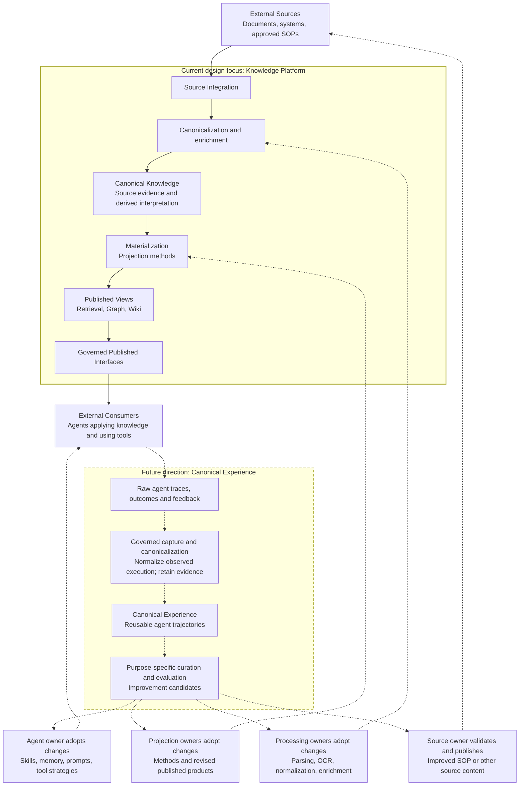

# HLD 階段適切性與 Knowledge Loop framing review

日期：2026-09-11\
檢視版本：`465b0fbc9258c23243161675676feb63d839c92d`；兩份主要文件與 review candidate `babda22` 相同。\
狀態：歷史 review memo；findings 的來源連結綁定原候選版本。

> 後續文件修訂已依此 review 展開。請由 [目前 HLD](../../HLD.md) 與
> [direction review brief](architecture-direction-review.md) 閱讀新候選。以下保留
> 修訂前的分析與建議，並不表示原候選或新候選已取得 endorsement。

本次依據使用者重新界定的階段：Knowledge Loop 剛開始，先對齊 problem framing、願景、架構責任與關鍵取捨，再展開細部設計。檢視對象是整份 `HLD.md` 和 `ARCHITECTURE-BASELINE.md`，並參照 `CONTEXT.md`、既有 normativity audit 與 Knowledge Loop diagram。本次不是 commit diff review，也不是正式架構或安全核准。

**判斷：HLD 的 knowledge-side 主軸可以保留；Baseline 已混入相當多詳細邏輯設計，超出本次希望取得的方向共識。應重新界定 review 的批准範圍，同時把 experience 的形成與改善回流位置補進 HLD。**

已有的兩條 improvement loop 並非缺席。問題在於它們目前只到「Improved models and agents」與「Improved governed knowledge」，還不足以表達 trace → canonical trajectory，以及四種不同改善對象的責任與回流路徑。

## 1. 這個階段應回答什麼

| 現在應對齊 | 可保留為候選設計 | 留給後續設計回答 |
|---|---|---|
| 現況問題、受影響者、代表性使用情境 | 初步 canonical 概念模型 | 完整邏輯欄位、schema、identity 編碼 |
| Knowledge 與 Experience 各自提供何種可重用資產 | Core／derived understanding 的表示選項 | Overlay 的 attachment、selection、re-anchoring 契約 |
| 哪一層負責來源理解、projection、agent behavior、改善採納 | 版本、相依性與發布的概念模型 | Head events、DAG、epochs、shards、transaction 邊界 |
| 保留來源依據、權限、可追溯性；變更不應悄悄改寫已發布意義 | 重建能力與撤權一致性的目標選項 | byte-exact replay、每個 observation 的 commit protocol |
| 本次範圍、未來方向、架構風險、下一步驗證問題 | 三種 projection 的代表性使用方式 | Wiki 發布粒度、Graph identity／join 契約、registry taxonomy |

判斷依據不是「有沒有提到資料庫」或「有沒有使用 MUST」。Logical design 即使沒有技術選型，仍可能太早。要問：**不同合理實作能否保留相同問題解法？如果可以，現在是否已有充分理由必須選定其中一種？**

治理、來源忠實性、責任與版本追溯應在 HLD 出現。它們的精確表示法與執行協定不必一起定案。

## 2. Findings

### R1 — Review gate 批准的內容比目前階段需要的更多

位置：[Baseline §2](https://github.com/davidlinnnn/data-ingestion/blob/babda22bfc0eeb06bed5a6af7d94717f648c5265/ARCHITECTURE-BASELINE.md#2-authority-levels)、[§19](https://github.com/davidlinnnn/data-ingestion/blob/babda22bfc0eeb06bed5a6af7d94717f648c5265/ARCHITECTURE-BASELINE.md#19-review-constituencies-and-outcomes)、[§24](https://github.com/davidlinnnn/data-ingestion/blob/babda22bfc0eeb06bed5a6af7d94717f648c5265/ARCHITECTURE-BASELINE.md#24-review-record-endorsement-and-re-review)、[HLD §9](https://github.com/davidlinnnn/data-ingestion/blob/babda22bfc0eeb06bed5a6af7d94717f648c5265/HLD.md#9-relationship-to-architecture-review-and-delivery-planning)。

§2 的 provisional mechanism contract 仍是 binding design intent，未標示的 Parts II–III 全部承接 normative authority。§24 的 endorsement 又以 decision-complete architecture 為目標。這並不是錯誤的文件制度，但它符合一個較成熟的架構定案階段，而非使用者現在要做的 framing review。

僅把更多段落標成 provisional，仍會讓 reviewer 閱讀整套機制，也會讓之後的設計以目前寫出的機制為預設答案。尤其 §9 的「invariants」已直接引用 five-primitive envelope、Revision Delta、Policy Decision Service、Eligibility Epoch、digest-exact replay 與 Coverage Report，機制已滲入原則層。

**建議：先把這次 review 定義為「問題、範圍、架構方向與待驗證假設的對齊」。** 保留三種 reviewer 的視角，但把詳細契約從這次批准範圍移出。下一階段才逐項批准有使用情境與驗證結果支持的 logical contracts。

既有 [normativity audit](https://github.com/davidlinnnn/data-ingestion/blob/babda22bfc0eeb06bed5a6af7d94717f648c5265/docs/baseline-normativity-audit.md) 已處理「哪些機制先不凍結」，本次要再往前一步處理「哪些內容尚不應是本階段的有約束力契約」。該 audit 把 identity、registry、ownership 等因未來難以改動而列為現在必須凍結；較適合本階段的結論是：它們必須在正式持久化或對外承諾前解決，未必必須在第一輪 HLD review 解決。既有決策與 prototype 可保留作為候選方案的依據。

### R2 — Rebuildability 已承諾到 byte-exact execution，應重新討論能力等級

位置：[Baseline §9.3](https://github.com/davidlinnnn/data-ingestion/blob/babda22bfc0eeb06bed5a6af7d94717f648c5265/ARCHITECTURE-BASELINE.md#93-rebuildability)、[§16.2](https://github.com/davidlinnnn/data-ingestion/blob/babda22bfc0eeb06bed5a6af7d94717f648c5265/ARCHITECTURE-BASELINE.md#162-complete-materialization-input-manifest)、[§16.6](https://github.com/davidlinnnn/data-ingestion/blob/babda22bfc0eeb06bed5a6af7d94717f648c5265/ARCHITECTURE-BASELINE.md#166-rebuildability-and-rebuild-verification)、[HLD §7.6](https://github.com/davidlinnnn/data-ingestion/blob/babda22bfc0eeb06bed5a6af7d94717f648c5265/HLD.md#76-rebuildability-change-and-lineage)。

目前要求所有 Published View Version 都能在完整 Reconstruction Closure 合法保留時 digest-exact 重建，並消除所有會影響輸出的 nondeterminism。§16.6 只把 verification workflow 降為 provisional，這個強承諾仍是 normative。

「從保留的 canonical inputs 重新產生 projection」、「保存並恢復歷史發布產物」與「重新執行後得到完全相同 bytes」是三種不同能力。最後一種會要求控制或保留模型、執行環境和其他完整相依性；在模型服務或非決定性 synthesis 情境，不能只靠記錄版本就保證成立。

**建議：HLD 保留無須重新連接來源即可重新產生 views 的方向，以及輸入、方法、結果的追溯能力；把精確重現等級列為待驗證選擇。** 是否需要保存歷史發布結果、哪些 projection 要求決定性 replay、保存成本與限制，留給具體使用情境。這不是認定 byte-exact replay 無法實作，而是不宜預先對所有類型承諾。

### R3 — Canonical 模型的表示方式、粒度與處理單位被一起凍結

位置：[Baseline §11](https://github.com/davidlinnnn/data-ingestion/blob/babda22bfc0eeb06bed5a6af7d94717f648c5265/ARCHITECTURE-BASELINE.md#11-canonical-knowledge-logical-contract)、[§12](https://github.com/davidlinnnn/data-ingestion/blob/babda22bfc0eeb06bed5a6af7d94717f648c5265/ARCHITECTURE-BASELINE.md#12-governed-registries-and-initial-taxonomy)、[§13](https://github.com/davidlinnnn/data-ingestion/blob/babda22bfc0eeb06bed5a6af7d94717f648c5265/ARCHITECTURE-BASELINE.md#13-atomic-validation-and-contract-versioning)、[§16.2](https://github.com/davidlinnnn/data-ingestion/blob/babda22bfc0eeb06bed5a6af7d94717f648c5265/ARCHITECTURE-BASELINE.md#162-complete-materialization-input-manifest)、[§16.5](https://github.com/davidlinnnn/data-ingestion/blob/babda22bfc0eeb06bed5a6af7d94717f648c5265/ARCHITECTURE-BASELINE.md#165-published-view-identity-and-composition)。

過早定義的例子包括：恰好五個 envelope primitives、恰好五種 fallback ancestors、每次成功 canonicalization 都有新 revision identity、revision-local element addresses、整個 Canonical Revision 原子接受或拒絕、Overlay 不得建立 Elements，以及 standard Retrieval 每 Run 恰好一個 Canonical Revision、所有 Published Views 由 per-Asset shards 組成。

這些是具體邏輯架構選擇，會影響大型或持續更新的來源、跨文件 synthesis、局部失敗處理與 multimodal reconstruction。例如掃描 SOP 的文字和表格可能主要由 OCR／重建產生；目前它們只能放在 Overlay，且 Overlay 不得 mint Elements。這值得用實際來源驗證後再定案，不能只由「保留來源忠實性」推導出唯一表示模型。

**建議：保留 source observation、canonical representation、derived interpretation、published product 的概念區別，以及來源依據與 producer attribution。** 精確 envelope、identity、revision/cardinality、atomicity 與 shard 模型移到非規範性的設計筆記，作為待比較的方案。

### R4 — 治理原則與一致性協定混在一起

位置：[Baseline §9.1](https://github.com/davidlinnnn/data-ingestion/blob/babda22bfc0eeb06bed5a6af7d94717f648c5265/ARCHITECTURE-BASELINE.md#91-governance-and-leakage)、[§14.2](https://github.com/davidlinnnn/data-ingestion/blob/babda22bfc0eeb06bed5a6af7d94717f648c5265/ARCHITECTURE-BASELINE.md#142-append-only-lineage-and-head-selection)、[§15.3](https://github.com/davidlinnnn/data-ingestion/blob/babda22bfc0eeb06bed5a6af7d94717f648c5265/ARCHITECTURE-BASELINE.md#153-policy-decision-service-and-read-side-linearization)。

目前不只要求可靠撤權與 fail-closed，還要求每個 Protected Observation 都 commit immutable Authorization Decision、檢查全部 dependency epochs，並排除 session grant、lease、pre-authorized URL 等授權形態。每種 Head 也已指定 linearizable compare-and-select。這些會直接影響 serving、cache、streaming 與可用性設計。

**建議：現在明確保留來源授權上限、治理無法判定時不揭露、撤權後不得沿受影響路徑繼續越權揭露，以及發布不得越過已生效的安全失效。** 將撤權的生效邊界、來源政策變更如何被得知，以及跨 cache／stream／replica 如何達成所需一致性，列為下一階段必答的 security design 問題。

這不表示可以自行放寬既有安全義務。若企業已要求特定一致性強度，應在 HLD 指出其來源與理由；目前的具體 epoch／commit 協定則作為實現它的候選方案。

### R5 — Consumer 的 source-access 禁令與未來 agent 業務行為存在範圍歧義

位置：[Baseline §10.5](https://github.com/davidlinnnn/data-ingestion/blob/babda22bfc0eeb06bed5a6af7d94717f648c5265/ARCHITECTURE-BASELINE.md#105-external-consumers)、[§22](https://github.com/davidlinnnn/data-ingestion/blob/babda22bfc0eeb06bed5a6af7d94717f648c5265/ARCHITECTURE-BASELINE.md#22-ai-consumer-architecture-gate)、[HLD §6.4](https://github.com/davidlinnnn/data-ingestion/blob/babda22bfc0eeb06bed5a6af7d94717f648c5265/HLD.md#64-external-consumers)。

§10.5 一面讓 External Consumers 擁有 tool use 與 actions，一面說它們 MUST NOT reconnect to enterprise sources。若按字面涵蓋 consumer 的全部行為，agent 便無法呼叫業務系統完成 SOP，也無法透過 source system 的正常流程提交改良 SOP。這是應在 framing 階段釐清的責任邊界。

**建議限縮語意：consumer 取得本平台提供的 governed knowledge 時，走 Published Interfaces，無須自行重做 ingestion；agent 的其他業務操作則仍由業務系統及其權限負責。** 這不授予 agent 額外來源權限，也不改變 materializer 不自行回源解析的原則。

可採用的英文表述：

> External Consumers obtain knowledge offered by the Knowledge Platform through Governed Published Interfaces, without having to implement source ingestion or parsing. Agents may separately interact with business systems through those systems' authorized operational interfaces. Such actions, including proposals to update source content, remain outside the Knowledge Platform's authority.

### R6 — Domain-specific 產品與組織選擇被提升為全域契約

位置：[Baseline §16.1](https://github.com/davidlinnnn/data-ingestion/blob/babda22bfc0eeb06bed5a6af7d94717f648c5265/ARCHITECTURE-BASELINE.md#161-projection-types-and-legal-definitions)、[§16.8](https://github.com/davidlinnnn/data-ingestion/blob/babda22bfc0eeb06bed5a6af7d94717f648c5265/ARCHITECTURE-BASELINE.md#168-two-axis-coverage-report-gate)、[§17.2](https://github.com/davidlinnnn/data-ingestion/blob/babda22bfc0eeb06bed5a6af7d94717f648c5265/ARCHITECTURE-BASELINE.md#172-graph)、[§17.3](https://github.com/davidlinnnn/data-ingestion/blob/babda22bfc0eeb06bed5a6af7d94717f648c5265/ARCHITECTURE-BASELINE.md#173-wiki)、[§18](https://github.com/davidlinnnn/data-ingestion/blob/babda22bfc0eeb06bed5a6af7d94717f648c5265/ARCHITECTURE-BASELINE.md#18-access-boundaries-and-observable-semantics)。

例如 Wiki 的三種 owner 必須是同一 accountable organizational principal、ownership transfer 必須連同版本與 re-attestation 原子完成、每個 View Version 恰好一個不可拆的 Wiki Bundle、所有 Graph cross-view joins 只承諾 Evidence Overlap，以及每次 materialization 的兩軸 Coverage Report 與完整分類。

這些可能是合理方案，但「語意和發布要有人負責」不必然推出「同一組織主體必須包辦三種角色」；「不能泄露 synthesis 的受保護依據」也不必然推出每種 Wiki 只能有目前這種發布粒度。

**建議：HLD 保留 accountable ownership、來源證據、獨立演進與可解釋的品質限制。** 三種 projection 用代表性能力說明；組織配置、bundle 粒度、graph identity／join、quality-report 演算法與 access-role 名單留到各自 logical design。

「不要求企業共用 ontology」可以保留為方向；更強的身份空間與跨 view 限制應說明其使用情境與取捨。既有拒絕方案仍保留歷史理由，不因本次 review 而默認重新採用。

### R7 — HLD 的 problem framing 把現況缺陷寫成 pipeline 的必然限制

位置：[HLD §3.1](https://github.com/davidlinnnn/data-ingestion/blob/babda22bfc0eeb06bed5a6af7d94717f648c5265/HLD.md#31-observable-symptoms)、[§3.4](https://github.com/davidlinnnn/data-ingestion/blob/babda22bfc0eeb06bed5a6af7d94717f648c5265/HLD.md#34-why-llm-wiki-and-graph-make-the-evolution-necessary-now)、[§4](https://github.com/davidlinnnn/data-ingestion/blob/babda22bfc0eeb06bed5a6af7d94717f648c5265/HLD.md#4-the-long-term-vision-know--apply--learn--improve)。

「pipeline stage structurally cannot provide」ownership 或 publication lifecycle 等說法太強。Pipeline 可以有明確 owner、版本與發布控制；此 repo 描述的問題是現有實作把這些責任和來源處理綁在一起，沒有提供可獨立演進的知識契約。絕對化敘述容易讓 reviewer 把討論轉成 pipeline 能不能做到，而非應如何切責任。

**建議：保留 brownfield 故事，把論述限定為目前觀察到的限制，並補少量可追溯實例。** 例如一次 embedding 方法變更牽動哪些不相關流程、一個新 consumer 需要改哪些 ingestion 階段。尚未確認的經驗資料現況則明確列為 discovery hypothesis，不直接宣稱企業已有 fragmented agent traces 的問題。

Problem framing 可分為兩層：目前 source understanding 和 consumer preparation 的耦合；未來如何把 agent 執行經驗累積為跨 framework 可重用的資產。後者應解釋為什麼今日的知識版本、來源與方法追溯值得保留，同時不把 experience 的全部實作放進本期。

### R8 — Experience 缺少 canonicalization 的意義與四個明確改善落點

位置：[HLD §4](https://github.com/davidlinnnn/data-ingestion/blob/babda22bfc0eeb06bed5a6af7d94717f648c5265/HLD.md#4-the-long-term-vision-know--apply--learn--improve)、[§8](https://github.com/davidlinnnn/data-ingestion/blob/babda22bfc0eeb06bed5a6af7d94717f648c5265/HLD.md#8-future-canonical-experience-and-the-complete-knowledge-loop)、[既有 loop diagram](https://github.com/davidlinnnn/data-ingestion/blob/babda22bfc0eeb06bed5a6af7d94717f648c5265/docs/diagrams/knowledge-loop.md)。

目前流程為 capture → Canonical Experience → curation，沒有解釋 framework-specific traces 如何整理成可重用的 trajectory。AI loop 主要舉 evaluation、analytics 與 training data；knowledge loop 則以 generic curation 結束。Skills、memory、projection methods、canonical processing methods 和 source-owned SOP 更新的差別尚未說明。既有 Mermaid 把 knowledge improvement 一概接到 Canonicalization，更容易掩蓋這些不同路徑。

**建議：在 §4 就展示完整概念 loop，於 §8 用 canonical trajectory 與四種改善落點展開。** 保留 future scope 標示；增加責任與概念資訊即可，暫不指定 trace schema、trajectory identity、memory store 或經驗平台服務拓樸。

## 3. Baseline 逐章處置建議

「移出」意指保存為有來源與理由的非規範性設計筆記，並不是丟棄既有研究。

| 章節 | HLD 階段保留 | 移出或改為待驗證問題 |
|---|---|---|
| §§1–6 | 問題、邊界、目標、非目標、關鍵取捨 | 決策完整性宣告；未充分說明範圍的永久禁令 |
| §7 | Knowledge 與 Experience 是不同意義的可重用資產 | 同一 physical service／schema 均不必指定 |
| §8 | 能追溯執行時實際使用的知識；reference 不授權 | 精確 address bundle、referent、resolver、post-purge reservation |
| §9 | 治理、lineage、可重做、刪除傳播、來源忠實性 | 以特定模型、report、epoch 或 digest 定義這些原則 |
| §10 | 各層職責、knowledge serving 與 agent runtime 的區別 | atomic writes、Head／epoch 等執行協定；限縮 consumer 禁令 |
| §11 | Source、canonical representation、derived interpretation 的概念關係 | 精確 primitives、fields、identity、Overlay 限制、attestation 格式 |
| §12 | 模型可演進、extension 有責任與相容性要求 | registry 三層、封閉 ancestor 集合、精確 admission gate |
| §13 | 不悄悄接受不完整或不相容的結果；失敗可見 | 全 revision 原子性與 validation checklist |
| §14 | 來源、處理方法、projection、權限能獨立演進；建立不等於發布 | DAG、single Head、zero Head、Delta 全分類與 selection events |
| §15 | 授權上限、來源政策保留、derived disclosure、撤權及 erasure 責任 | ReBAC 表示、PDS 協定、epoch、purge-record 欄位及操作細則 |
| §16.1 | Projection 可獨立定義、發布，有 semantic 與 publication accountability | 強制 role co-location、atomic ownership transfer、custom-runtime 審核細節 |
| §§16.2–16.4 | 宣告與追溯相依性；變更可評估；不發布已失效輸入的晚到結果 | 完整 manifest 欄位、Run cardinality、reverse-reference／reuse 演算法 |
| §§16.5–16.7 | Published product 具有版本與受治理的更替、回復能力 | per-Asset shards、Aggregate Manifest、byte-exact verification、Carry-Forward |
| §16.8 | 未處理內容、轉換限制與品質損失可見 | 全量 address accounting、兩軸 gate、profile、reason enum、witness 規則 |
| §17 | Retrieval／Graph／Wiki 的價值、責任、證據與治理 | exact payload、graph identity minting、Wiki bundle granularity |
| §18 | 平台消費介面、知識來源可追溯、拒絕／不可用可解釋 | internal read-role 封閉清單、精確 observable-state 契約 |
| §§19–24 | 三種 review 視角、scenario walkthrough、決策與問題紀錄 | 改成方向 review；不以全部 logical contracts 完整為通過前提 |

## 4. 建議的完整 Knowledge Loop

下圖為方向提案。實線表示當前 Knowledge Platform 的目標資料流，不代表已完成實作；虛線表示 future experience 與改善回流。Evaluation、curation、adoption 是能力與責任，圖中未指定由單一服務或單一團隊承擔。

### Trace、trajectory、experience 的候選語意

| 概念 | 建議在 HLD 的意思 |
|---|---|
| Raw agent trace | 某 runtime／工具產生的原始執行記錄；格式、完整性與語意可能依 framework 而異 |
| Canonical Agent Trajectory | 把任務脈絡、觀察到的 actions、tool interactions、knowledge use、results 及可取得的 outcomes／feedback 整理成可追溯、可重用的執行歷程 |
| Canonical Experience | 保存可重用執行經驗的較廣領域；trajectory 是候選核心表示，不等同於全部 experience，也不等同 agent memory 或 training dataset |
| Curated experience product | 為某個目的選取、評估或衍生的結果，例如 evaluation cases、skill 改善候選或 memory 候選 |

這些是概念提案，尚未加入 `CONTEXT.md`。Trajectory 應保留可觀察的先後、分支／重試與證據連結；哪些能可靠正規化仍需驗證。不要把 agent 自評成功直接當作已確認 outcome，也不要把缺少的事件或因果關係補成事實。Canonicalization 產生可重用表示，不代表自動取得訓練、長期記憶或發布資格。

### 四種改善對象的回流位置

| 改善對象 | 例子 | 回到哪裡；由誰採納 |
|---|---|---|
| Agent 本身 | Skill、memory、prompt、planning／tool-use strategy；模型改善是其中一種 | Agent／application owner 評估後更新 agent；不要求重新 ingestion |
| Knowledge projection 方法或產物 | Chunking／embedding、ontology mapping、Wiki synthesis／citation 規則；修正或撤回有問題的 view | Projection／publication 責任方採納方法或發布決策，經 materialization／publication lifecycle 產生 successor result |
| Canonical processing 方法 | Parser、OCR、表格重建、正規化、enrichment 方法 | Processing owner 驗證後處理合法保留的 source inputs，產生有版本與 lineage 的新結果 |
| Source knowledge 本身 | Agent 發現 SOP 可以簡化或補足，提出新版內容 | Source owner 透過來源系統的正常流程驗證與發布，然後再進 Source Integration |

Projection product 出錯不代表一定修改 projection method：如果錯在原始 SOP，要走 source path；如果錯在 OCR，要走 processing path。Query rewriting、reranking 或 agent context assembly 則依目前責任切分屬於 External Consumer，不能全部歸入 Materialization。

若未來要把經驗報告本身接成 Source，也應先形成有 owner、證據與適用政策的可發布產物，再經正常 acquisition boundary 納入。不能把 raw trace 直接視為權威 knowledge。

### 用 SOP 情境驗證責任是否清楚

1. Agent 經 Published Interface 使用 SOP v1，並在自身業務權限下呼叫系統工具執行任務。
2. Trace 保留實際 knowledge version、observed actions、tool results 與後續 outcome／feedback；future experience 處理產生可重用 trajectory。
3. Evaluation 發現可能改良的步驟，產生帶有依據的建議。這個建議尚不代表 SOP 已正確或已被採納。
4. 若只改變 agent 的操作技巧，由 agent owner 評估並更新 skill；若改變 SOP 的業務內容，由 source owner 驗證並在 SOP 的原始系統發布。
5. SOP 新版再被 Source Integration 擷取，經 canonical processing、materialization 與正常發布更新消費結果。

依目前 glossary，**新版 SOP 通常是現有 Source 中既有 Asset 的新 Source Revision**。獨立新 SOP 可能是新 Asset；只有新增受治理的 acquisition boundary 才是新 Source。使用者所說「成為新的 data source」在願景上成立，文件中則應把這三種情況分清楚。

Processing method 的改善也需區別：修正來源內容走新的 Source Revision；改善 OCR 等方法可重處理合法保留的來源輸入，不必宣稱來源本身變了。依現行模型，結果會是新的 Canonical Revision 或 Enrichment Overlay Version；HLD 不必先鎖定更細的執行單位。

## 5. HLD 建議改寫結構與示例

保留現有 brownfield 故事與 §6.5 的責任映射，縮減 §§6–7 中重複 Baseline 的 Governance Binding、Head Selection、attestation、Reconstruction Closure 等細節。以一張完整 loop 圖加一張本期 architecture 圖為主，避免多張近似的線性圖重複描述。

建議目錄：

1. **Purpose, stage, and decision sought**：這次要對齊的問題、架構方向與保留的設計空間。
2. **Current situation and evidence**：既有共用 ingestion 的價值、已觀察的耦合及代表性例子。
3. **Problem and architectural drivers**：knowledge reuse 的當前問題；experience reuse 的未來需求與待確認假設。
4. **Vision: Know → Apply → Learn → Improve**：兩種 canonical 資產、trace → trajectory、四種改善回流。
5. **Current scope and future scope**：Knowledge Platform 是當前設計焦點；experience 是未來領域；agent runtime 與來源的操作權責在外部。
6. **Conceptual architecture and responsibilities**：來源理解、canonical representation、projection、publication、consumer；保留現有責任映射。
7. **Representative scenarios and intended value**：consumer 方法變更、source update／revocation，以及完整 SOP 改善例子。
8. **Key principles, alternatives, and trade-offs**：為何需要可重用資產與獨立生命週期；成本、品質與一致性的開放問題。
9. **Open questions and next design work**：將會用哪些來源／consumer 情境驗證什麼，不承諾 delivery 日期或完整 backlog。

可以放進 problem／vision 的英文草稿：

> The enterprise needs to preserve reusable knowledge from two kinds of activity: understanding its sources and carrying out work with that knowledge. Today, the shared ingestion pipeline couples source understanding with consumer-specific preparation. As agents take on operational tasks, the Foundation also needs a path for turning execution traces into reusable experience that can inform later improvement.
>
> The proposed Knowledge Loop connects these two assets. Canonical Knowledge preserves source-derived information for independently governed projections. Future Canonical Experience organizes observed agent execution into reusable trajectories, retaining the connection between the task, actions, knowledge used, results, and available outcome evidence. Purpose-specific evaluation can then identify improvements to agent skills and memory, projection methods and published products, canonical processing methods, or the source knowledge itself.
>
> Each improvement returns through the lifecycle of the thing being changed. An agent skill is adopted by its agent owner; a projection change is evaluated and published by its responsible owners; a processing change produces new attributable knowledge-processing results. When an agent proposes a better SOP, the source owner validates and publishes the revision in the source system, after which it enters the ordinary knowledge ingestion flow.
>
> This HLD seeks alignment on that direction and on the Knowledge Platform as the current design focus. It identifies responsibilities, evidence needs, and design questions for the next phase. Detailed trajectory schemas, lifecycle protocols, technology choices, and delivery commitments remain subsequent design work.

本段是建議替換文字，採納時需同步調整 HLD §9 與 Baseline 的 authority／review 定義，避免摘要與規範互相衝突。

## 6. 下一階段應解決的問題

| 問題 | 合適的驗證切入點 |
|---|---|
| Canonical 表示能否同時支持 reuse 與 multimodal fidelity？ | 一份 native SOP、一份掃描或表格密集 SOP，搭配兩個 consumer 需求；比較 Core／derived representation 選項 |
| 第一種 projection 需要哪個 replay 等級？ | 比較重新 materialize、保留歷史產物與決定性 replay 所需的輸入／環境及成本 |
| 權限變更如何從 source 傳到發布與 query？ | 一個真實來源的 policy-change 能力，涵蓋 capture gaps、cache 與 in-flight results；定義所需生效語意 |
| Trace 如何成為可重用 trajectory？ | 一段含 tool failure／retry 的 agent trace，檢查哪些事件、版本、結果與 outcome 可取得；用它測試跨 runtime 概念，而非現在建立全套服務 |
| 改善應由哪一層承接？ | 用同一 SOP 情境分別注入 source 錯誤、OCR 錯誤、projection 錯誤與 agent 操作錯誤，確認不會一律回寫 canonical data |
| 當前架構是否改善現有耦合？ | 追蹤一種 projection 方法變更是否能獨立評估與發布，以及新增 consumer 是否仍需修改 Source Integration |

這些是設計問題與驗證入口，並非本次 HLD 通過前必須全部完成的實作清單。

## 7. 文件處置建議

先調整 HLD 的 stage、problem framing 與完整 loop，再把 Baseline 收斂為本階段需要對齊的責任、概念關係及原則。詳細內容保存為明確非規範性的候選設計，不以附錄形式繼續承接整份 Baseline 的 normative authority。

若採納，應同步檢查 `README.md` 的狀態說明、`CONTEXT.md` 中已寫成定案的詳細契約、Knowledge Loop Mermaid／PNG，以及 review record 的 candidate、範圍與 walkthroughs。歷史 review evidence 保留其原始版本綁定；不把這次 framing review 等同於原候選的正式 endorsement。

最初 review 僅新增此 memo。後續文件修訂另見上方連結；GitHub 的歷史 review record 保留其原始候選範圍。
